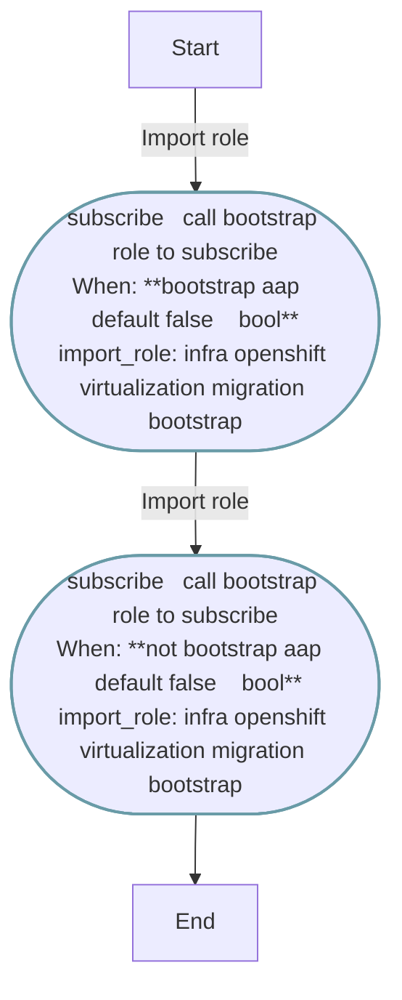
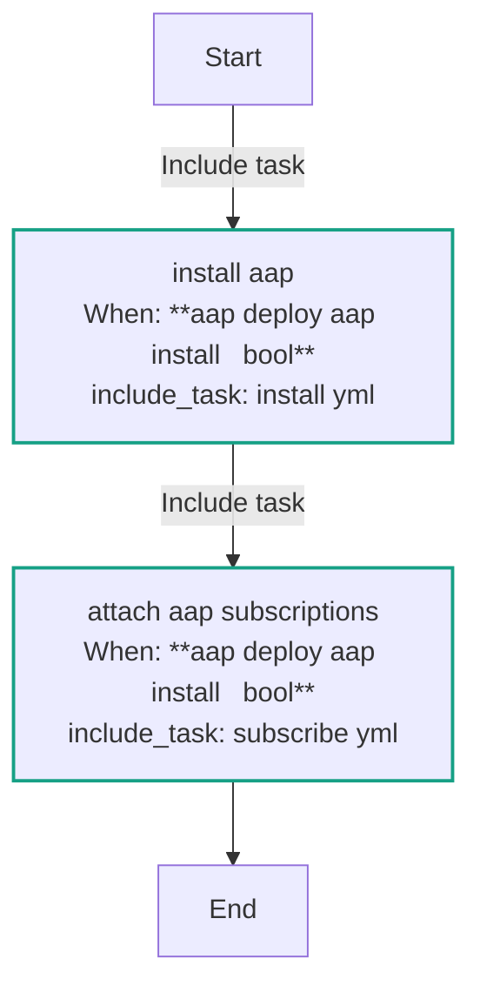
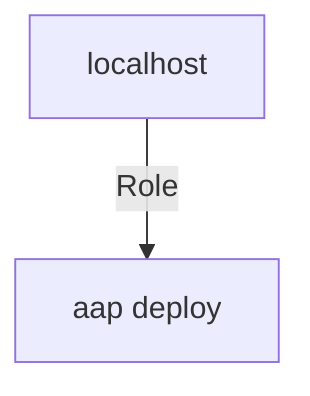

<!-- STATIC CONTENT START
Use this section for adding additional content to the README
This will not be overwritten by Docsible -->
# 📃 Role overview

<!-- STATIC CONTENT END -->
<!-- Everything below will be overwritten by Docsible -->
<!-- DOCSIBLE START -->
## aap_deploy

```
Role belongs to infra/openshift_virtualization_migration
Namespace - infra
Collection - openshift_virtualization_migration
```

Description: Deploys an instance of Ansible Automation Platform.

### Defaults

**These are static variables with lower priority**

#### File: defaults/main.yml

| Var          | Type         | Value       |Choices    |Required    | Title       |
|--------------|--------------|-------------|-------------|-------------|-------------|
| [`aap_deploy_aap_install`](defaults/main.yml#L7)   | bool   | `True` |  None  |   True  |  Boolean to allow AAP instalation and subscription attachment |
| [`aap_deploy_controller_username`](defaults/main.yml#L18)   | str   | `{{ controller_username ¦ default('admin', true) }}` |  None  |   True  |  Username for AAP Controller authentication |
| [`aap_deploy_openshift_host`](defaults/main.yml#L23)   | str   | `{{ openshift_host }}` |  None  |   True  |  OpenShift cluster hostname |
| [`aap_deploy_openshift_api_key`](defaults/main.yml#L28)   | str   | `{{ openshift_api_key }}` |  None  |   False  |  OpenShift API authentication key |
| [`aap_deploy_openshift_verify_ssl`](defaults/main.yml#L33)   | str   | `{{ openshift_verify_ssl }}` |  None  |   False  |  Verify SSL certificates for OpenShift connection |
| [`aap_deploy_validate_components`](defaults/main.yml#L38)   | list   | `[]` |  None  |   True  |  Ansible Automation Platform component validation |
| [`aap_deploy_validate_components.0`](defaults/main.yml#L38)   | str   | `{{ aap_instance_name + '-controller-task' if aap_version is not defined or aap_version is version('2.5', '>=') else aap_instance_name + '-web' }}` |  None  |   True  |  Ansible Automation Platform component validation |
| [`aap_deploy_validate_components.1`](defaults/main.yml#L38)   | str   | `{{ aap_instance_name + '-controller-task' if aap_version is not defined or aap_version is version('2.5', '>=') else aap_instance_name + '-task' }}` |  None  |   True  |  Ansible Automation Platform component validation |
| [`aap_deploy_validate_components.2`](defaults/main.yml#L38)   | str   | `{{ aap_instance_name + '-gateway' if aap_version is not defined or aap_version is version('2.5', '>=') else '' }}` |  None  |   True  |  Ansible Automation Platform component validation |
| [`aap_deploy_cac_collection`](defaults/main.yml#L49)   | str   | `<multiline value: folded_strip>` |  None  |   True  |  Ansible Automation Platform configuration collection |
| [`aap_deploy_aap_channel`](defaults/main.yml#L53)   | str   | `{{ aap_channel ¦ default('stable-2.5') }}` |  None  |   None  |  None |

<summary><b>🖇️ Full descriptions for vars in defaults/main.yml</b></summary>
<br>
<b>`aap_deploy_aap_install`:</b> Setting this variable to true will install AAP and attach a valid subscription based on your account.
<br>
<b>`aap_deploy_controller_username`:</b> Username used to authenticate against the AAP Controller.
<br>
<b>`aap_deploy_openshift_host`:</b> The hostname or API endpoint of the OpenShift cluster to validate bearer token.
<br>
<b>`aap_deploy_openshift_api_key`:</b> API key used to authenticate against the OpenShift cluster.
<br>
<b>`aap_deploy_openshift_verify_ssl`:</b> Whether to verify SSL certificates when connecting to OpenShift.
<br>
<b>`aap_deploy_validate_components`:</b> The names of the components to verify is running after installation.
<br>
<b>`aap_deploy_validate_components.0`:</b> The names of the components to verify is running after installation.
<br>
<b>`aap_deploy_validate_components.1`:</b> The names of the components to verify is running after installation.
<br>
<b>`aap_deploy_validate_components.2`:</b> The names of the components to verify is running after installation.
<br>
<b>`aap_deploy_cac_collection`:</b> Determines which collection to use for configuring AAP based on the version.
<br>
<b>`aap_deploy_aap_channel`:</b> None
<br>
<br>

### Tasks

#### File: tasks/main.yml

| Name | Module | Has Conditions |
| ---- | ------ | --------- |
| Install AAP | `ansible.builtin.include_tasks` | True |
| Attach AAP Subscriptions | `ansible.builtin.include_tasks` | True |

#### File: tasks/install.yml

| Name | Module | Has Conditions |
| ---- | ------ | --------- |
| install ¦ Validate OpenShift bearer token | `ansible.builtin.uri` | False |
| install ¦ Set Platform variables (2.5+) | `ansible.builtin.set_fact` | True |
| install ¦ Set Platform variables (<2.5) | `ansible.builtin.set_fact` | True |
| install ¦ Call aap_ocp_install role | `ansible.builtin.import_role` | False |
| install ¦ Verify AAP Components are running | `kubernetes.core.k8s_info` | True |
| install ¦ Bootstrap block | `block` | True |
| install ¦ Set controller username fact for Bootstrap mode | `ansible.builtin.set_fact` | False |
| install ¦ Retrieve Migration Factory AAP admin credential for Bootstrap mode | `kubernetes.core.k8s_info` | False |
| install ¦ Set controller facts for bootstrap mode | `ansible.builtin.set_fact` | False |
| install ¦ Set controller stats for bootstrap mode | `ansible.builtin.set_stats` | False |
| install ¦ Call credential config as code role on Bootstrap AAP | `ansible.builtin.include_role` | False |
| install ¦ Non-bootstrap block | `block` | True |
| install ¦ Set controller username fact for non-bootstrap mode | `ansible.builtin.set_fact` | False |
| install ¦ Retrieve Migration Factory AAP admin credential for non-bootstrap mode | `kubernetes.core.k8s_info` | False |
| install ¦ Set controller facts if not bootstrap mode | `ansible.builtin.set_fact` | False |
| install ¦ Set controller stats if not bootstrap mode | `ansible.builtin.set_stats` | False |
| install ¦ Display retrieved password for non-bootstrap mode | `ansible.builtin.debug` | False |

#### File: tasks/subscribe.yml

| Name | Module | Has Conditions |
| ---- | ------ | --------- |
| subscribe ¦ Call bootstrap role to subscribe | `ansible.builtin.import_role` | True |
| subscribe ¦ Call bootstrap role to subscribe | `ansible.builtin.import_role` | True |

## Task Flow Graphs

### Graph for install.yml

```mermaid
flowchart TD
Start
classDef block stroke:#3498db,stroke-width:2px;
classDef task stroke:#4b76bb,stroke-width:2px;
classDef includeTasks stroke:#16a085,stroke-width:2px;
classDef importTasks stroke:#34495e,stroke-width:2px;
classDef includeRole stroke:#2980b9,stroke-width:2px;
classDef importRole stroke:#699ba7,stroke-width:2px;
classDef includeVars stroke:#8e44ad,stroke-width:2px;
classDef rescue stroke:#665352,stroke-width:2px;

  Start-->|Task| install___Validate_OpenShift_bearer_token0[install   validate openshift bearer token]:::task
  install___Validate_OpenShift_bearer_token0-->|Task| install___Set_Platform_variables__2_5__1[install   set platform variables  2 5  <br>When: **aap version is not defined  or aap version is<br>defined and aap version is version  2 5**]:::task
  install___Set_Platform_variables__2_5__1-->|Task| install___Set_Platform_variables___2_5_2[install   set platform variables   2 5 <br>When: **aap version is defined and aap version is version <br>2 5**]:::task
  install___Set_Platform_variables___2_5_2-->|Import role| install___Call_aap_ocp_install_role_infra_aap_utilities_aap_ocp_install_3([install   call aap ocp install role<br>import_role: infra aap utilities aap ocp install]):::importRole
  install___Call_aap_ocp_install_role_infra_aap_utilities_aap_ocp_install_3-->|Task| install___Verify_AAP_Components_are_running4[install   verify aap components are running<br>When: **component   default     true    length   0**]:::task
  install___Verify_AAP_Components_are_running4-->|Block Start| install___Bootstrap_block5_block_start_0[[install   bootstrap block<br>When: **bootstrap aap   default true    bool**]]:::block
  install___Bootstrap_block5_block_start_0-->|Task| install___Set_controller_username_fact_for_Bootstrap_mode0[install   set controller username fact for<br>bootstrap mode]:::task
  install___Set_controller_username_fact_for_Bootstrap_mode0-->|Task| install___Retrieve_Migration_Factory_AAP_admin_credential_for_Bootstrap_mode1[install   retrieve migration factory aap admin<br>credential for bootstrap mode]:::task
  install___Retrieve_Migration_Factory_AAP_admin_credential_for_Bootstrap_mode1-->|Task| install___Set_controller_facts_for_bootstrap_mode2[install   set controller facts for bootstrap mode]:::task
  install___Set_controller_facts_for_bootstrap_mode2-->|Task| install___Set_controller_stats_for_bootstrap_mode3[install   set controller stats for bootstrap mode]:::task
  install___Set_controller_stats_for_bootstrap_mode3-->|Include role| install___Call_credential_config_as_code_role_on_Bootstrap_AAP____aap_deploy_cac_collection____credentials_4(install   call credential config as code role on<br>bootstrap aap<br>include_role:    aap deploy cac collection    credentials):::includeRole
  install___Call_credential_config_as_code_role_on_Bootstrap_AAP____aap_deploy_cac_collection____credentials_4-.->|End of Block| install___Bootstrap_block5_block_start_0
  install___Call_credential_config_as_code_role_on_Bootstrap_AAP____aap_deploy_cac_collection____credentials_4-->|Block Start| install___Non_bootstrap_block6_block_start_0[[install   non bootstrap block<br>When: **not bootstrap aap   default true    bool**]]:::block
  install___Non_bootstrap_block6_block_start_0-->|Task| install___Set_controller_username_fact_for_non_bootstrap_mode0[install   set controller username fact for non<br>bootstrap mode]:::task
  install___Set_controller_username_fact_for_non_bootstrap_mode0-->|Task| install___Retrieve_Migration_Factory_AAP_admin_credential_for_non_bootstrap_mode1[install   retrieve migration factory aap admin<br>credential for non bootstrap mode]:::task
  install___Retrieve_Migration_Factory_AAP_admin_credential_for_non_bootstrap_mode1-->|Task| install___Set_controller_facts_if_not_bootstrap_mode2[install   set controller facts if not bootstrap<br>mode]:::task
  install___Set_controller_facts_if_not_bootstrap_mode2-->|Task| install___Set_controller_stats_if_not_bootstrap_mode3[install   set controller stats if not bootstrap<br>mode]:::task
  install___Set_controller_stats_if_not_bootstrap_mode3-->|Task| install___Display_retrieved_password_for_non_bootstrap_mode4[install   display retrieved password for non<br>bootstrap mode]:::task
  install___Display_retrieved_password_for_non_bootstrap_mode4-.->|End of Block| install___Non_bootstrap_block6_block_start_0
  install___Display_retrieved_password_for_non_bootstrap_mode4-->End
```



### Graph for subscribe.yml



### Graph for main.yml



## Playbook

```yml
---
- name: Test
  hosts: localhost
  remote_user: root
  roles:
    - aap_deploy
...

```

## Playbook graph



## Author Information

OpenShift Virtualization Migration Contributors

## License

GPL-3.0-only

## Minimum Ansible Version

2.15.0

## Platforms

No platforms specified.

<!-- DOCSIBLE END -->
