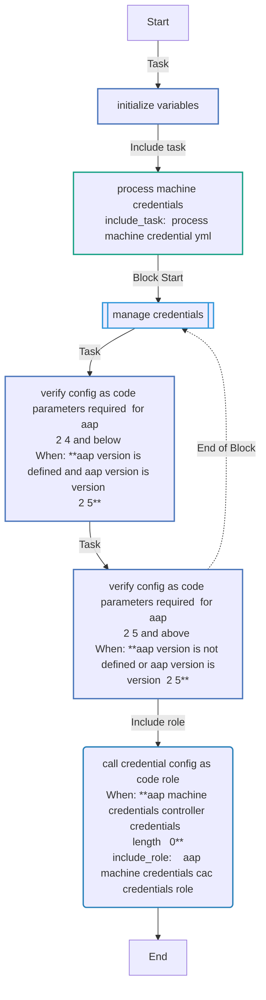
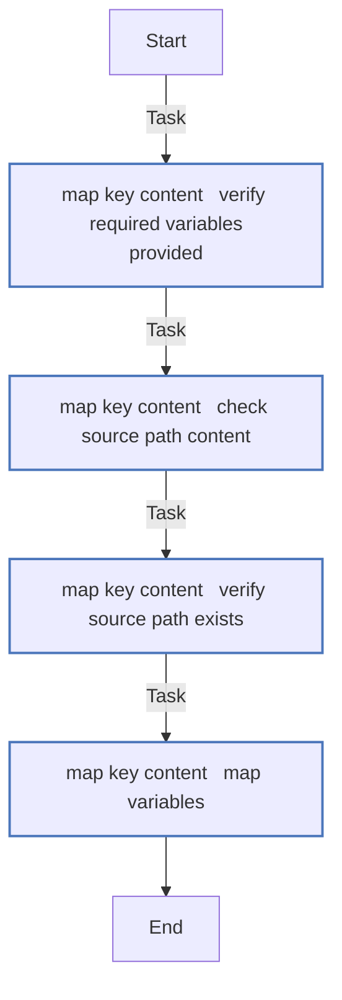
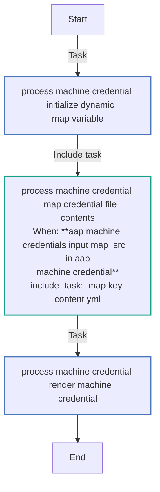
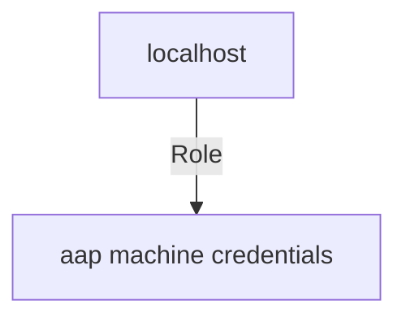

<!-- STATIC CONTENT START
Use this section for adding additional content to the README
This will not be overwritten by Docsible -->
# 📃 Role overview

This role enables the management of Ansible Automation Platform _Credentials_.

<!-- STATIC CONTENT END -->
<!-- Everything below will be overwritten by Docsible -->
<!-- DOCSIBLE START -->
## aap_machine_credentials

```
Role belongs to infra/openshift_virtualization_migration
Namespace - infra
Collection - openshift_virtualization_migration
Version - 1.24.0
Repository - https://github.com/redhat-cop/openshift_virtualization_migration
```

Description: Management of Machine Credentials.

### Defaults

**These are static variables with lower priority**

#### File: defaults/main.yml

| Var          | Type         | Value       |Choices    |Required    | Title       |
|--------------|--------------|-------------|-------------|-------------|-------------|
| [`aap_machine_credentials_request`](defaults/main.yml#L7)   | list   | `[]` |  None  |   True  |  List of AAP Credentials |
| [`aap_machine_credentials_organization`](defaults/main.yml#L15)   | str   | `{{ aap_project ¦ default('OpenShift Virtualization Migration', true) }}` |  None  |   True  |  Organization name in AAP host |
| [`aap_machine_credentials_cac_credentials_role`](defaults/main.yml#L20)   | str   | `<multiline value: folded_strip>` |  None  |   True  |  Ansible Automation Platform configuration collection credentials role |

<summary><b>🖇️ Full descriptions for vars in defaults/main.yml</b></summary>
<br>
<b>`aap_machine_credentials_request`:</b> List of credentials to access AAP provided by _process_machine_credential.yml
<br>
<b>`aap_machine_credentials_organization`:</b> Name of the organization in AAP
<br>
<b>`aap_machine_credentials_cac_credentials_role`:</b> Determines which collection to use for configuring AAP based on the version.
<br>
<br>

### Vars

**These are variables with higher priority**

#### File: vars/main.yml

| Var          | Type         | Value       |
|--------------|--------------|-------------|
| [aap_machine_credentials_input_keys](vars/main.yml#L3)   | list   | `[]` |
| [aap_machine_credentials_input_keys.0](vars/main.yml#L4)   | str   | `username` |
| [aap_machine_credentials_input_keys.1](vars/main.yml#L5)   | str   | `password` |
| [aap_machine_credentials_input_keys.2](vars/main.yml#L6)   | str   | `ssh_key_data` |
| [aap_machine_credentials_input_keys.3](vars/main.yml#L7)   | str   | `ssh_public_key_data` |
| [aap_machine_credentials_input_keys.4](vars/main.yml#L8)   | str   | `ssh_key_unlock` |
| [aap_machine_credentials_input_keys.5](vars/main.yml#L9)   | str   | `become_method` |
| [aap_machine_credentials_input_keys.6](vars/main.yml#L10)   | str   | `become_username` |
| [aap_machine_credentials_input_keys.7](vars/main.yml#L11)   | str   | `become_password` |
| [aap_machine_credentials_input_keys.8](vars/main.yml#L12)   | str   | `state` |
| [aap_machine_credentials_base_keys](vars/main.yml#L14)   | list   | `[]` |
| [aap_machine_credentials_base_keys.0](vars/main.yml#L15)   | dict   | `{}` |
| [aap_machine_credentials_base_keys.0.name](vars/main.yml#L15)   | str   | `name` |
| [aap_machine_credentials_base_keys.1](vars/main.yml#L16)   | dict   | `{}` |
| [aap_machine_credentials_base_keys.1.name](vars/main.yml#L16)   | str   | `description` |
| [aap_machine_credentials_base_keys.2](vars/main.yml#L17)   | dict   | `{}` |
| [aap_machine_credentials_base_keys.2.name](vars/main.yml#L17)   | str   | `organization` |
| [aap_machine_credentials_base_keys.2.default](vars/main.yml#L18)   | str   | `{{ aap_machine_credentials_organization }}` |
| [aap_machine_credentials_base_keys.3](vars/main.yml#L19)   | dict   | `{}` |
| [aap_machine_credentials_base_keys.3.name](vars/main.yml#L19)   | str   | `credential_type` |
| [aap_machine_credentials_base_keys.3.default](vars/main.yml#L20)   | str   | `Machine` |
| [aap_machine_credentials_input_maps](vars/main.yml#L22)   | list   | `[]` |
| [aap_machine_credentials_input_maps.0](vars/main.yml#L23)   | dict   | `{}` |
| [aap_machine_credentials_input_maps.0.src](vars/main.yml#L23)   | str   | `ssh_key_data_path` |
| [aap_machine_credentials_input_maps.0.dest](vars/main.yml#L24)   | str   | `ssh_key_data` |
| [aap_machine_credentials_input_maps.1](vars/main.yml#L25)   | dict   | `{}` |
| [aap_machine_credentials_input_maps.1.src](vars/main.yml#L25)   | str   | `ssh_public_key_data_path` |
| [aap_machine_credentials_input_maps.1.dest](vars/main.yml#L26)   | str   | `ssh_public_key_data` |

### Tasks

#### File: tasks/main.yml

| Name | Module | Has Conditions |
| ---- | ------ | --------- |
| Initialize Variables | `ansible.builtin.set_fact` | False |
| Process Machine Credentials | `ansible.builtin.include_tasks` | False |
| Manage Credentials | `block` | False |
| Verify Config as Code parameters required (for AAP 2.4 and below) | `ansible.builtin.assert` | True |
| Verify Config as Code parameters required (for AAP 2.5 and above) | `ansible.builtin.assert` | True |
| Call credential config as code role | `ansible.builtin.include_role` | True |

#### File: tasks/_map_key_content.yml

| Name | Module | Has Conditions |
| ---- | ------ | --------- |
| _map_key_content ¦ Verify required variables provided | `ansible.builtin.assert` | False |
| _map_key_content ¦ Check source path content | `ansible.builtin.stat` | False |
| _map_key_content ¦ Verify source path exists | `ansible.builtin.assert` | False |
| _map_key_content ¦ Map Variables | `ansible.builtin.set_fact` | False |

#### File: tasks/_process_machine_credential.yml

| Name | Module | Has Conditions |
| ---- | ------ | --------- |
| _process_machine_credential ¦ Initialize Dynamic Map Variable | `ansible.builtin.set_fact` | False |
| _process_machine_credential ¦ Map Credential File Contents | `ansible.builtin.include_tasks` | True |
| _process_machine_credential ¦ Render Machine Credential | `ansible.builtin.set_fact` | False |

## Task Flow Graphs

### Graph for main.yml



### Graph for _map_key_content.yml



### Graph for _process_machine_credential.yml



## Playbook

```yml
---
- name: Test
  hosts: localhost
  remote_user: root
  roles:
    - aap_machine_credentials

...

```

## Playbook graph



## Author Information

OpenShift Virtualization Migration Contributors

## License

GPL-3.0-only

## Minimum Ansible Version

2.15.0

## Platforms

No platforms specified.

<!-- DOCSIBLE END -->