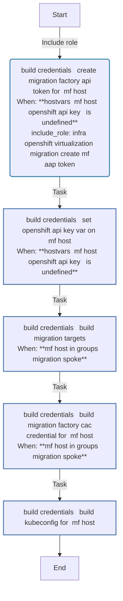
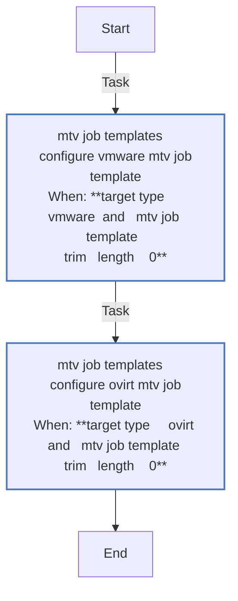
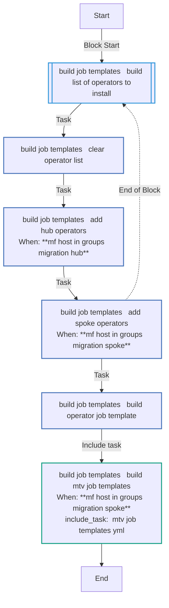
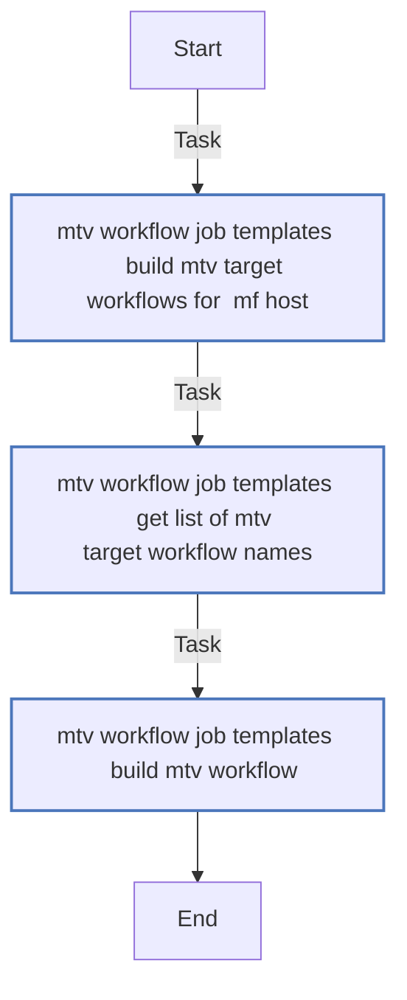
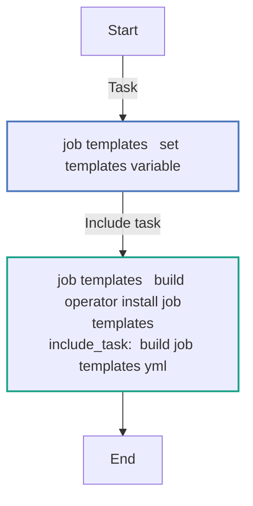
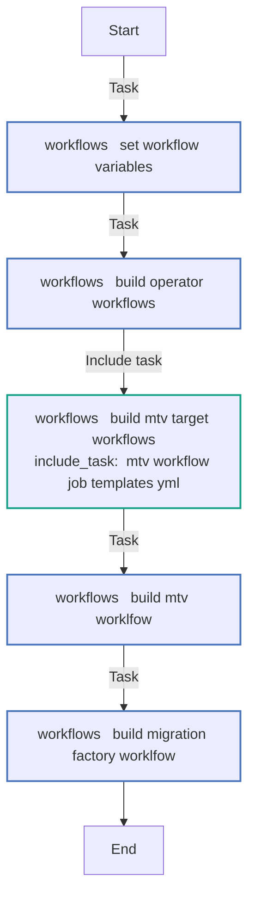

<!-- STATIC CONTENT START
Use this section for adding additional content to the README
This will not be overwritten by Docsible -->
# 📃 Role overview

This role defines the initial configuration and setup of the Ansible Automation Platform with the organizations, inventories, projects, job templates, credentials, execution environments for the Ansible Collection for OpenShift Virtualization Migration.

<!-- STATIC CONTENT END -->
<!-- Everything below will be overwritten by Docsible -->
<!-- DOCSIBLE START -->
## aap_seed

```
Role belongs to infra/openshift_virtualization_migration
Namespace - infra
Collection - openshift_virtualization_migration
```

Description: Populates an Ansible Automation Platform instance.

### Defaults

**These are static variables with lower priority**

#### File: defaults/main.yml

| Var          | Type         | Value       |Choices    |Required    | Title       |
|--------------|--------------|-------------|-------------|-------------|-------------|
| [`aap_seed_secure_logging`](defaults/main.yml#L5)   | str   | `{{ secure_logging ¦ default(true) }}` |  None  |   True  |  AAP Secure Logging |
| [`aap_seed_migration_hub`](defaults/main.yml#L10)   | list   | `[]` |  None  |   True  |  AAP Migration Hub |
| [`aap_seed_aap_namespace`](defaults/main.yml#L15)   | str   | `{{ aap_namespace }}` |  None  |   True  |  AAP Namespace in OpenShift |
| [`aap_seed_aap_channel`](defaults/main.yml#L20)   | str   | `{{ aap_channel }}` |  None  |   True  |  AAP Subscription Channel |
| [`aap_seed_aap_instance_name`](defaults/main.yml#L25)   | str   | `{{ aap_instance_name }}` |  None  |   True  |  AAP Instance Name |
| [`aap_seed_aap_org_name`](defaults/main.yml#L30)   | str   | `{{ aap_org_name }}` |  None  |   True  |  AAP Organization Name |
| [`aap_seed_controller_username`](defaults/main.yml#L35)   | str   | `<multiline value: folded_strip>` |  None  |   True  |  AAP Controller Username |
| [`aap_seed_controller_password`](defaults/main.yml#L42)   | str   | `<multiline value: folded_strip>` |  None  |   True  |  AAP Controller Password |
| [`aap_seed_controller_token`](defaults/main.yml#L48)   | str   | `<multiline value: folded_strip>` |  None  |   False  |  AAP token |
| [`aap_seed_controller_hostname`](defaults/main.yml#L51)   | str   | `<multiline value: folded_strip>` |  None  |   None  |  None |
| [`aap_seed_controller_validate_certs`](defaults/main.yml#L58)   | str   | `<multiline value: folded_strip>` |  None  |   True  |  Validate AAP Controller Certificate |
| [`aap_seed_cac_collection`](defaults/main.yml#L65)   | str   | `<multiline value: folded_strip>` |  None  |   True  |  AAP CaC Collection Name |
| [`aap_seed_controller_organizations_var`](defaults/main.yml#L72)   | str   | `<multiline value: folded_strip>` |  None  |   True  |  AAP Organizations Variable |
| [`aap_seed_controller_configuration_async_retries`](defaults/main.yml#L81)   | int   | `60` |  None  |   True  |  Configuration Async Retries |
| [`aap_seed_controller_dependency_check`](defaults/main.yml#L86)   | bool   | `False` |  None  |   True  |  Dependency Check |
| [`aap_seed_aap_inventory`](defaults/main.yml#L93)   | str   | `openshift_virtualization_migration` |  None  |   True  |  AAP Inventory |
| [`aap_seed_aap_version`](defaults/main.yml#L98)   | str   | `{{ aap_version ¦ default(2.5) }}` |  None  |   True  |  AAP Version |
| [`aap_seed_aap_execution_environment`](defaults/main.yml#L103)   | str   | `{{ aap_execution_environment }}` |  None  |   True  |  AAP Execution Environment |
| [`aap_seed_aap_execution_environment_image`](defaults/main.yml#L108)   | str   | `{{ aap_execution_environment_image }}` |  None  |   True  |  AAP Execution Environment Image |
| [`aap_seed_aap_project`](defaults/main.yml#L113)   | str   | `{{ aap_project }}` |  None  |   True  |  AAP Project |
| [`aap_seed_aap_project_branch`](defaults/main.yml#L118)   | str   | `{{ aap_project_branch }}` |  None  |   True  |  AAP Project Branch |
| [`aap_seed_aap_project_repo`](defaults/main.yml#L123)   | str   | `{{ aap_project_repo }}` |  None  |   True  |  AAP Project Repository |
| [`aap_seed_automation_hub_certified_credential_name`](defaults/main.yml#L128)   | str   | `<multiline value: folded_strip>` |  None  |   True  |  Automation Hub Certified Name |
| [`aap_seed_automation_hub_validated_credential_name`](defaults/main.yml#L134)   | str   | `<multiline value: folded_strip>` |  None  |   True  |  Automation Hub Validated Name |
| [`aap_seed_automation_hub_certified_url`](defaults/main.yml#L140)   | str   | `{{ automation_hub_certified_url }}` |  None  |   True  |  Automation Hub Certified URL |
| [`aap_seed_automation_hub_certified_auth_url`](defaults/main.yml#L145)   | str   | `{{ automation_hub_certified_auth_url }}` |  None  |   True  |  Automation Hub Certified URL |
| [`aap_seed_automation_hub_certified_token`](defaults/main.yml#L150)   | str   | `{{ automation_hub_certified_token }}` |  None  |   True  |  Automation Hub Token |
| [`aap_seed_automation_hub_validated_url`](defaults/main.yml#L155)   | str   | `{{ automation_hub_validated_url }}` |  None  |   True  |  Automation Hub Validated URL |
| [`aap_seed_automation_hub_validated_auth_url`](defaults/main.yml#L160)   | str   | `{{ automation_hub_validated_auth_url }}` |  None  |   True  |  Automation Hub Validated Authorization URL |
| [`aap_seed_automation_hub_validated_token`](defaults/main.yml#L165)   | str   | `{{ automation_hub_validated_token }}` |  None  |   True  |  Automation Hub Validated Token |
| [`aap_seed_git_credential_name`](defaults/main.yml#L170)   | str   | `<multiline value: folded_strip>` |  None  |   True  |  Git Credential Name |
| [`aap_seed_git_username`](defaults/main.yml#L176)   | str   | `{{ (git_username is defined) ¦ ansible.builtin.ternary(git_username, '') }}` |  None  |   True  |  Git Username |
| [`aap_seed_git_password`](defaults/main.yml#L181)   | str   | `{{ (git_password is defined) ¦ ansible.builtin.ternary(git_password, '') }}` |  None  |   True  |  Git Password |
| [`aap_seed_git_ssh_private_key`](defaults/main.yml#L186)   | str   | `<multiline value: folded_strip>` |  None  |   True  |  Git SSH Private Key |
| [`aap_seed_git_ssh_key_passphrase`](defaults/main.yml#L193)   | str   | `<multiline value: folded_strip>` |  None  |   True  |  Git SSH Private Key Passphrase |
| [`aap_seed_vmware_host`](defaults/main.yml#L202)   | str   | `{{ vmware_host }}` |  None  |   True  |  VMware Host |
| [`aap_seed_vmware_user`](defaults/main.yml#L207)   | str   | `{{ vmware_user }}` |  None  |   True  |  VMware Username |
| [`aap_seed_vmware_password`](defaults/main.yml#L212)   | str   | `{{ vmware_password }}` |  None  |   True  |  VMware Password |
| [`aap_seed_vmware_validate_certs`](defaults/main.yml#L217)   | str   | `{{ vmware_validate_certs }}` |  None  |   True  |  Validate VMware Certificate |
| [`aap_seed_vmware_cacert`](defaults/main.yml#L222)   | str   | `{{ vmware_cacert }}` |  None  |   True  |  VMware CA Certificate |
| [`aap_seed_vmware_context_path`](defaults/main.yml#L227)   | str   | `{{ vmware_context_path }}` |  None  |   True  |  VMware Context Path |
| [`aap_seed_container_credential_name`](defaults/main.yml#L232)   | str   | `{{ container_credential_name ¦ default('Container Registry') }}` |  None  |   True  |  AAP Container Credential Name |
| [`aap_seed_container_host`](defaults/main.yml#L237)   | str   | `{{ container_host }}` |  None  |   True  |  AAP Container Host |
| [`aap_seed_container_password`](defaults/main.yml#L242)   | str   | `{{ container_password }}` |  None  |   True  |  AAP Container Password |
| [`aap_seed_container_username`](defaults/main.yml#L247)   | str   | `{{ container_username }}` |  None  |   True  |  AAP Container Username |
| [`aap_seed_container_verify_ssl`](defaults/main.yml#L252)   | str   | `{{ container_verify_ssl ¦ default(false) }}` |  None  |   True  |  Container Verify SSL |
| [`aap_seed_aap_job_template_extra_vars`](defaults/main.yml#L257)   | str   | `{{ aap_job_template_extra_vars ¦ default('{}') }}` |  None  |   True  |  AAP Job Template Variables |
| [`aap_seed_migration_targets`](defaults/main.yml#L262)   | str   | `{{ migration_targets ¦ default([]) }}` |  None  |   True  |  Migration Targets |
| [`aap_seed_operator_management_hub`](defaults/main.yml#L268)   | list   | `[]` |  None  |   True  |  Default Management Hub Operators |
| [`aap_seed_operator_management_hub.0`](defaults/main.yml#L269)   | str   | `acm` |  None  |   None  |  None |
| [`aap_seed_operator_management_hub.1`](defaults/main.yml#L270)   | str   | `oadp` |  None  |   None  |  None |
| [`aap_seed_operator_management_hub.2`](defaults/main.yml#L271)   | str   | `far` |  None  |   None  |  None |
| [`aap_seed_operator_management_hub.3`](defaults/main.yml#L272)   | str   | `nho` |  None  |   None  |  None |
| [`aap_seed_operator_management_spoke`](defaults/main.yml#L278)   | list   | `[]` |  None  |   True  |  Default Spoke Operators |
| [`aap_seed_operator_management_spoke.0`](defaults/main.yml#L279)   | str   | `mtv` |  None  |   None  |  None |
| [`aap_seed_operator_management_spoke.1`](defaults/main.yml#L280)   | str   | `cnv` |  None  |   None  |  None |
| [`aap_seed_operator_management_spoke.2`](defaults/main.yml#L281)   | str   | `oadp` |  None  |   None  |  None |
| [`aap_seed_operator_management_spoke.3`](defaults/main.yml#L282)   | str   | `far` |  None  |   None  |  None |
| [`aap_seed_operator_management_spoke.4`](defaults/main.yml#L283)   | str   | `nmstate` |  None  |   None  |  None |
| [`aap_seed_operator_management_spoke.5`](defaults/main.yml#L284)   | str   | `nho` |  None  |   None  |  None |
| [`aap_seed_ansible_galaxy_credential_enabled`](defaults/main.yml#L289)   | bool   | `True` |  None  |   True  |  Enable Ansible Galaxy Credential |
| [`aap_seed_ansible_galaxy_credential_name`](defaults/main.yml#L294)   | str   | `Ansible Galaxy` |  None  |   True  |  Name of the Ansible Galaxy Credential |
| [`aap_seed_automation_hub_credentials_create`](defaults/main.yml#L299)   | bool   | `True` |  None  |   True  |  Create Automation Hub Credentials |
| [`aap_seed_automation_hub_credentials`](defaults/main.yml#L304)   | list   | `[]` |  None  |   True  |  Automation Hub Credentials |
| [`aap_seed_automation_hub_credentials.0`](defaults/main.yml#L305)   | dict   | `{}` |  None  |   None  |  None |
| [`aap_seed_automation_hub_credentials.0.name`](defaults/main.yml#L305)   | str   | `{{ aap_seed_automation_hub_certified_credential_name }}` |  None  |   None  |  None |
| [`aap_seed_automation_hub_credentials.0.description`](defaults/main.yml#L306)   | str   | `Red Hat Automation Hub Certified Credential` |  None  |   None  |  None |
| [`aap_seed_automation_hub_credentials.0.organization`](defaults/main.yml#L307)   | str   | `{{ aap_seed_aap_org_name }}` |  None  |   None  |  None |
| [`aap_seed_automation_hub_credentials.0.credential_type`](defaults/main.yml#L308)   | str   | `Ansible Galaxy/Automation Hub API Token` |  None  |   None  |  None |
| [`aap_seed_automation_hub_credentials.0.inputs`](defaults/main.yml#L309)   | dict   | `{}` |  None  |   None  |  None |
| [`aap_seed_automation_hub_credentials.0.inputs.url`](defaults/main.yml#L310)   | str   | `{{ aap_seed_automation_hub_certified_url }}` |  None  |   None  |  None |
| [`aap_seed_automation_hub_credentials.0.inputs.auth_url`](defaults/main.yml#L311)   | str   | `{{ aap_seed_automation_hub_certified_auth_url }}` |  None  |   None  |  None |
| [`aap_seed_automation_hub_credentials.0.inputs.token`](defaults/main.yml#L312)   | str   | `{{ aap_seed_automation_hub_certified_token }}` |  None  |   None  |  None |
| [`aap_seed_automation_hub_credentials.1`](defaults/main.yml#L313)   | dict   | `{}` |  None  |   None  |  None |
| [`aap_seed_automation_hub_credentials.1.name`](defaults/main.yml#L313)   | str   | `{{ aap_seed_automation_hub_validated_credential_name }}` |  None  |   None  |  None |
| [`aap_seed_automation_hub_credentials.1.description`](defaults/main.yml#L314)   | str   | `Red Hat Automation Hub Validated Credential` |  None  |   None  |  None |
| [`aap_seed_automation_hub_credentials.1.organization`](defaults/main.yml#L315)   | str   | `{{ aap_seed_aap_org_name }}` |  None  |   None  |  None |
| [`aap_seed_automation_hub_credentials.1.credential_type`](defaults/main.yml#L316)   | str   | `Ansible Galaxy/Automation Hub API Token` |  None  |   None  |  None |
| [`aap_seed_automation_hub_credentials.1.inputs`](defaults/main.yml#L317)   | dict   | `{}` |  None  |   None  |  None |
| [`aap_seed_automation_hub_credentials.1.inputs.url`](defaults/main.yml#L318)   | str   | `{{ aap_seed_automation_hub_validated_url }}` |  None  |   None  |  None |
| [`aap_seed_automation_hub_credentials.1.inputs.auth_url`](defaults/main.yml#L319)   | str   | `{{ aap_seed_automation_hub_validated_auth_url }}` |  None  |   None  |  None |
| [`aap_seed_automation_hub_credentials.1.inputs.token`](defaults/main.yml#L320)   | str   | `{{ aap_seed_automation_hub_validated_token }}` |  None  |   None  |  None |
| [`aap_seed_controller_credentials`](defaults/main.yml#L325)   | list   | `[]` |  None  |   True  |  Credentials to Seed |
| [`aap_seed_controller_credential_types`](defaults/main.yml#L330)   | list   | `[]` |  None  |   True  |  Credential Types |
| [`aap_seed_controller_credential_types.0`](defaults/main.yml#L331)   | dict   | `{}` |  None  |   None  |  None |
| [`aap_seed_controller_credential_types.0.name`](defaults/main.yml#L331)   | str   | `openshift_virtualization_migration_cac` |  None  |   None  |  None |
| [`aap_seed_controller_credential_types.0.description`](defaults/main.yml#L332)   | str   | `OpenShift Virtualization Migration Config-as-Code Data structure` |  None  |   None  |  None |
| [`aap_seed_controller_credential_types.0.organization`](defaults/main.yml#L333)   | str   | `{{ aap_seed_aap_org_name }}` |  None  |   None  |  None |
| [`aap_seed_controller_credential_types.0.kind`](defaults/main.yml#L334)   | str   | `cloud` |  None  |   None  |  None |
| [`aap_seed_controller_credential_types.0.inputs`](defaults/main.yml#L335)   | dict   | `{}` |  None  |   None  |  None |
| [`aap_seed_controller_credential_types.0.inputs.fields`](defaults/main.yml#L336)   | list   | `[]` |  None  |   None  |  None |
| [`aap_seed_controller_credential_types.0.inputs.fields.0`](defaults/main.yml#L337)   | dict   | `{}` |  None  |   None  |  None |
| [`aap_seed_controller_credential_types.0.inputs.fields.0.id`](defaults/main.yml#L337)   | str   | `aap_version` |  None  |   None  |  None |
| [`aap_seed_controller_credential_types.0.inputs.fields.0.type`](defaults/main.yml#L338)   | str   | `string` |  None  |   None  |  None |
| [`aap_seed_controller_credential_types.0.inputs.fields.0.label`](defaults/main.yml#L339)   | str   | `AAP Version` |  None  |   None  |  None |
| [`aap_seed_controller_credential_types.0.inputs.fields.1`](defaults/main.yml#L340)   | dict   | `{}` |  None  |   None  |  None |
| [`aap_seed_controller_credential_types.0.inputs.fields.1.id`](defaults/main.yml#L340)   | str   | `aap_instance_name` |  None  |   None  |  None |
| [`aap_seed_controller_credential_types.0.inputs.fields.1.type`](defaults/main.yml#L341)   | str   | `string` |  None  |   None  |  None |
| [`aap_seed_controller_credential_types.0.inputs.fields.1.label`](defaults/main.yml#L342)   | str   | `AAP Instance Name` |  None  |   None  |  None |
| [`aap_seed_controller_credential_types.0.inputs.fields.2`](defaults/main.yml#L343)   | dict   | `{}` |  None  |   None  |  None |
| [`aap_seed_controller_credential_types.0.inputs.fields.2.id`](defaults/main.yml#L343)   | str   | `aap_execution_environment` |  None  |   None  |  None |
| [`aap_seed_controller_credential_types.0.inputs.fields.2.type`](defaults/main.yml#L344)   | str   | `string` |  None  |   None  |  None |
| [`aap_seed_controller_credential_types.0.inputs.fields.2.label`](defaults/main.yml#L345)   | str   | `AAP Execution Environment` |  None  |   None  |  None |
| [`aap_seed_controller_credential_types.0.inputs.fields.3`](defaults/main.yml#L346)   | dict   | `{}` |  None  |   None  |  None |
| [`aap_seed_controller_credential_types.0.inputs.fields.3.id`](defaults/main.yml#L346)   | str   | `aap_org_name` |  None  |   None  |  None |
| [`aap_seed_controller_credential_types.0.inputs.fields.3.type`](defaults/main.yml#L347)   | str   | `string` |  None  |   None  |  None |
| [`aap_seed_controller_credential_types.0.inputs.fields.3.label`](defaults/main.yml#L348)   | str   | `AAP Org Name` |  None  |   None  |  None |
| [`aap_seed_controller_credential_types.0.inputs.fields.4`](defaults/main.yml#L349)   | dict   | `{}` |  None  |   None  |  None |
| [`aap_seed_controller_credential_types.0.inputs.fields.4.id`](defaults/main.yml#L349)   | str   | `aap_namespace` |  None  |   None  |  None |
| [`aap_seed_controller_credential_types.0.inputs.fields.4.type`](defaults/main.yml#L350)   | str   | `string` |  None  |   None  |  None |
| [`aap_seed_controller_credential_types.0.inputs.fields.4.label`](defaults/main.yml#L351)   | str   | `AAP Namespace` |  None  |   None  |  None |
| [`aap_seed_controller_credential_types.0.inputs.fields.5`](defaults/main.yml#L352)   | dict   | `{}` |  None  |   None  |  None |
| [`aap_seed_controller_credential_types.0.inputs.fields.5.id`](defaults/main.yml#L352)   | str   | `aap_project` |  None  |   None  |  None |
| [`aap_seed_controller_credential_types.0.inputs.fields.5.type`](defaults/main.yml#L353)   | str   | `string` |  None  |   None  |  None |
| [`aap_seed_controller_credential_types.0.inputs.fields.5.label`](defaults/main.yml#L354)   | str   | `AAP Project Name` |  None  |   None  |  None |
| [`aap_seed_controller_credential_types.0.inputs.fields.6`](defaults/main.yml#L355)   | dict   | `{}` |  None  |   None  |  None |
| [`aap_seed_controller_credential_types.0.inputs.fields.6.id`](defaults/main.yml#L355)   | str   | `aap_inventory` |  None  |   None  |  None |
| [`aap_seed_controller_credential_types.0.inputs.fields.6.type`](defaults/main.yml#L356)   | str   | `string` |  None  |   None  |  None |
| [`aap_seed_controller_credential_types.0.inputs.fields.6.label`](defaults/main.yml#L357)   | str   | `AAP Inventory` |  None  |   None  |  None |
| [`aap_seed_controller_credential_types.0.inputs.fields.7`](defaults/main.yml#L358)   | dict   | `{}` |  None  |   None  |  None |
| [`aap_seed_controller_credential_types.0.inputs.fields.7.id`](defaults/main.yml#L358)   | str   | `aap_job_template_extra_vars` |  None  |   None  |  None |
| [`aap_seed_controller_credential_types.0.inputs.fields.7.type`](defaults/main.yml#L359)   | str   | `string` |  None  |   None  |  None |
| [`aap_seed_controller_credential_types.0.inputs.fields.7.label`](defaults/main.yml#L360)   | str   | `Job Template Extra Variables` |  None  |   None  |  None |
| [`aap_seed_controller_credential_types.0.inputs.fields.7.secret`](defaults/main.yml#L361)   | bool   | `True` |  None  |   None  |  None |
| [`aap_seed_controller_credential_types.0.inputs.fields.8`](defaults/main.yml#L362)   | dict   | `{}` |  None  |   None  |  None |
| [`aap_seed_controller_credential_types.0.inputs.fields.8.id`](defaults/main.yml#L362)   | str   | `migration_targets` |  None  |   None  |  None |
| [`aap_seed_controller_credential_types.0.inputs.fields.8.type`](defaults/main.yml#L363)   | str   | `string` |  None  |   None  |  None |
| [`aap_seed_controller_credential_types.0.inputs.fields.8.label`](defaults/main.yml#L364)   | str   | `Migration Targets` |  None  |   None  |  None |
| [`aap_seed_controller_credential_types.0.inputs.fields.8.multiline`](defaults/main.yml#L365)   | bool   | `True` |  None  |   None  |  None |
| [`aap_seed_controller_credential_types.0.inputs.fields.8.secret`](defaults/main.yml#L366)   | bool   | `True` |  None  |   None  |  None |
| [`aap_seed_controller_credential_types.0.inputs.required`](defaults/main.yml#L367)   | list   | `[]` |  None  |   None  |  None |
| [`aap_seed_controller_credential_types.0.inputs.required.0`](defaults/main.yml#L368)   | str   | `aap_version` |  None  |   None  |  None |
| [`aap_seed_controller_credential_types.0.inputs.required.1`](defaults/main.yml#L369)   | str   | `aap_instance_name` |  None  |   None  |  None |
| [`aap_seed_controller_credential_types.0.inputs.required.2`](defaults/main.yml#L370)   | str   | `aap_execution_environment` |  None  |   None  |  None |
| [`aap_seed_controller_credential_types.0.inputs.required.3`](defaults/main.yml#L371)   | str   | `aap_org_name` |  None  |   None  |  None |
| [`aap_seed_controller_credential_types.0.inputs.required.4`](defaults/main.yml#L372)   | str   | `aap_project` |  None  |   None  |  None |
| [`aap_seed_controller_credential_types.0.inputs.required.5`](defaults/main.yml#L373)   | str   | `aap_inventory` |  None  |   None  |  None |
| [`aap_seed_controller_credential_types.0.injectors`](defaults/main.yml#L374)   | dict   | `{}` |  None  |   None  |  None |
| [`aap_seed_controller_credential_types.0.injectors.extra_vars`](defaults/main.yml#L375)   | dict   | `{}` |  None  |   None  |  None |
| [`aap_seed_controller_credential_types.0.injectors.extra_vars.aap_version`](defaults/main.yml#L376)   | str   | `{  { aap_version }}` |  None  |   None  |  None |
| [`aap_seed_controller_credential_types.0.injectors.extra_vars.aap_instance_name`](defaults/main.yml#L377)   | str   | `{  { aap_instance_name }}` |  None  |   None  |  None |
| [`aap_seed_controller_credential_types.0.injectors.extra_vars.aap_execution_environment`](defaults/main.yml#L378)   | str   | `{  { aap_execution_environment }}` |  None  |   None  |  None |
| [`aap_seed_controller_credential_types.0.injectors.extra_vars.aap_org_name`](defaults/main.yml#L379)   | str   | `{  { aap_org_name }}` |  None  |   None  |  None |
| [`aap_seed_controller_credential_types.0.injectors.extra_vars.aap_project`](defaults/main.yml#L380)   | str   | `{  { aap_project }}` |  None  |   None  |  None |
| [`aap_seed_controller_credential_types.0.injectors.extra_vars.aap_inventory`](defaults/main.yml#L381)   | str   | `{  { aap_inventory }}` |  None  |   None  |  None |
| [`aap_seed_controller_credential_types.0.injectors.extra_vars.aap_namespace`](defaults/main.yml#L382)   | str   | `{  { aap_namespace }}` |  None  |   None  |  None |
| [`aap_seed_controller_credential_types.0.injectors.extra_vars.aap_job_template_extra_vars`](defaults/main.yml#L383)   | str   | `{  { aap_job_template_extra_vars }}` |  None  |   None  |  None |
| [`aap_seed_controller_credential_types.0.injectors.extra_vars.provided_migration_targets`](defaults/main.yml#L384)   | str   | `{  { migration_targets }}` |  None  |   None  |  None |
| [`aap_seed_controller_credential_types.1`](defaults/main.yml#L385)   | dict   | `{}` |  None  |   None  |  None |
| [`aap_seed_controller_credential_types.1.name`](defaults/main.yml#L385)   | str   | `VMware Migration Target` |  None  |   None  |  None |
| [`aap_seed_controller_credential_types.1.description`](defaults/main.yml#L386)   | str   | `Migration Target for VMware` |  None  |   None  |  None |
| [`aap_seed_controller_credential_types.1.organization`](defaults/main.yml#L387)   | str   | `{{ aap_seed_aap_org_name }}` |  None  |   None  |  None |
| [`aap_seed_controller_credential_types.1.kind`](defaults/main.yml#L388)   | str   | `cloud` |  None  |   None  |  None |
| [`aap_seed_controller_credential_types.1.inputs`](defaults/main.yml#L389)   | dict   | `{}` |  None  |   None  |  None |
| [`aap_seed_controller_credential_types.1.inputs.fields`](defaults/main.yml#L390)   | list   | `[]` |  None  |   None  |  None |
| [`aap_seed_controller_credential_types.1.inputs.fields.0`](defaults/main.yml#L391)   | dict   | `{}` |  None  |   None  |  None |
| [`aap_seed_controller_credential_types.1.inputs.fields.0.id`](defaults/main.yml#L391)   | str   | `name` |  None  |   None  |  None |
| [`aap_seed_controller_credential_types.1.inputs.fields.0.type`](defaults/main.yml#L392)   | str   | `string` |  None  |   None  |  None |
| [`aap_seed_controller_credential_types.1.inputs.fields.0.label`](defaults/main.yml#L393)   | str   | `Target Name` |  None  |   None  |  None |
| [`aap_seed_controller_credential_types.1.inputs.fields.1`](defaults/main.yml#L394)   | dict   | `{}` |  None  |   None  |  None |
| [`aap_seed_controller_credential_types.1.inputs.fields.1.id`](defaults/main.yml#L394)   | str   | `host` |  None  |   None  |  None |
| [`aap_seed_controller_credential_types.1.inputs.fields.1.type`](defaults/main.yml#L395)   | str   | `string` |  None  |   None  |  None |
| [`aap_seed_controller_credential_types.1.inputs.fields.1.label`](defaults/main.yml#L396)   | str   | `VCenter Host` |  None  |   None  |  None |
| [`aap_seed_controller_credential_types.1.inputs.fields.2`](defaults/main.yml#L397)   | dict   | `{}` |  None  |   None  |  None |
| [`aap_seed_controller_credential_types.1.inputs.fields.2.id`](defaults/main.yml#L397)   | str   | `username` |  None  |   None  |  None |
| [`aap_seed_controller_credential_types.1.inputs.fields.2.type`](defaults/main.yml#L398)   | str   | `string` |  None  |   None  |  None |
| [`aap_seed_controller_credential_types.1.inputs.fields.2.label`](defaults/main.yml#L399)   | str   | `Username` |  None  |   None  |  None |
| [`aap_seed_controller_credential_types.1.inputs.fields.3`](defaults/main.yml#L400)   | dict   | `{}` |  None  |   None  |  None |
| [`aap_seed_controller_credential_types.1.inputs.fields.3.id`](defaults/main.yml#L400)   | str   | `password` |  None  |   None  |  None |
| [`aap_seed_controller_credential_types.1.inputs.fields.3.type`](defaults/main.yml#L401)   | str   | `string` |  None  |   None  |  None |
| [`aap_seed_controller_credential_types.1.inputs.fields.3.label`](defaults/main.yml#L402)   | str   | `Password` |  None  |   None  |  None |
| [`aap_seed_controller_credential_types.1.inputs.fields.3.secret`](defaults/main.yml#L403)   | bool   | `True` |  None  |   None  |  None |
| [`aap_seed_controller_credential_types.1.inputs.fields.4`](defaults/main.yml#L404)   | dict   | `{}` |  None  |   None  |  None |
| [`aap_seed_controller_credential_types.1.inputs.fields.4.id`](defaults/main.yml#L404)   | str   | `insecure_ssl` |  None  |   None  |  None |
| [`aap_seed_controller_credential_types.1.inputs.fields.4.type`](defaults/main.yml#L405)   | str   | `boolean` |  None  |   None  |  None |
| [`aap_seed_controller_credential_types.1.inputs.fields.4.label`](defaults/main.yml#L406)   | str   | `Skip Validate VMware Certificate Verification` |  None  |   None  |  None |
| [`aap_seed_controller_credential_types.1.inputs.fields.5`](defaults/main.yml#L407)   | dict   | `{}` |  None  |   None  |  None |
| [`aap_seed_controller_credential_types.1.inputs.fields.5.id`](defaults/main.yml#L407)   | str   | `cacert` |  None  |   None  |  None |
| [`aap_seed_controller_credential_types.1.inputs.fields.5.type`](defaults/main.yml#L408)   | str   | `string` |  None  |   None  |  None |
| [`aap_seed_controller_credential_types.1.inputs.fields.5.label`](defaults/main.yml#L409)   | str   | `VMware CA Certificate` |  None  |   None  |  None |
| [`aap_seed_controller_credential_types.1.inputs.fields.5.multiline`](defaults/main.yml#L410)   | bool   | `True` |  None  |   None  |  None |
| [`aap_seed_controller_credential_types.1.inputs.fields.6`](defaults/main.yml#L411)   | dict   | `{}` |  None  |   None  |  None |
| [`aap_seed_controller_credential_types.1.inputs.fields.6.id`](defaults/main.yml#L411)   | str   | `context_path` |  None  |   None  |  None |
| [`aap_seed_controller_credential_types.1.inputs.fields.6.type`](defaults/main.yml#L412)   | str   | `string` |  None  |   None  |  None |
| [`aap_seed_controller_credential_types.1.inputs.fields.6.label`](defaults/main.yml#L413)   | str   | `VMware Context Path` |  None  |   None  |  None |
| [`aap_seed_controller_credential_types.1.inputs.fields.7`](defaults/main.yml#L414)   | dict   | `{}` |  None  |   None  |  None |
| [`aap_seed_controller_credential_types.1.inputs.fields.7.id`](defaults/main.yml#L414)   | str   | `credentials_secret_ref` |  None  |   None  |  None |
| [`aap_seed_controller_credential_types.1.inputs.fields.7.type`](defaults/main.yml#L415)   | str   | `string` |  None  |   None  |  None |
| [`aap_seed_controller_credential_types.1.inputs.fields.7.label`](defaults/main.yml#L416)   | str   | `Credentials Secret Reference` |  None  |   None  |  None |
| [`aap_seed_controller_credential_types.1.inputs.fields.8`](defaults/main.yml#L417)   | dict   | `{}` |  None  |   None  |  None |
| [`aap_seed_controller_credential_types.1.inputs.fields.8.id`](defaults/main.yml#L417)   | str   | `vddk_init_image` |  None  |   None  |  None |
| [`aap_seed_controller_credential_types.1.inputs.fields.8.type`](defaults/main.yml#L418)   | str   | `string` |  None  |   None  |  None |
| [`aap_seed_controller_credential_types.1.inputs.fields.8.label`](defaults/main.yml#L419)   | str   | `VDDK Init Image` |  None  |   None  |  None |
| [`aap_seed_controller_credential_types.1.inputs.fields.9`](defaults/main.yml#L420)   | dict   | `{}` |  None  |   None  |  None |
| [`aap_seed_controller_credential_types.1.inputs.fields.9.id`](defaults/main.yml#L420)   | str   | `vddk_init_image_username` |  None  |   None  |  None |
| [`aap_seed_controller_credential_types.1.inputs.fields.9.type`](defaults/main.yml#L421)   | str   | `string` |  None  |   None  |  None |
| [`aap_seed_controller_credential_types.1.inputs.fields.9.label`](defaults/main.yml#L422)   | str   | `VDDK Init Image Username` |  None  |   None  |  None |
| [`aap_seed_controller_credential_types.1.inputs.fields.10`](defaults/main.yml#L423)   | dict   | `{}` |  None  |   None  |  None |
| [`aap_seed_controller_credential_types.1.inputs.fields.10.id`](defaults/main.yml#L423)   | str   | `vddk_init_image_password` |  None  |   None  |  None |
| [`aap_seed_controller_credential_types.1.inputs.fields.10.type`](defaults/main.yml#L424)   | str   | `string` |  None  |   None  |  None |
| [`aap_seed_controller_credential_types.1.inputs.fields.10.label`](defaults/main.yml#L425)   | str   | `VDDK Init Image Password` |  None  |   None  |  None |
| [`aap_seed_controller_credential_types.1.inputs.fields.10.secret`](defaults/main.yml#L426)   | bool   | `True` |  None  |   None  |  None |
| [`aap_seed_controller_credential_types.1.inputs.fields.11`](defaults/main.yml#L427)   | dict   | `{}` |  None  |   None  |  None |
| [`aap_seed_controller_credential_types.1.inputs.fields.11.id`](defaults/main.yml#L427)   | str   | `vddk_init_image_credentials_secret` |  None  |   None  |  None |
| [`aap_seed_controller_credential_types.1.inputs.fields.11.type`](defaults/main.yml#L428)   | str   | `string` |  None  |   None  |  None |
| [`aap_seed_controller_credential_types.1.inputs.fields.11.label`](defaults/main.yml#L429)   | str   | `VDDK Init Image Credentials Secret` |  None  |   None  |  None |
| [`aap_seed_controller_credential_types.1.inputs.fields.12`](defaults/main.yml#L430)   | dict   | `{}` |  None  |   None  |  None |
| [`aap_seed_controller_credential_types.1.inputs.fields.12.id`](defaults/main.yml#L430)   | str   | `provider_name` |  None  |   None  |  None |
| [`aap_seed_controller_credential_types.1.inputs.fields.12.type`](defaults/main.yml#L431)   | str   | `string` |  None  |   None  |  None |
| [`aap_seed_controller_credential_types.1.inputs.fields.12.label`](defaults/main.yml#L432)   | str   | `Provider source` |  None  |   None  |  None |
| [`aap_seed_controller_credential_types.1.inputs.required`](defaults/main.yml#L433)   | list   | `[]` |  None  |   None  |  None |
| [`aap_seed_controller_credential_types.1.inputs.required.0`](defaults/main.yml#L434)   | str   | `name` |  None  |   None  |  None |
| [`aap_seed_controller_credential_types.1.inputs.required.1`](defaults/main.yml#L435)   | str   | `host` |  None  |   None  |  None |
| [`aap_seed_controller_credential_types.1.inputs.required.2`](defaults/main.yml#L436)   | str   | `provider_name` |  None  |   None  |  None |
| [`aap_seed_controller_credential_types.1.injectors`](defaults/main.yml#L437)   | dict   | `{}` |  None  |   None  |  None |
| [`aap_seed_controller_credential_types.1.injectors.extra_vars`](defaults/main.yml#L438)   | dict   | `{}` |  None  |   None  |  None |
| [`aap_seed_controller_credential_types.1.injectors.extra_vars.vmware_target_name`](defaults/main.yml#L439)   | str   | `{  { name }}` |  None  |   None  |  None |
| [`aap_seed_controller_credential_types.1.injectors.extra_vars.vmware_insecure_ssl`](defaults/main.yml#L440)   | str   | `{  { insecure_ssl }}` |  None  |   None  |  None |
| [`aap_seed_controller_credential_types.1.injectors.extra_vars.vmware_cacert`](defaults/main.yml#L441)   | str   | `{  { cacert }}` |  None  |   None  |  None |
| [`aap_seed_controller_credential_types.1.injectors.extra_vars.vmware_context_path`](defaults/main.yml#L442)   | str   | `{  { context_path }}` |  None  |   None  |  None |
| [`aap_seed_controller_credential_types.1.injectors.extra_vars.vmware_credentials_secret_ref`](defaults/main.yml#L443)   | str   | `{  { credentials_secret_ref }}` |  None  |   None  |  None |
| [`aap_seed_controller_credential_types.1.injectors.extra_vars.vmware_vddk_init_image`](defaults/main.yml#L444)   | str   | `{  { vddk_init_image }}` |  None  |   None  |  None |
| [`aap_seed_controller_credential_types.1.injectors.extra_vars.vmware_vddk_init_image_username`](defaults/main.yml#L445)   | str   | `{  { vddk_init_image_username }}` |  None  |   None  |  None |
| [`aap_seed_controller_credential_types.1.injectors.extra_vars.vmware_vddk_init_image_password`](defaults/main.yml#L446)   | str   | `{  { vddk_init_image_password }}` |  None  |   None  |  None |
| [`aap_seed_controller_credential_types.1.injectors.extra_vars.vmware_vddk_init_image_credentials_secret`](defaults/main.yml#L447)   | str   | `{  { vddk_init_image_credentials_secret }}` |  None  |   None  |  None |
| [`aap_seed_controller_credential_types.1.injectors.extra_vars.provider`](defaults/main.yml#L448)   | str   | `{  { provider_name }}` |  None  |   None  |  None |
| [`aap_seed_controller_credential_types.1.injectors.env`](defaults/main.yml#L449)   | dict   | `{}` |  None  |   None  |  None |
| [`aap_seed_controller_credential_types.1.injectors.env.VMWARE_HOST`](defaults/main.yml#L450)   | str   | `{  { host }}` |  None  |   None  |  None |
| [`aap_seed_controller_credential_types.1.injectors.env.VMWARE_USER`](defaults/main.yml#L451)   | str   | `{  { username }}` |  None  |   None  |  None |
| [`aap_seed_controller_credential_types.1.injectors.env.VMWARE_PASSWORD`](defaults/main.yml#L452)   | str   | `{  { password }}` |  None  |   None  |  None |
| [`aap_seed_controller_credential_types.2`](defaults/main.yml#L453)   | dict   | `{}` |  None  |   None  |  None |
| [`aap_seed_controller_credential_types.2.name`](defaults/main.yml#L453)   | str   | `Ovirt Migration Target` |  None  |   None  |  None |
| [`aap_seed_controller_credential_types.2.description`](defaults/main.yml#L454)   | str   | `Migration Target for Ovirt` |  None  |   None  |  None |
| [`aap_seed_controller_credential_types.2.organization`](defaults/main.yml#L455)   | str   | `{{ aap_seed_aap_org_name }}` |  None  |   None  |  None |
| [`aap_seed_controller_credential_types.2.kind`](defaults/main.yml#L456)   | str   | `cloud` |  None  |   None  |  None |
| [`aap_seed_controller_credential_types.2.inputs`](defaults/main.yml#L457)   | dict   | `{}` |  None  |   None  |  None |
| [`aap_seed_controller_credential_types.2.inputs.fields`](defaults/main.yml#L458)   | list   | `[]` |  None  |   None  |  None |
| [`aap_seed_controller_credential_types.2.inputs.fields.0`](defaults/main.yml#L459)   | dict   | `{}` |  None  |   None  |  None |
| [`aap_seed_controller_credential_types.2.inputs.fields.0.id`](defaults/main.yml#L459)   | str   | `name` |  None  |   None  |  None |
| [`aap_seed_controller_credential_types.2.inputs.fields.0.type`](defaults/main.yml#L460)   | str   | `string` |  None  |   None  |  None |
| [`aap_seed_controller_credential_types.2.inputs.fields.0.label`](defaults/main.yml#L461)   | str   | `Target Name` |  None  |   None  |  None |
| [`aap_seed_controller_credential_types.2.inputs.fields.1`](defaults/main.yml#L462)   | dict   | `{}` |  None  |   None  |  None |
| [`aap_seed_controller_credential_types.2.inputs.fields.1.id`](defaults/main.yml#L462)   | str   | `host` |  None  |   None  |  None |
| [`aap_seed_controller_credential_types.2.inputs.fields.1.type`](defaults/main.yml#L463)   | str   | `string` |  None  |   None  |  None |
| [`aap_seed_controller_credential_types.2.inputs.fields.1.label`](defaults/main.yml#L464)   | str   | `Ovirt Host` |  None  |   None  |  None |
| [`aap_seed_controller_credential_types.2.inputs.fields.2`](defaults/main.yml#L465)   | dict   | `{}` |  None  |   None  |  None |
| [`aap_seed_controller_credential_types.2.inputs.fields.2.id`](defaults/main.yml#L465)   | str   | `username` |  None  |   None  |  None |
| [`aap_seed_controller_credential_types.2.inputs.fields.2.type`](defaults/main.yml#L466)   | str   | `string` |  None  |   None  |  None |
| [`aap_seed_controller_credential_types.2.inputs.fields.2.label`](defaults/main.yml#L467)   | str   | `Username` |  None  |   None  |  None |
| [`aap_seed_controller_credential_types.2.inputs.fields.3`](defaults/main.yml#L468)   | dict   | `{}` |  None  |   None  |  None |
| [`aap_seed_controller_credential_types.2.inputs.fields.3.id`](defaults/main.yml#L468)   | str   | `password` |  None  |   None  |  None |
| [`aap_seed_controller_credential_types.2.inputs.fields.3.type`](defaults/main.yml#L469)   | str   | `string` |  None  |   None  |  None |
| [`aap_seed_controller_credential_types.2.inputs.fields.3.label`](defaults/main.yml#L470)   | str   | `Password` |  None  |   None  |  None |
| [`aap_seed_controller_credential_types.2.inputs.fields.3.secret`](defaults/main.yml#L471)   | bool   | `True` |  None  |   None  |  None |
| [`aap_seed_controller_credential_types.2.inputs.fields.4`](defaults/main.yml#L472)   | dict   | `{}` |  None  |   None  |  None |
| [`aap_seed_controller_credential_types.2.inputs.fields.4.id`](defaults/main.yml#L472)   | str   | `insecure_ssl` |  None  |   None  |  None |
| [`aap_seed_controller_credential_types.2.inputs.fields.4.type`](defaults/main.yml#L473)   | str   | `boolean` |  None  |   None  |  None |
| [`aap_seed_controller_credential_types.2.inputs.fields.4.label`](defaults/main.yml#L474)   | str   | `Skip Validate Ovirt Certificate Verification` |  None  |   None  |  None |
| [`aap_seed_controller_credential_types.2.inputs.fields.5`](defaults/main.yml#L475)   | dict   | `{}` |  None  |   None  |  None |
| [`aap_seed_controller_credential_types.2.inputs.fields.5.id`](defaults/main.yml#L475)   | str   | `cacert` |  None  |   None  |  None |
| [`aap_seed_controller_credential_types.2.inputs.fields.5.type`](defaults/main.yml#L476)   | str   | `string` |  None  |   None  |  None |
| [`aap_seed_controller_credential_types.2.inputs.fields.5.label`](defaults/main.yml#L477)   | str   | `Ovirt CA Certificate` |  None  |   None  |  None |
| [`aap_seed_controller_credential_types.2.inputs.fields.5.multiline`](defaults/main.yml#L478)   | bool   | `True` |  None  |   None  |  None |
| [`aap_seed_controller_credential_types.2.inputs.fields.6`](defaults/main.yml#L479)   | dict   | `{}` |  None  |   None  |  None |
| [`aap_seed_controller_credential_types.2.inputs.fields.6.id`](defaults/main.yml#L479)   | str   | `context_path` |  None  |   None  |  None |
| [`aap_seed_controller_credential_types.2.inputs.fields.6.type`](defaults/main.yml#L480)   | str   | `string` |  None  |   None  |  None |
| [`aap_seed_controller_credential_types.2.inputs.fields.6.label`](defaults/main.yml#L481)   | str   | `Ovirt Context Path` |  None  |   None  |  None |
| [`aap_seed_controller_credential_types.2.inputs.fields.7`](defaults/main.yml#L482)   | dict   | `{}` |  None  |   None  |  None |
| [`aap_seed_controller_credential_types.2.inputs.fields.7.id`](defaults/main.yml#L482)   | str   | `credentials_secret_ref` |  None  |   None  |  None |
| [`aap_seed_controller_credential_types.2.inputs.fields.7.type`](defaults/main.yml#L483)   | str   | `string` |  None  |   None  |  None |
| [`aap_seed_controller_credential_types.2.inputs.fields.7.label`](defaults/main.yml#L484)   | str   | `Credentials Secret Reference` |  None  |   None  |  None |
| [`aap_seed_controller_credential_types.2.inputs.fields.8`](defaults/main.yml#L485)   | dict   | `{}` |  None  |   None  |  None |
| [`aap_seed_controller_credential_types.2.inputs.fields.8.id`](defaults/main.yml#L485)   | str   | `provider_name` |  None  |   None  |  None |
| [`aap_seed_controller_credential_types.2.inputs.fields.8.type`](defaults/main.yml#L486)   | str   | `string` |  None  |   None  |  None |
| [`aap_seed_controller_credential_types.2.inputs.fields.8.label`](defaults/main.yml#L487)   | str   | `Provider source` |  None  |   None  |  None |
| [`aap_seed_controller_credential_types.2.inputs.required`](defaults/main.yml#L488)   | list   | `[]` |  None  |   None  |  None |
| [`aap_seed_controller_credential_types.2.inputs.required.0`](defaults/main.yml#L489)   | str   | `name` |  None  |   None  |  None |
| [`aap_seed_controller_credential_types.2.inputs.required.1`](defaults/main.yml#L490)   | str   | `host` |  None  |   None  |  None |
| [`aap_seed_controller_credential_types.2.inputs.required.2`](defaults/main.yml#L491)   | str   | `provider_name` |  None  |   None  |  None |
| [`aap_seed_controller_credential_types.2.injectors`](defaults/main.yml#L492)   | dict   | `{}` |  None  |   None  |  None |
| [`aap_seed_controller_credential_types.2.injectors.extra_vars`](defaults/main.yml#L493)   | dict   | `{}` |  None  |   None  |  None |
| [`aap_seed_controller_credential_types.2.injectors.extra_vars.ovirt_target_name`](defaults/main.yml#L494)   | str   | `{  { name }}` |  None  |   None  |  None |
| [`aap_seed_controller_credential_types.2.injectors.extra_vars.ovirt_insecure_ssl`](defaults/main.yml#L495)   | str   | `{  { insecure_ssl }}` |  None  |   None  |  None |
| [`aap_seed_controller_credential_types.2.injectors.extra_vars.ovirt_cacert`](defaults/main.yml#L496)   | str   | `{  { cacert }}` |  None  |   None  |  None |
| [`aap_seed_controller_credential_types.2.injectors.extra_vars.ovirt_context_path`](defaults/main.yml#L497)   | str   | `{  { context_path }}` |  None  |   None  |  None |
| [`aap_seed_controller_credential_types.2.injectors.extra_vars.ovirt_credentials_secret_ref`](defaults/main.yml#L498)   | str   | `{  { credentials_secret_ref }}` |  None  |   None  |  None |
| [`aap_seed_controller_credential_types.2.injectors.extra_vars.provider`](defaults/main.yml#L499)   | str   | `{  { provider_name }}` |  None  |   None  |  None |
| [`aap_seed_controller_credential_types.2.injectors.env`](defaults/main.yml#L500)   | dict   | `{}` |  None  |   None  |  None |
| [`aap_seed_controller_credential_types.2.injectors.env.OVIRT_HOST`](defaults/main.yml#L501)   | str   | `{  { host }}` |  None  |   None  |  None |
| [`aap_seed_controller_credential_types.2.injectors.env.OVIRT_USER`](defaults/main.yml#L502)   | str   | `{  { username }}` |  None  |   None  |  None |
| [`aap_seed_controller_credential_types.2.injectors.env.OVIRT_PASSWORD`](defaults/main.yml#L503)   | str   | `{  { password }}` |  None  |   None  |  None |
| [`aap_seed_controller_organizations`](defaults/main.yml#L507)   | list   | `[]` |  None  |   True  |  Organization |
| [`aap_seed_controller_organizations.0`](defaults/main.yml#L508)   | dict   | `{}` |  None  |   None  |  None |
| [`aap_seed_controller_organizations.0.name`](defaults/main.yml#L508)   | str   | `{{ aap_seed_aap_org_name }}` |  None  |   None  |  None |
| [`aap_seed_controller_organizations.0.galaxy_credentials`](defaults/main.yml#L509)   | str   | `<multiline value: folded_strip>` |  None  |   None  |  None |
| [`aap_seed_controller_projects`](defaults/main.yml#L516)   | list   | `[]` |  None  |   The project in AAP where the collection will reside  |  Project |
| [`aap_seed_controller_projects.0`](defaults/main.yml#L517)   | dict   | `{}` |  None  |   None  |  None |
| [`aap_seed_controller_projects.0.name`](defaults/main.yml#L517)   | str   | `{{ aap_seed_aap_project }}` |  None  |   None  |  None |
| [`aap_seed_controller_projects.0.organization`](defaults/main.yml#L518)   | str   | `{{ aap_seed_aap_org_name }}` |  None  |   None  |  None |
| [`aap_seed_controller_projects.0.scm_branch`](defaults/main.yml#L519)   | str   | `{{ aap_seed_aap_project_branch }}` |  None  |   None  |  None |
| [`aap_seed_controller_projects.0.scm_clean`](defaults/main.yml#L520)   | str   | `no` |  None  |   None  |  None |
| [`aap_seed_controller_projects.0.scm_delete_on_update`](defaults/main.yml#L521)   | str   | `no` |  None  |   None  |  None |
| [`aap_seed_controller_projects.0.scm_type`](defaults/main.yml#L522)   | str   | `git` |  None  |   None  |  None |
| [`aap_seed_controller_projects.0.scm_update_on_launch`](defaults/main.yml#L523)   | str   | `yes` |  None  |   None  |  None |
| [`aap_seed_controller_projects.0.scm_url`](defaults/main.yml#L524)   | str   | `{{ aap_seed_aap_project_repo }}` |  None  |   None  |  None |
| [`aap_seed_controller_projects.0.credential`](defaults/main.yml#L525)   | str   | `{{ aap_seed_git_credential_name }}` |  None  |   None  |  None |
| [`aap_seed_controller_projects.0.local_path`](defaults/main.yml#L526)   | str   | `infra/openshift_virtualization_migration` |  None  |   None  |  None |
| [`aap_seed_controller_execution_environments`](defaults/main.yml#L531)   | list   | `[]` |  None  |   True  |  Execution Environment |
| [`aap_seed_controller_execution_environments.0`](defaults/main.yml#L532)   | dict   | `{}` |  None  |   None  |  None |
| [`aap_seed_controller_execution_environments.0.name`](defaults/main.yml#L532)   | str   | `{{ aap_seed_aap_execution_environment }}` |  None  |   None  |  None |
| [`aap_seed_controller_execution_environments.0.image`](defaults/main.yml#L533)   | str   | `{{ aap_seed_aap_execution_environment_image }}` |  None  |   None  |  None |
| [`aap_seed_controller_execution_environments.0.pull`](defaults/main.yml#L534)   | str   | `always` |  None  |   None  |  None |
| [`aap_seed_controller_execution_environments.0.credential`](defaults/main.yml#L535)   | str   | `<multiline value: folded_strip>` |  None  |   None  |  None |
| [`aap_seed_controller_inventories`](defaults/main.yml#L542)   | list   | `[]` |  None  |   True  |  Inventory |
| [`aap_seed_controller_inventories.0`](defaults/main.yml#L543)   | dict   | `{}` |  None  |   None  |  None |
| [`aap_seed_controller_inventories.0.name`](defaults/main.yml#L543)   | str   | `{{ aap_seed_aap_inventory }}` |  None  |   None  |  None |
| [`aap_seed_controller_inventories.0.organization`](defaults/main.yml#L544)   | str   | `{{ aap_seed_aap_org_name }}` |  None  |   None  |  None |
| [`aap_seed_controller_hosts`](defaults/main.yml#L549)   | list   | `[]` |  None  |   True  |  Host |
| [`aap_seed_controller_hosts.0`](defaults/main.yml#L550)   | dict   | `{}` |  None  |   None  |  None |
| [`aap_seed_controller_hosts.0.name`](defaults/main.yml#L550)   | str   | `localhost` |  None  |   None  |  None |
| [`aap_seed_controller_hosts.0.inventory`](defaults/main.yml#L551)   | str   | `{{ aap_seed_aap_inventory }}` |  None  |   None  |  None |
| [`aap_seed_controller_hosts.0.variables`](defaults/main.yml#L552)   | dict   | `{}` |  None  |   None  |  None |
| [`aap_seed_controller_hosts.0.variables.ansible_connection`](defaults/main.yml#L553)   | str   | `local` |  None  |   None  |  None |
| [`aap_seed_controller_hosts.0.variables.ansible_python_interpreter`](defaults/main.yml#L554)   | str   | `{  { ansible_playbook_python }}` |  None  |   None  |  None |
| [`aap_seed_controller_templates`](defaults/main.yml#L559)   | list   | `[]` |  None  |   True  |  AAP Controller Templates |
| [`aap_seed_controller_templates.0`](defaults/main.yml#L560)   | dict   | `{}` |  None  |   None  |  None |
| [`aap_seed_controller_templates.0.name`](defaults/main.yml#L560)   | str   | `OpenShift Virtualization Migration - Migrate` |  None  |   None  |  None |
| [`aap_seed_controller_templates.0.organization`](defaults/main.yml#L561)   | str   | `{{ aap_seed_aap_org_name }}` |  None  |   None  |  None |
| [`aap_seed_controller_templates.0.project`](defaults/main.yml#L562)   | str   | `{{ aap_seed_aap_project }}` |  None  |   None  |  None |
| [`aap_seed_controller_templates.0.job_type`](defaults/main.yml#L563)   | str   | `run` |  None  |   None  |  None |
| [`aap_seed_controller_templates.0.ask_variables_on_launch`](defaults/main.yml#L564)   | bool   | `True` |  None  |   None  |  None |
| [`aap_seed_controller_templates.0.extra_vars`](defaults/main.yml#L565)   | str   | `{{ aap_seed_aap_job_template_extra_vars }}` |  None  |   None  |  None |
| [`aap_seed_controller_templates.0.playbook`](defaults/main.yml#L566)   | str   | `playbooks/mtv_migrate.yml` |  None  |   None  |  None |
| [`aap_seed_controller_templates.0.inventory`](defaults/main.yml#L567)   | str   | `{{ aap_seed_aap_inventory }}` |  None  |   None  |  None |
| [`aap_seed_controller_templates.0.execution_environment`](defaults/main.yml#L568)   | str   | `{{ aap_seed_aap_execution_environment }}` |  None  |   None  |  None |
| [`aap_seed_controller_templates.0.ask_credential_on_launch`](defaults/main.yml#L569)   | bool   | `True` |  None  |   None  |  None |
| [`aap_seed_controller_workflow_launch_jobs`](defaults/main.yml#L577)   | NoneType   | `None` |  None  |   True  |  Workflow Launch Jobs |
| [`aap_seed_organization_create`](defaults/main.yml#L584)   | bool   | `True` |  None  |   True  |  Create Organization |
| [`aap_seed_projects_create`](defaults/main.yml#L589)   | bool   | `True` |  None  |   True  |  Create Projects |
| [`aap_seed_execution_environments_create`](defaults/main.yml#L594)   | bool   | `True` |  None  |   True  |  Create Execution Environments |
| [`aap_seed_credential_types_create`](defaults/main.yml#L599)   | bool   | `True` |  None  |   True  |  Create Credential Types |
| [`aap_seed_inventories_create`](defaults/main.yml#L604)   | bool   | `True` |  None  |   True  |  Create Inventories |
| [`aap_seed_hosts_create`](defaults/main.yml#L609)   | bool   | `True` |  None  |   True  |  Create Hosts |
| [`aap_seed_job_templates_create`](defaults/main.yml#L614)   | bool   | `True` |  None  |   True  |  Create Job Templates |
| [`aap_seed_workflow_job_templates_create`](defaults/main.yml#L619)   | bool   | `True` |  None  |   True  |  Create Workflow Job Templates |
| [`aap_seed_aap_credentials_create`](defaults/main.yml#L624)   | bool   | `True` |  None  |   True  |  Create AAP Credentials |
| [`aap_seed_project_credentials_create`](defaults/main.yml#L629)   | bool   | `True` |  None  |   True  |  Create Project Credentials |
| [`aap_seed_migration_targets_credentials_create`](defaults/main.yml#L634)   | bool   | `True` |  None  |   True  |  Create Migration Target Credentials |
| [`aap_seed_container_registry_credentials_create`](defaults/main.yml#L639)   | bool   | `True` |  None  |   True  |  Create Container Registry Credentials |

<summary><b>🖇️ Full descriptions for vars in defaults/main.yml</b></summary>
<br>
<b>`aap_seed_secure_logging`:</b> Enable Secure Logging
<br>
<b>`aap_seed_migration_hub`:</b> AAP Migration Hub
<br>
<b>`aap_seed_aap_namespace`:</b> AAP Namespace in OpenShift
<br>
<b>`aap_seed_aap_channel`:</b> AAP Subscription Channel
<br>
<b>`aap_seed_aap_instance_name`:</b> AAP Instance Name
<br>
<b>`aap_seed_aap_org_name`:</b> Name of the organization in AAP
<br>
<b>`aap_seed_controller_username`:</b> AAP Controller Username
<br>
<b>`aap_seed_controller_password`:</b> AAP Controller Password
<br>
<b>`aap_seed_controller_token`:</b> AAP token to use for the AAP controller, not required if aap_username and aap_password are set
<br>
<b>`aap_seed_controller_hostname`:</b> None
<br>
<b>`aap_seed_controller_validate_certs`:</b> Validate AAP Controller Certificate
<br>
<b>`aap_seed_cac_collection`:</b> If AAP is 2.5< use infra.controller_configuration otherwise use infra.aap_configuration
<br>
<b>`aap_seed_controller_organizations_var`:</b> If AAP is 2.5< use controller_organizations, otherwise use aap_organizations
<br>
<b>`aap_seed_controller_configuration_async_retries`:</b> Maximum number of of asynchronous retries
<br>
<b>`aap_seed_controller_dependency_check`:</b> Verify availability and configuration of the required dependencies for the EE
<br>
<b>`aap_seed_aap_inventory`:</b> AAP Inventory used for the collection
<br>
<b>`aap_seed_aap_version`:</b> AAP Version
<br>
<b>`aap_seed_aap_execution_environment`:</b> AAP Execution Environment
<br>
<b>`aap_seed_aap_execution_environment_image`:</b> AAP Execution Environment Image
<br>
<b>`aap_seed_aap_project`:</b> AAP Project
<br>
<b>`aap_seed_aap_project_branch`:</b> AAP Project Branch in the git repo
<br>
<b>`aap_seed_aap_project_repo`:</b> AAP Project Repository that contains the Ansible Collection for OpenShift Virtualization Migration
<br>
<b>`aap_seed_automation_hub_certified_credential_name`:</b> Automation Hub Certified Name
<br>
<b>`aap_seed_automation_hub_validated_credential_name`:</b> Automation Hub Validated Name
<br>
<b>`aap_seed_automation_hub_certified_url`:</b> Automation Hub Certified URL
<br>
<b>`aap_seed_automation_hub_certified_auth_url`:</b> Automation Hub Authorization URL
<br>
<b>`aap_seed_automation_hub_certified_token`:</b> Automation Hub Token
<br>
<b>`aap_seed_automation_hub_validated_url`:</b> Automation Hub Validated URL
<br>
<b>`aap_seed_automation_hub_validated_auth_url`:</b> Automation Hub Validated Authorization URL
<br>
<b>`aap_seed_automation_hub_validated_token`:</b> Automation Hub Validated Token
<br>
<b>`aap_seed_git_credential_name`:</b> Git Credential Name
<br>
<b>`aap_seed_git_username`:</b> Git Username
<br>
<b>`aap_seed_git_password`:</b> Git Password
<br>
<b>`aap_seed_git_ssh_private_key`:</b> Git SSH Private Key
<br>
<b>`aap_seed_git_ssh_key_passphrase`:</b> Git SSH Private Key Passphrase
<br>
<b>`aap_seed_vmware_host`:</b> VMware Host
<br>
<b>`aap_seed_vmware_user`:</b> VMware Username
<br>
<b>`aap_seed_vmware_password`:</b> VMware Password
<br>
<b>`aap_seed_vmware_validate_certs`:</b> Validate VMware Certificate
<br>
<b>`aap_seed_vmware_cacert`:</b> VMware CA Certificate
<br>
<b>`aap_seed_vmware_context_path`:</b> VMware Context Path
<br>
<b>`aap_seed_container_credential_name`:</b> AAP Container Credential Name
<br>
<b>`aap_seed_container_host`:</b> AAP Container Host that runs the execution environment
<br>
<b>`aap_seed_container_password`:</b> AAP Container Password
<br>
<b>`aap_seed_container_username`:</b> AAP Container Username
<br>
<b>`aap_seed_container_verify_ssl`:</b> Determines whether SSL certificates are verified when pulling EE images
<br>
<b>`aap_seed_aap_job_template_extra_vars`:</b> AAP Job Template Extra Variables
<br>
<b>`aap_seed_migration_targets`:</b> Migration Targets
<br>
<b>`aap_seed_operator_management_hub`:</b> Default Management Hub Operators
<br>
<b>`aap_seed_operator_management_hub.0`:</b> None
<br>
<b>`aap_seed_operator_management_hub.1`:</b> None
<br>
<b>`aap_seed_operator_management_hub.2`:</b> None
<br>
<b>`aap_seed_operator_management_hub.3`:</b> None
<br>
<b>`aap_seed_operator_management_spoke`:</b> Default Spoke Operators
<br>
<b>`aap_seed_operator_management_spoke.0`:</b> None
<br>
<b>`aap_seed_operator_management_spoke.1`:</b> None
<br>
<b>`aap_seed_operator_management_spoke.2`:</b> None
<br>
<b>`aap_seed_operator_management_spoke.3`:</b> None
<br>
<b>`aap_seed_operator_management_spoke.4`:</b> None
<br>
<b>`aap_seed_operator_management_spoke.5`:</b> None
<br>
<b>`aap_seed_ansible_galaxy_credential_enabled`:</b> Enable Ansible Galaxy Credential in AAP Organization Credentials
<br>
<b>`aap_seed_ansible_galaxy_credential_name`:</b> Name of the Ansible Galaxy Credential
<br>
<b>`aap_seed_automation_hub_credentials_create`:</b> Create Automation Hub Credentials in AAP Organization Credentials
<br>
<b>`aap_seed_automation_hub_credentials`:</b> Defines the Automation Hub credentials to be used by AAP
<br>
<b>`aap_seed_automation_hub_credentials.0`:</b> None
<br>
<b>`aap_seed_automation_hub_credentials.0.name`:</b> None
<br>
<b>`aap_seed_automation_hub_credentials.0.description`:</b> None
<br>
<b>`aap_seed_automation_hub_credentials.0.organization`:</b> None
<br>
<b>`aap_seed_automation_hub_credentials.0.credential_type`:</b> None
<br>
<b>`aap_seed_automation_hub_credentials.0.inputs`:</b> None
<br>
<b>`aap_seed_automation_hub_credentials.0.inputs.url`:</b> None
<br>
<b>`aap_seed_automation_hub_credentials.0.inputs.auth_url`:</b> None
<br>
<b>`aap_seed_automation_hub_credentials.0.inputs.token`:</b> None
<br>
<b>`aap_seed_automation_hub_credentials.1`:</b> None
<br>
<b>`aap_seed_automation_hub_credentials.1.name`:</b> None
<br>
<b>`aap_seed_automation_hub_credentials.1.description`:</b> None
<br>
<b>`aap_seed_automation_hub_credentials.1.organization`:</b> None
<br>
<b>`aap_seed_automation_hub_credentials.1.credential_type`:</b> None
<br>
<b>`aap_seed_automation_hub_credentials.1.inputs`:</b> None
<br>
<b>`aap_seed_automation_hub_credentials.1.inputs.url`:</b> None
<br>
<b>`aap_seed_automation_hub_credentials.1.inputs.auth_url`:</b> None
<br>
<b>`aap_seed_automation_hub_credentials.1.inputs.token`:</b> None
<br>
<b>`aap_seed_controller_credentials`:</b> Credentials to Seed
<br>
<b>`aap_seed_controller_credential_types`:</b> Defines the Config as Code Credential Types
<br>
<b>`aap_seed_controller_credential_types.0`:</b> None
<br>
<b>`aap_seed_controller_credential_types.0.name`:</b> None
<br>
<b>`aap_seed_controller_credential_types.0.description`:</b> None
<br>
<b>`aap_seed_controller_credential_types.0.organization`:</b> None
<br>
<b>`aap_seed_controller_credential_types.0.kind`:</b> None
<br>
<b>`aap_seed_controller_credential_types.0.inputs`:</b> None
<br>
<b>`aap_seed_controller_credential_types.0.inputs.fields`:</b> None
<br>
<b>`aap_seed_controller_credential_types.0.inputs.fields.0`:</b> None
<br>
<b>`aap_seed_controller_credential_types.0.inputs.fields.0.id`:</b> None
<br>
<b>`aap_seed_controller_credential_types.0.inputs.fields.0.type`:</b> None
<br>
<b>`aap_seed_controller_credential_types.0.inputs.fields.0.label`:</b> None
<br>
<b>`aap_seed_controller_credential_types.0.inputs.fields.1`:</b> None
<br>
<b>`aap_seed_controller_credential_types.0.inputs.fields.1.id`:</b> None
<br>
<b>`aap_seed_controller_credential_types.0.inputs.fields.1.type`:</b> None
<br>
<b>`aap_seed_controller_credential_types.0.inputs.fields.1.label`:</b> None
<br>
<b>`aap_seed_controller_credential_types.0.inputs.fields.2`:</b> None
<br>
<b>`aap_seed_controller_credential_types.0.inputs.fields.2.id`:</b> None
<br>
<b>`aap_seed_controller_credential_types.0.inputs.fields.2.type`:</b> None
<br>
<b>`aap_seed_controller_credential_types.0.inputs.fields.2.label`:</b> None
<br>
<b>`aap_seed_controller_credential_types.0.inputs.fields.3`:</b> None
<br>
<b>`aap_seed_controller_credential_types.0.inputs.fields.3.id`:</b> None
<br>
<b>`aap_seed_controller_credential_types.0.inputs.fields.3.type`:</b> None
<br>
<b>`aap_seed_controller_credential_types.0.inputs.fields.3.label`:</b> None
<br>
<b>`aap_seed_controller_credential_types.0.inputs.fields.4`:</b> None
<br>
<b>`aap_seed_controller_credential_types.0.inputs.fields.4.id`:</b> None
<br>
<b>`aap_seed_controller_credential_types.0.inputs.fields.4.type`:</b> None
<br>
<b>`aap_seed_controller_credential_types.0.inputs.fields.4.label`:</b> None
<br>
<b>`aap_seed_controller_credential_types.0.inputs.fields.5`:</b> None
<br>
<b>`aap_seed_controller_credential_types.0.inputs.fields.5.id`:</b> None
<br>
<b>`aap_seed_controller_credential_types.0.inputs.fields.5.type`:</b> None
<br>
<b>`aap_seed_controller_credential_types.0.inputs.fields.5.label`:</b> None
<br>
<b>`aap_seed_controller_credential_types.0.inputs.fields.6`:</b> None
<br>
<b>`aap_seed_controller_credential_types.0.inputs.fields.6.id`:</b> None
<br>
<b>`aap_seed_controller_credential_types.0.inputs.fields.6.type`:</b> None
<br>
<b>`aap_seed_controller_credential_types.0.inputs.fields.6.label`:</b> None
<br>
<b>`aap_seed_controller_credential_types.0.inputs.fields.7`:</b> None
<br>
<b>`aap_seed_controller_credential_types.0.inputs.fields.7.id`:</b> None
<br>
<b>`aap_seed_controller_credential_types.0.inputs.fields.7.type`:</b> None
<br>
<b>`aap_seed_controller_credential_types.0.inputs.fields.7.label`:</b> None
<br>
<b>`aap_seed_controller_credential_types.0.inputs.fields.7.secret`:</b> None
<br>
<b>`aap_seed_controller_credential_types.0.inputs.fields.8`:</b> None
<br>
<b>`aap_seed_controller_credential_types.0.inputs.fields.8.id`:</b> None
<br>
<b>`aap_seed_controller_credential_types.0.inputs.fields.8.type`:</b> None
<br>
<b>`aap_seed_controller_credential_types.0.inputs.fields.8.label`:</b> None
<br>
<b>`aap_seed_controller_credential_types.0.inputs.fields.8.multiline`:</b> None
<br>
<b>`aap_seed_controller_credential_types.0.inputs.fields.8.secret`:</b> None
<br>
<b>`aap_seed_controller_credential_types.0.inputs.required`:</b> None
<br>
<b>`aap_seed_controller_credential_types.0.inputs.required.0`:</b> None
<br>
<b>`aap_seed_controller_credential_types.0.inputs.required.1`:</b> None
<br>
<b>`aap_seed_controller_credential_types.0.inputs.required.2`:</b> None
<br>
<b>`aap_seed_controller_credential_types.0.inputs.required.3`:</b> None
<br>
<b>`aap_seed_controller_credential_types.0.inputs.required.4`:</b> None
<br>
<b>`aap_seed_controller_credential_types.0.inputs.required.5`:</b> None
<br>
<b>`aap_seed_controller_credential_types.0.injectors`:</b> None
<br>
<b>`aap_seed_controller_credential_types.0.injectors.extra_vars`:</b> None
<br>
<b>`aap_seed_controller_credential_types.0.injectors.extra_vars.aap_version`:</b> None
<br>
<b>`aap_seed_controller_credential_types.0.injectors.extra_vars.aap_instance_name`:</b> None
<br>
<b>`aap_seed_controller_credential_types.0.injectors.extra_vars.aap_execution_environment`:</b> None
<br>
<b>`aap_seed_controller_credential_types.0.injectors.extra_vars.aap_org_name`:</b> None
<br>
<b>`aap_seed_controller_credential_types.0.injectors.extra_vars.aap_project`:</b> None
<br>
<b>`aap_seed_controller_credential_types.0.injectors.extra_vars.aap_inventory`:</b> None
<br>
<b>`aap_seed_controller_credential_types.0.injectors.extra_vars.aap_namespace`:</b> None
<br>
<b>`aap_seed_controller_credential_types.0.injectors.extra_vars.aap_job_template_extra_vars`:</b> None
<br>
<b>`aap_seed_controller_credential_types.0.injectors.extra_vars.provided_migration_targets`:</b> None
<br>
<b>`aap_seed_controller_credential_types.1`:</b> None
<br>
<b>`aap_seed_controller_credential_types.1.name`:</b> None
<br>
<b>`aap_seed_controller_credential_types.1.description`:</b> None
<br>
<b>`aap_seed_controller_credential_types.1.organization`:</b> None
<br>
<b>`aap_seed_controller_credential_types.1.kind`:</b> None
<br>
<b>`aap_seed_controller_credential_types.1.inputs`:</b> None
<br>
<b>`aap_seed_controller_credential_types.1.inputs.fields`:</b> None
<br>
<b>`aap_seed_controller_credential_types.1.inputs.fields.0`:</b> None
<br>
<b>`aap_seed_controller_credential_types.1.inputs.fields.0.id`:</b> None
<br>
<b>`aap_seed_controller_credential_types.1.inputs.fields.0.type`:</b> None
<br>
<b>`aap_seed_controller_credential_types.1.inputs.fields.0.label`:</b> None
<br>
<b>`aap_seed_controller_credential_types.1.inputs.fields.1`:</b> None
<br>
<b>`aap_seed_controller_credential_types.1.inputs.fields.1.id`:</b> None
<br>
<b>`aap_seed_controller_credential_types.1.inputs.fields.1.type`:</b> None
<br>
<b>`aap_seed_controller_credential_types.1.inputs.fields.1.label`:</b> None
<br>
<b>`aap_seed_controller_credential_types.1.inputs.fields.2`:</b> None
<br>
<b>`aap_seed_controller_credential_types.1.inputs.fields.2.id`:</b> None
<br>
<b>`aap_seed_controller_credential_types.1.inputs.fields.2.type`:</b> None
<br>
<b>`aap_seed_controller_credential_types.1.inputs.fields.2.label`:</b> None
<br>
<b>`aap_seed_controller_credential_types.1.inputs.fields.3`:</b> None
<br>
<b>`aap_seed_controller_credential_types.1.inputs.fields.3.id`:</b> None
<br>
<b>`aap_seed_controller_credential_types.1.inputs.fields.3.type`:</b> None
<br>
<b>`aap_seed_controller_credential_types.1.inputs.fields.3.label`:</b> None
<br>
<b>`aap_seed_controller_credential_types.1.inputs.fields.3.secret`:</b> None
<br>
<b>`aap_seed_controller_credential_types.1.inputs.fields.4`:</b> None
<br>
<b>`aap_seed_controller_credential_types.1.inputs.fields.4.id`:</b> None
<br>
<b>`aap_seed_controller_credential_types.1.inputs.fields.4.type`:</b> None
<br>
<b>`aap_seed_controller_credential_types.1.inputs.fields.4.label`:</b> None
<br>
<b>`aap_seed_controller_credential_types.1.inputs.fields.5`:</b> None
<br>
<b>`aap_seed_controller_credential_types.1.inputs.fields.5.id`:</b> None
<br>
<b>`aap_seed_controller_credential_types.1.inputs.fields.5.type`:</b> None
<br>
<b>`aap_seed_controller_credential_types.1.inputs.fields.5.label`:</b> None
<br>
<b>`aap_seed_controller_credential_types.1.inputs.fields.5.multiline`:</b> None
<br>
<b>`aap_seed_controller_credential_types.1.inputs.fields.6`:</b> None
<br>
<b>`aap_seed_controller_credential_types.1.inputs.fields.6.id`:</b> None
<br>
<b>`aap_seed_controller_credential_types.1.inputs.fields.6.type`:</b> None
<br>
<b>`aap_seed_controller_credential_types.1.inputs.fields.6.label`:</b> None
<br>
<b>`aap_seed_controller_credential_types.1.inputs.fields.7`:</b> None
<br>
<b>`aap_seed_controller_credential_types.1.inputs.fields.7.id`:</b> None
<br>
<b>`aap_seed_controller_credential_types.1.inputs.fields.7.type`:</b> None
<br>
<b>`aap_seed_controller_credential_types.1.inputs.fields.7.label`:</b> None
<br>
<b>`aap_seed_controller_credential_types.1.inputs.fields.8`:</b> None
<br>
<b>`aap_seed_controller_credential_types.1.inputs.fields.8.id`:</b> None
<br>
<b>`aap_seed_controller_credential_types.1.inputs.fields.8.type`:</b> None
<br>
<b>`aap_seed_controller_credential_types.1.inputs.fields.8.label`:</b> None
<br>
<b>`aap_seed_controller_credential_types.1.inputs.fields.9`:</b> None
<br>
<b>`aap_seed_controller_credential_types.1.inputs.fields.9.id`:</b> None
<br>
<b>`aap_seed_controller_credential_types.1.inputs.fields.9.type`:</b> None
<br>
<b>`aap_seed_controller_credential_types.1.inputs.fields.9.label`:</b> None
<br>
<b>`aap_seed_controller_credential_types.1.inputs.fields.10`:</b> None
<br>
<b>`aap_seed_controller_credential_types.1.inputs.fields.10.id`:</b> None
<br>
<b>`aap_seed_controller_credential_types.1.inputs.fields.10.type`:</b> None
<br>
<b>`aap_seed_controller_credential_types.1.inputs.fields.10.label`:</b> None
<br>
<b>`aap_seed_controller_credential_types.1.inputs.fields.10.secret`:</b> None
<br>
<b>`aap_seed_controller_credential_types.1.inputs.fields.11`:</b> None
<br>
<b>`aap_seed_controller_credential_types.1.inputs.fields.11.id`:</b> None
<br>
<b>`aap_seed_controller_credential_types.1.inputs.fields.11.type`:</b> None
<br>
<b>`aap_seed_controller_credential_types.1.inputs.fields.11.label`:</b> None
<br>
<b>`aap_seed_controller_credential_types.1.inputs.fields.12`:</b> None
<br>
<b>`aap_seed_controller_credential_types.1.inputs.fields.12.id`:</b> None
<br>
<b>`aap_seed_controller_credential_types.1.inputs.fields.12.type`:</b> None
<br>
<b>`aap_seed_controller_credential_types.1.inputs.fields.12.label`:</b> None
<br>
<b>`aap_seed_controller_credential_types.1.inputs.required`:</b> None
<br>
<b>`aap_seed_controller_credential_types.1.inputs.required.0`:</b> None
<br>
<b>`aap_seed_controller_credential_types.1.inputs.required.1`:</b> None
<br>
<b>`aap_seed_controller_credential_types.1.inputs.required.2`:</b> None
<br>
<b>`aap_seed_controller_credential_types.1.injectors`:</b> None
<br>
<b>`aap_seed_controller_credential_types.1.injectors.extra_vars`:</b> None
<br>
<b>`aap_seed_controller_credential_types.1.injectors.extra_vars.vmware_target_name`:</b> None
<br>
<b>`aap_seed_controller_credential_types.1.injectors.extra_vars.vmware_insecure_ssl`:</b> None
<br>
<b>`aap_seed_controller_credential_types.1.injectors.extra_vars.vmware_cacert`:</b> None
<br>
<b>`aap_seed_controller_credential_types.1.injectors.extra_vars.vmware_context_path`:</b> None
<br>
<b>`aap_seed_controller_credential_types.1.injectors.extra_vars.vmware_credentials_secret_ref`:</b> None
<br>
<b>`aap_seed_controller_credential_types.1.injectors.extra_vars.vmware_vddk_init_image`:</b> None
<br>
<b>`aap_seed_controller_credential_types.1.injectors.extra_vars.vmware_vddk_init_image_username`:</b> None
<br>
<b>`aap_seed_controller_credential_types.1.injectors.extra_vars.vmware_vddk_init_image_password`:</b> None
<br>
<b>`aap_seed_controller_credential_types.1.injectors.extra_vars.vmware_vddk_init_image_credentials_secret`:</b> None
<br>
<b>`aap_seed_controller_credential_types.1.injectors.extra_vars.provider`:</b> None
<br>
<b>`aap_seed_controller_credential_types.1.injectors.env`:</b> None
<br>
<b>`aap_seed_controller_credential_types.1.injectors.env.VMWARE_HOST`:</b> None
<br>
<b>`aap_seed_controller_credential_types.1.injectors.env.VMWARE_USER`:</b> None
<br>
<b>`aap_seed_controller_credential_types.1.injectors.env.VMWARE_PASSWORD`:</b> None
<br>
<b>`aap_seed_controller_credential_types.2`:</b> None
<br>
<b>`aap_seed_controller_credential_types.2.name`:</b> None
<br>
<b>`aap_seed_controller_credential_types.2.description`:</b> None
<br>
<b>`aap_seed_controller_credential_types.2.organization`:</b> None
<br>
<b>`aap_seed_controller_credential_types.2.kind`:</b> None
<br>
<b>`aap_seed_controller_credential_types.2.inputs`:</b> None
<br>
<b>`aap_seed_controller_credential_types.2.inputs.fields`:</b> None
<br>
<b>`aap_seed_controller_credential_types.2.inputs.fields.0`:</b> None
<br>
<b>`aap_seed_controller_credential_types.2.inputs.fields.0.id`:</b> None
<br>
<b>`aap_seed_controller_credential_types.2.inputs.fields.0.type`:</b> None
<br>
<b>`aap_seed_controller_credential_types.2.inputs.fields.0.label`:</b> None
<br>
<b>`aap_seed_controller_credential_types.2.inputs.fields.1`:</b> None
<br>
<b>`aap_seed_controller_credential_types.2.inputs.fields.1.id`:</b> None
<br>
<b>`aap_seed_controller_credential_types.2.inputs.fields.1.type`:</b> None
<br>
<b>`aap_seed_controller_credential_types.2.inputs.fields.1.label`:</b> None
<br>
<b>`aap_seed_controller_credential_types.2.inputs.fields.2`:</b> None
<br>
<b>`aap_seed_controller_credential_types.2.inputs.fields.2.id`:</b> None
<br>
<b>`aap_seed_controller_credential_types.2.inputs.fields.2.type`:</b> None
<br>
<b>`aap_seed_controller_credential_types.2.inputs.fields.2.label`:</b> None
<br>
<b>`aap_seed_controller_credential_types.2.inputs.fields.3`:</b> None
<br>
<b>`aap_seed_controller_credential_types.2.inputs.fields.3.id`:</b> None
<br>
<b>`aap_seed_controller_credential_types.2.inputs.fields.3.type`:</b> None
<br>
<b>`aap_seed_controller_credential_types.2.inputs.fields.3.label`:</b> None
<br>
<b>`aap_seed_controller_credential_types.2.inputs.fields.3.secret`:</b> None
<br>
<b>`aap_seed_controller_credential_types.2.inputs.fields.4`:</b> None
<br>
<b>`aap_seed_controller_credential_types.2.inputs.fields.4.id`:</b> None
<br>
<b>`aap_seed_controller_credential_types.2.inputs.fields.4.type`:</b> None
<br>
<b>`aap_seed_controller_credential_types.2.inputs.fields.4.label`:</b> None
<br>
<b>`aap_seed_controller_credential_types.2.inputs.fields.5`:</b> None
<br>
<b>`aap_seed_controller_credential_types.2.inputs.fields.5.id`:</b> None
<br>
<b>`aap_seed_controller_credential_types.2.inputs.fields.5.type`:</b> None
<br>
<b>`aap_seed_controller_credential_types.2.inputs.fields.5.label`:</b> None
<br>
<b>`aap_seed_controller_credential_types.2.inputs.fields.5.multiline`:</b> None
<br>
<b>`aap_seed_controller_credential_types.2.inputs.fields.6`:</b> None
<br>
<b>`aap_seed_controller_credential_types.2.inputs.fields.6.id`:</b> None
<br>
<b>`aap_seed_controller_credential_types.2.inputs.fields.6.type`:</b> None
<br>
<b>`aap_seed_controller_credential_types.2.inputs.fields.6.label`:</b> None
<br>
<b>`aap_seed_controller_credential_types.2.inputs.fields.7`:</b> None
<br>
<b>`aap_seed_controller_credential_types.2.inputs.fields.7.id`:</b> None
<br>
<b>`aap_seed_controller_credential_types.2.inputs.fields.7.type`:</b> None
<br>
<b>`aap_seed_controller_credential_types.2.inputs.fields.7.label`:</b> None
<br>
<b>`aap_seed_controller_credential_types.2.inputs.fields.8`:</b> None
<br>
<b>`aap_seed_controller_credential_types.2.inputs.fields.8.id`:</b> None
<br>
<b>`aap_seed_controller_credential_types.2.inputs.fields.8.type`:</b> None
<br>
<b>`aap_seed_controller_credential_types.2.inputs.fields.8.label`:</b> None
<br>
<b>`aap_seed_controller_credential_types.2.inputs.required`:</b> None
<br>
<b>`aap_seed_controller_credential_types.2.inputs.required.0`:</b> None
<br>
<b>`aap_seed_controller_credential_types.2.inputs.required.1`:</b> None
<br>
<b>`aap_seed_controller_credential_types.2.inputs.required.2`:</b> None
<br>
<b>`aap_seed_controller_credential_types.2.injectors`:</b> None
<br>
<b>`aap_seed_controller_credential_types.2.injectors.extra_vars`:</b> None
<br>
<b>`aap_seed_controller_credential_types.2.injectors.extra_vars.ovirt_target_name`:</b> None
<br>
<b>`aap_seed_controller_credential_types.2.injectors.extra_vars.ovirt_insecure_ssl`:</b> None
<br>
<b>`aap_seed_controller_credential_types.2.injectors.extra_vars.ovirt_cacert`:</b> None
<br>
<b>`aap_seed_controller_credential_types.2.injectors.extra_vars.ovirt_context_path`:</b> None
<br>
<b>`aap_seed_controller_credential_types.2.injectors.extra_vars.ovirt_credentials_secret_ref`:</b> None
<br>
<b>`aap_seed_controller_credential_types.2.injectors.extra_vars.provider`:</b> None
<br>
<b>`aap_seed_controller_credential_types.2.injectors.env`:</b> None
<br>
<b>`aap_seed_controller_credential_types.2.injectors.env.OVIRT_HOST`:</b> None
<br>
<b>`aap_seed_controller_credential_types.2.injectors.env.OVIRT_USER`:</b> None
<br>
<b>`aap_seed_controller_credential_types.2.injectors.env.OVIRT_PASSWORD`:</b> None
<br>
<b>`aap_seed_controller_organizations`:</b> AAP Organization for OpenShift Virtualization Migration
<br>
<b>`aap_seed_controller_organizations.0`:</b> None
<br>
<b>`aap_seed_controller_organizations.0.name`:</b> None
<br>
<b>`aap_seed_controller_organizations.0.galaxy_credentials`:</b> None
<br>
<b>`aap_seed_controller_projects`:</b> None
<br>
<b>`aap_seed_controller_projects.0`:</b> None
<br>
<b>`aap_seed_controller_projects.0.name`:</b> None
<br>
<b>`aap_seed_controller_projects.0.organization`:</b> None
<br>
<b>`aap_seed_controller_projects.0.scm_branch`:</b> None
<br>
<b>`aap_seed_controller_projects.0.scm_clean`:</b> None
<br>
<b>`aap_seed_controller_projects.0.scm_delete_on_update`:</b> None
<br>
<b>`aap_seed_controller_projects.0.scm_type`:</b> None
<br>
<b>`aap_seed_controller_projects.0.scm_update_on_launch`:</b> None
<br>
<b>`aap_seed_controller_projects.0.scm_url`:</b> None
<br>
<b>`aap_seed_controller_projects.0.credential`:</b> None
<br>
<b>`aap_seed_controller_projects.0.local_path`:</b> None
<br>
<b>`aap_seed_controller_execution_environments`:</b> The execution environment where the ansible playbooks for OpenShift Virtualization Migration will run
<br>
<b>`aap_seed_controller_execution_environments.0`:</b> None
<br>
<b>`aap_seed_controller_execution_environments.0.name`:</b> None
<br>
<b>`aap_seed_controller_execution_environments.0.image`:</b> None
<br>
<b>`aap_seed_controller_execution_environments.0.pull`:</b> None
<br>
<b>`aap_seed_controller_execution_environments.0.credential`:</b> None
<br>
<b>`aap_seed_controller_inventories`:</b> Target inventory for OpenShift Virtualization Migration
<br>
<b>`aap_seed_controller_inventories.0`:</b> None
<br>
<b>`aap_seed_controller_inventories.0.name`:</b> None
<br>
<b>`aap_seed_controller_inventories.0.organization`:</b> None
<br>
<b>`aap_seed_controller_hosts`:</b> The hosts where the migration will run
<br>
<b>`aap_seed_controller_hosts.0`:</b> None
<br>
<b>`aap_seed_controller_hosts.0.name`:</b> None
<br>
<b>`aap_seed_controller_hosts.0.inventory`:</b> None
<br>
<b>`aap_seed_controller_hosts.0.variables`:</b> None
<br>
<b>`aap_seed_controller_hosts.0.variables.ansible_connection`:</b> None
<br>
<b>`aap_seed_controller_hosts.0.variables.ansible_python_interpreter`:</b> None
<br>
<b>`aap_seed_controller_templates`:</b> AAP controller templates to seed
<br>
<b>`aap_seed_controller_templates.0`:</b> None
<br>
<b>`aap_seed_controller_templates.0.name`:</b> None
<br>
<b>`aap_seed_controller_templates.0.organization`:</b> None
<br>
<b>`aap_seed_controller_templates.0.project`:</b> None
<br>
<b>`aap_seed_controller_templates.0.job_type`:</b> None
<br>
<b>`aap_seed_controller_templates.0.ask_variables_on_launch`:</b> None
<br>
<b>`aap_seed_controller_templates.0.extra_vars`:</b> None
<br>
<b>`aap_seed_controller_templates.0.playbook`:</b> None
<br>
<b>`aap_seed_controller_templates.0.inventory`:</b> None
<br>
<b>`aap_seed_controller_templates.0.execution_environment`:</b> None
<br>
<b>`aap_seed_controller_templates.0.ask_credential_on_launch`:</b> None
<br>
<b>`aap_seed_controller_workflow_launch_jobs`:</b> Workflow Launch Jobs
<br>
<b>`aap_seed_organization_create`:</b> Create Organization
<br>
<b>`aap_seed_projects_create`:</b> Create Projects
<br>
<b>`aap_seed_execution_environments_create`:</b> Create Execution Environments
<br>
<b>`aap_seed_credential_types_create`:</b> Create Credential Types
<br>
<b>`aap_seed_inventories_create`:</b> Create Inventories
<br>
<b>`aap_seed_hosts_create`:</b> Create Hosts
<br>
<b>`aap_seed_job_templates_create`:</b> Create Job Templates
<br>
<b>`aap_seed_workflow_job_templates_create`:</b> Create Workflow Job Templates
<br>
<b>`aap_seed_aap_credentials_create`:</b> Create AAP Credentials
<br>
<b>`aap_seed_project_credentials_create`:</b> Create Project Credentials
<br>
<b>`aap_seed_migration_targets_credentials_create`:</b> Create Migration Target Credentials
<br>
<b>`aap_seed_container_registry_credentials_create`:</b> Create Container Registry Credentials
<br>
<br>

### Tasks

#### File: tasks/main.yml

| Name | Module | Has Conditions |
| ---- | ------ | --------- |
| Set controller_configuration vars | `ansible.builtin.set_fact` | False |
| Build Credentials | `ansible.builtin.include_tasks` | False |
| Build Job Templates | `ansible.builtin.include_tasks` | True |
| Build Workflows | `ansible.builtin.include_tasks` | True |
| Ensure AAP API credentials are set | `ansible.builtin.assert` | False |
| Check if both username/password and token are defined | `ansible.builtin.debug` | True |
| Wait for API to become available using username and password | `ansible.builtin.uri` | True |
| Wait for API to become available using token | `ansible.builtin.uri` | True |
| Call dispatch role | `ansible.builtin.include_role` | False |

#### File: tasks/_build_credentials.yml

| Name | Module | Has Conditions |
| ---- | ------ | --------- |
| _build_credentials ¦ Create migration factory api token for {{ _mf_host }} | `ansible.builtin.include_role` | True |
| _build_credentials ¦ Set openshift_api_key var on {{ _mf_host }} | `ansible.builtin.set_fact` | True |
| _build_credentials ¦ Build migration targets | `ansible.builtin.set_fact` | True |
| _build_credentials ¦ Build Migration Factory CaC Credential for {{ _mf_host }} | `ansible.builtin.set_fact` | True |
| _build_credentials ¦ Build kubeconfig for {{ _mf_host }} | `ansible.builtin.set_fact` | False |

#### File: tasks/_build_job_templates.yml

| Name | Module | Has Conditions |
| ---- | ------ | --------- |
| _build_job_templates ¦ Build list of operators to install | `block` | False |
| _build_job_templates ¦ Clear operator list | `ansible.builtin.set_fact` | False |
| _build_job_templates ¦ Add hub operators | `ansible.builtin.set_fact` | True |
| _build_job_templates ¦ Add spoke operators | `ansible.builtin.set_fact` | True |
| _build_job_templates ¦ Build Operator Job Template | `ansible.builtin.set_fact` | False |
| _build_job_templates ¦ Build MTV Job Templates | `ansible.builtin.include_tasks` | True |

#### File: tasks/_mtv_job_templates.yml

| Name | Module | Has Conditions |
| ---- | ------ | --------- |
| _mtv_job_templates ¦ Configure VMWare MTV Job Template | `ansible.builtin.set_fact` | True |
| _mtv_job_templates ¦ Configure Ovirt MTV Job Template | `ansible.builtin.set_fact` | True |

#### File: tasks/_mtv_workflow_job_templates.yml

| Name | Module | Has Conditions |
| ---- | ------ | --------- |
| _mtv_workflow_job_templates ¦ Build MTV Target Workflows for {{ _mf_host }} | `ansible.builtin.set_fact` | False |
| _mtv_workflow_job_templates ¦ Get list of MTV Target workflow names | `ansible.builtin.set_fact` | False |
| _mtv_workflow_job_templates ¦ Build MTV workflow | `ansible.builtin.set_fact` | False |

#### File: tasks/credentials.yml

| Name | Module | Has Conditions |
| ---- | ------ | --------- |
| credentials ¦ Set credentials variable | `ansible.builtin.set_fact` | False |
| credentials ¦ Build AAP Credential | `ansible.builtin.set_fact` | True |
| credentials ¦ Build Automation Hub Credentials | `ansible.builtin.set_fact` | True |
| credentials ¦ Build Project Credential | `ansible.builtin.set_fact` | True |
| credentials ¦ Build Container Registry Credential | `ansible.builtin.set_fact` | True |
| credentials ¦ Build Operator Management Credentials | `block` | True |
| credentials ¦ Build Migration Target Credentials | `ansible.builtin.set_fact` | True |
| credentials ¦ Build required credentials | `ansible.builtin.include_tasks` | False |

#### File: tasks/job_templates.yml

| Name | Module | Has Conditions |
| ---- | ------ | --------- |
| job_templates ¦ Set templates variable | `ansible.builtin.set_fact` | False |
| job_templates ¦ Build Operator Install Job Templates | `ansible.builtin.include_tasks` | False |

#### File: tasks/workflows.yml

| Name | Module | Has Conditions |
| ---- | ------ | --------- |
| workflows ¦ Set workflow variables | `ansible.builtin.set_fact` | False |
| workflows ¦ Build Operator Workflows | `ansible.builtin.set_fact` | False |
| workflows ¦ Build MTV Target Workflows | `ansible.builtin.include_tasks` | False |
| workflows ¦ Build MTV Worklfow | `ansible.builtin.set_fact` | False |
| workflows ¦ Build Migration Factory Worklfow | `ansible.builtin.set_fact` | False |

## Task Flow Graphs

### Graph for _build_credentials.yml



### Graph for _mtv_job_templates.yml



### Graph for _build_job_templates.yml



### Graph for _mtv_workflow_job_templates.yml



### Graph for job_templates.yml



### Graph for credentials.yml

```mermaid
flowchart TD
Start
classDef block stroke:#3498db,stroke-width:2px;
classDef task stroke:#4b76bb,stroke-width:2px;
classDef includeTasks stroke:#16a085,stroke-width:2px;
classDef importTasks stroke:#34495e,stroke-width:2px;
classDef includeRole stroke:#2980b9,stroke-width:2px;
classDef importRole stroke:#699ba7,stroke-width:2px;
classDef includeVars stroke:#8e44ad,stroke-width:2px;
classDef rescue stroke:#665352,stroke-width:2px;

  Start-->|Task| credentials___Set_credentials_variable0[credentials   set credentials variable]:::task
  credentials___Set_credentials_variable0-->|Task| credentials___Build_AAP_Credential1[credentials   build aap credential<br>When: **aap seed aap credentials create   default true**]:::task
  credentials___Build_AAP_Credential1-->|Task| credentials___Build_Automation_Hub_Credentials2[credentials   build automation hub credentials<br>When: **aap seed automation hub credentials create  <br>default true**]:::task
  credentials___Build_Automation_Hub_Credentials2-->|Task| credentials___Build_Project_Credential3[credentials   build project credential<br>When: **aap seed project credentials create   default true<br>**]:::task
  credentials___Build_Project_Credential3-->|Task| credentials___Build_Container_Registry_Credential4[credentials   build container registry credential<br>When: **aap seed container registry credentials create  <br>default true**]:::task
  credentials___Build_Container_Registry_Credential4-->|Block Start| credentials___Build_Operator_Management_Credentials5_block_start_0[[credentials   build operator management<br>credentials<br>When: **aap seed migration targets credentials create  <br>default true**]]:::block
  credentials___Build_Operator_Management_Credentials5_block_start_0-->|Task| credentials___Build_Migration_Target_Credentials0[credentials   build migration target credentials<br>When: **groups  migration spoke     length   0 and<br>hostvars groups  migration spoke   0    migration<br>targets     default       length   0**]:::task
  credentials___Build_Migration_Target_Credentials0-->|Include task| credentials___Build_required_credentials__build_credentials_yml_1[credentials   build required credentials<br>include_task:  build credentials yml]:::includeTasks
  credentials___Build_required_credentials__build_credentials_yml_1-.->|End of Block| credentials___Build_Operator_Management_Credentials5_block_start_0
  credentials___Build_required_credentials__build_credentials_yml_1-->End
```



### Graph for main.yml

```mermaid
flowchart TD
Start
classDef block stroke:#3498db,stroke-width:2px;
classDef task stroke:#4b76bb,stroke-width:2px;
classDef includeTasks stroke:#16a085,stroke-width:2px;
classDef importTasks stroke:#34495e,stroke-width:2px;
classDef includeRole stroke:#2980b9,stroke-width:2px;
classDef importRole stroke:#699ba7,stroke-width:2px;
classDef includeVars stroke:#8e44ad,stroke-width:2px;
classDef rescue stroke:#665352,stroke-width:2px;

  Start-->|Task| Set_controller_configuration_vars0[set controller configuration vars]:::task
  Set_controller_configuration_vars0-->|Include task| Build_Credentials_credentials_yml_1[build credentials<br>include_task: credentials yml]:::includeTasks
  Build_Credentials_credentials_yml_1-->|Include task| Build_Job_Templates_job_templates_yml_2[build job templates<br>When: **aap seed job templates create   default true   <br>bool**<br>include_task: job templates yml]:::includeTasks
  Build_Job_Templates_job_templates_yml_2-->|Include task| Build_Workflows_workflows_yml_3[build workflows<br>When: **aap seed workflow job templates create   default<br>true    bool**<br>include_task: workflows yml]:::includeTasks
  Build_Workflows_workflows_yml_3-->|Task| Ensure_AAP_API_credentials_are_set4[ensure aap api credentials are set]:::task
  Ensure_AAP_API_credentials_are_set4-->|Task| Check_if_both_username_password_and_token_are_defined5[check if both username password and token are<br>defined<br>When: **aap seed controller username   default     true   <br>trim   length   0 and aap seed controller password<br>  default     true    trim   length   0 and aap<br>seed controller token   default     true    trim  <br>length   0**]:::task
  Check_if_both_username_password_and_token_are_defined5-->|Task| Wait_for_API_to_become_available_using_username_and_password6[wait for api to become available using username<br>and password<br>When: **aap seed controller token   default     true   <br>length   0**]:::task
  Wait_for_API_to_become_available_using_username_and_password6-->|Task| Wait_for_API_to_become_available_using_token7[wait for api to become available using token<br>When: **aap seed controller token   default     true   <br>length   0**]:::task
  Wait_for_API_to_become_available_using_token7-->|Include role| Call_dispatch_role____aap_seed_cac_collection____dispatch_8(call dispatch role<br>include_role:    aap seed cac collection    dispatch):::includeRole
  Call_dispatch_role____aap_seed_cac_collection____dispatch_8-->End
```



### Graph for workflows.yml



## Author Information

OpenShift Virtualization Migration Contributors

## License

GPL-3.0-only

## Minimum Ansible Version

2.15.0

## Platforms

No platforms specified.

<!-- DOCSIBLE END -->
