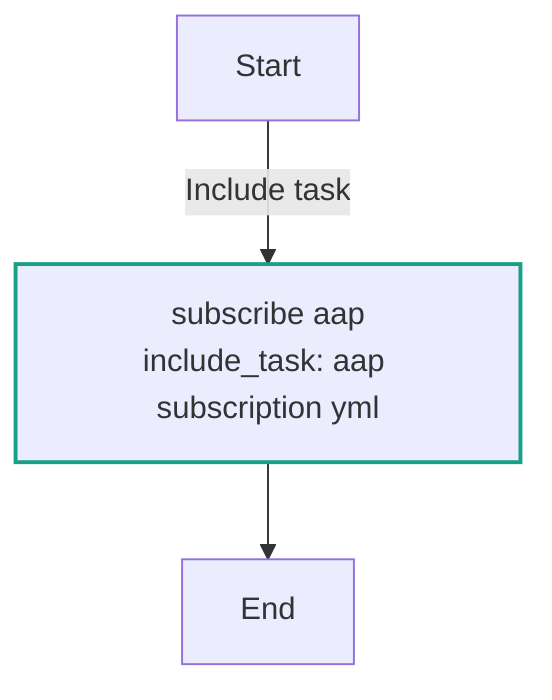
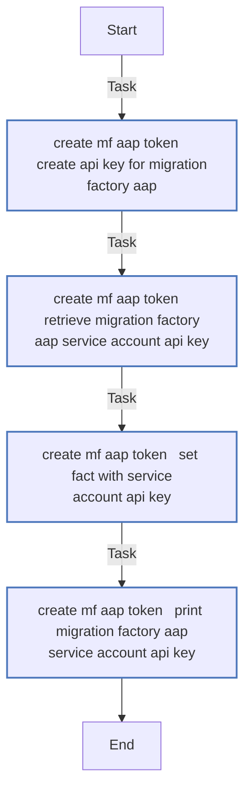
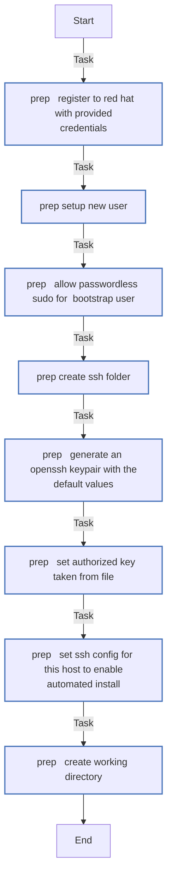
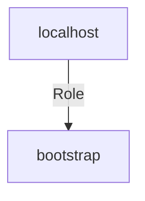

<!-- STATIC CONTENT START
Use this section for adding additional content to the README
This will not be overwritten by Docsible -->
# 📃 Role overview

<!-- STATIC CONTENT END -->
<!-- Everything below will be overwritten by Docsible -->
<!-- DOCSIBLE START -->
## bootstrap

```
Role belongs to infra/openshift_virtualization_migration
Namespace - infra
Collection - openshift_virtualization_migration
Version - 1.21.1
Repository - https://github.com/redhat-cop/openshift_virtualization_migration
```

Description: Initialization of the Ansible for OpenShift Virtualization Migration environment.

### Defaults

**These are static variables with lower priority**

#### File: defaults/main.yml

| Var          | Type         | Value       |Choices    |Required    | Title       |
|--------------|--------------|-------------|-------------|-------------|-------------|
| [`bootstrap_user`](defaults/main.yml#L6)   | str   | `ansible` |  None  |   true  |  This is the bootstrap user with sudo that should already exist on the bootsrap host |
| [`bootstrap_public_keys`](defaults/main.yml#L10)   | list   | `[]` |  None  |   false  |  Add a list of SSH public keys to be added to authorized_keys on the bootstrap VM |
| [`bootstrap_aap_setup_working_dir`](defaults/main.yml#L14)   | str   | `/home/ansible/bootstrap_dir` |  None  |   true  |  Working direcotry on the bootstrap host |
| [`bootstrap_rh_username`](defaults/main.yml#L18)   | str   | `{{ rh_username }}` |  None  |   true  |  Red Hat account login (this is used to attach your subs to controller) |
| [`bootstrap_rh_password`](defaults/main.yml#L22)   | str   | `{{ rh_password }}` |  None  |   true  |  Red Hat account password |
| [`bootstrap_rh_subscription_id`](defaults/main.yml#L26)   | str   | `` |  None  |   true  |  Red Hat subscription ID |
| [`bootstrap_rh_filter_product_name`](defaults/main.yml#L30)   | str   | `Red Hat Ansible Automation Platform` |  None  |   false  |  Red Hat subscription product name |
| [`bootstrap_rh_filter_support_level`](defaults/main.yml#L34)   | str   | `Self-Support` |  None  |   false  |  Red Hat subscription support level |
| [`bootstrap_controller_password`](defaults/main.yml#L38)   | str   | `{{ controller_password }}` |  None  |   true  |  The admin password for the controller |
| [`bootstrap_aap_setup_inst_verbosity`](defaults/main.yml#L42)   | int   | `1` |  None  |   false  |  Level from 0 - 5 for verbosity |
| [`bootstrap_aap_license_manifest`](defaults/main.yml#L46)   | str   | `` |  None  |   false  |  Location of the AAP license manifest file |
| [`bootstrap_controller_hostname`](defaults/main.yml#L55)   | str   | `{{ controller_hostname ¦ default(ansible_host) }}` |  None  |   false  |  Bootstrap controller hostname |
| [`bootstrap_controller_username`](defaults/main.yml#L59)   | str   | `admin` |  None  |   false  |  Bootstrap controller username |
| [`bootstrap_aap_version`](defaults/main.yml#L63)   | str   | `{{ aap_version ¦ default(2.5) }}` |  None  |   false  |  Bootstrap AAP Version |
| [`bootstrap_controller_validate_certs`](defaults/main.yml#L67)   | str   | `{{ controller_validate_certs ¦ default(false) }}` |  None  |   false  |  Validate Controller SSL certificates |
| [`bootstrap_license_file_submission_retries`](defaults/main.yml#L73)   | int   | `25` |  None  |   True  |  License File Submission Retries |
| [`bootstrap_license_file_submission_delay`](defaults/main.yml#L79)   | int   | `10` |  None  |   True  |  License File Submission Delay |

<summary><b>🖇️ Full descriptions for vars in defaults/main.yml</b></summary>
<br>
<b>`bootstrap_user`:</b> None
<br>
<b>`bootstrap_public_keys`:</b> None
<br>
<b>`bootstrap_aap_setup_working_dir`:</b> None
<br>
<b>`bootstrap_rh_username`:</b> None
<br>
<b>`bootstrap_rh_password`:</b> None
<br>
<b>`bootstrap_rh_subscription_id`:</b> None
<br>
<b>`bootstrap_rh_filter_product_name`:</b> None
<br>
<b>`bootstrap_rh_filter_support_level`:</b> None
<br>
<b>`bootstrap_controller_password`:</b> None
<br>
<b>`bootstrap_aap_setup_inst_verbosity`:</b> None
<br>
<b>`bootstrap_aap_license_manifest`:</b> None
<br>
<b>`bootstrap_controller_hostname`:</b> None
<br>
<b>`bootstrap_controller_username`:</b> None
<br>
<b>`bootstrap_aap_version`:</b> None
<br>
<b>`bootstrap_controller_validate_certs`:</b> None
<br>
<b>`bootstrap_license_file_submission_retries`:</b> None
<br>
<b>`bootstrap_license_file_submission_delay`:</b> None
<br>
<br>

### Tasks

#### File: tasks/main.yml

| Name | Module | Has Conditions |
| ---- | ------ | --------- |
| Subscribe AAP | `ansible.builtin.include_tasks` | False |

#### File: tasks/aap_subscription.yml

| Name | Module | Has Conditions |
| ---- | ------ | --------- |
| aap_subscription ¦ Get subscriptions with a filter | `block` | True |
| aap_subscription ¦ Query Subscription | `ansible.controller.subscriptions` | False |
| aap_subscription ¦ Set subscription ID based on bootstrap_subscription | `ansible.builtin.set_fact` | False |
| aap_subscription ¦ Attach to a subscription | `ansible.controller.license` | False |
| aap_subscription ¦ Verify License Manifest Exists | `block` | True |
| aap_subscription ¦ Check if license file exists | `ansible.builtin.stat` | False |
| aap_subscription ¦ Verify license file exists | `ansible.builtin.assert` | False |
| aap_subscription ¦ Read the License file | `ansible.builtin.slurp` | False |
| aap_subscription ¦ Apply license to AAP | `ansible.builtin.uri` | False |

#### File: tasks/create_mf_aap_token.yml

| Name | Module | Has Conditions |
| ---- | ------ | --------- |
| create_mf_aap_token ¦ Create API key for Migration Factory AAP | `redhat.openshift.k8s` | False |
| create_mf_aap_token ¦ Retrieve Migration Factory AAP Service Account API key | `kubernetes.core.k8s_info` | False |
| create_mf_aap_token ¦ Set fact with Service Account API key | `ansible.builtin.set_fact` | False |
| create_mf_aap_token ¦ Print Migration Factory AAP Service Account API key | `ansible.builtin.debug` | False |

#### File: tasks/prep.yml

| Name | Module | Has Conditions |
| ---- | ------ | --------- |
| prep ¦ Register to Red Hat with provided credentials | `community.general.redhat_subscription` | False |
| prep ¦ Setup new user | `ansible.builtin.user` | False |
| prep ¦ Allow passwordless sudo for '{{ bootstrap_user }}' | `ansible.builtin.copy` | False |
| prep ¦ Create SSH folder | `ansible.builtin.file` | False |
| prep ¦ Generate an OpenSSH keypair with the default values | `community.crypto.openssh_keypair` | False |
| prep ¦ Set authorized key taken from file | `ansible.posix.authorized_key` | False |
| prep ¦ Set SSH config for this host to enable automated install | `ansible.builtin.copy` | False |
| prep ¦ Create working directory | `ansible.builtin.file` | False |

## Task Flow Graphs

### Graph for main.yml



### Graph for create_mf_aap_token.yml



### Graph for prep.yml



### Graph for aap_subscription.yml

```mermaid
flowchart TD
Start
classDef block stroke:#3498db,stroke-width:2px;
classDef task stroke:#4b76bb,stroke-width:2px;
classDef includeTasks stroke:#16a085,stroke-width:2px;
classDef importTasks stroke:#34495e,stroke-width:2px;
classDef includeRole stroke:#2980b9,stroke-width:2px;
classDef importRole stroke:#699ba7,stroke-width:2px;
classDef includeVars stroke:#8e44ad,stroke-width:2px;
classDef rescue stroke:#665352,stroke-width:2px;

  Start-->|Block Start| aap_subscription___Get_subscriptions_with_a_filter0_block_start_0[[aap subscription   get subscriptions with a filter<br>When: **bootstrap rh subscription id   default     true   <br>trim   length    0 and bootstrap aap license<br>manifest   default     true    trim   length    0**]]:::block
  aap_subscription___Get_subscriptions_with_a_filter0_block_start_0-->|Task| aap_subscription___Query_Subscription0[aap subscription   query subscription]:::task
  aap_subscription___Query_Subscription0-->|Task| aap_subscription___Set_subscription_ID_based_on_bootstrap_subscription1[aap subscription   set subscription id based on<br>bootstrap subscription]:::task
  aap_subscription___Set_subscription_ID_based_on_bootstrap_subscription1-->|Task| aap_subscription___Attach_to_a_subscription2[aap subscription   attach to a subscription]:::task
  aap_subscription___Attach_to_a_subscription2-.->|End of Block| aap_subscription___Get_subscriptions_with_a_filter0_block_start_0
  aap_subscription___Attach_to_a_subscription2-->|Block Start| aap_subscription___Verify_License_Manifest_Exists1_block_start_0[[aap subscription   verify license manifest exists<br>When: **bootstrap aap license manifest   default     true <br>  trim   length   0**]]:::block
  aap_subscription___Verify_License_Manifest_Exists1_block_start_0-->|Task| aap_subscription___Check_if_license_file_exists0[aap subscription   check if license file exists]:::task
  aap_subscription___Check_if_license_file_exists0-->|Task| aap_subscription___Verify_license_file_exists1[aap subscription   verify license file exists]:::task
  aap_subscription___Verify_license_file_exists1-->|Task| aap_subscription___Read_the_License_file2[aap subscription   read the license file]:::task
  aap_subscription___Read_the_License_file2-->|Task| aap_subscription___Apply_license_to_AAP3[aap subscription   apply license to aap]:::task
  aap_subscription___Apply_license_to_AAP3-.->|End of Block| aap_subscription___Verify_License_Manifest_Exists1_block_start_0
  aap_subscription___Apply_license_to_AAP3-->End
```



## Playbook

```yml
---
- name: Test
  hosts: localhost
  remote_user: root
  roles:
    - bootstrap
...

```

## Playbook graph



## Author Information

OpenShift Virtualization Migration Contributors

## License

GPL-3.0-only

## Minimum Ansible Version

2.15.0

## Platforms

No platforms specified.

<!-- DOCSIBLE END -->