<!-- STATIC CONTENT START
Use this section for adding additional content to the README
This will not be overwritten by Docsible -->
# 📃 Role overview

<!-- STATIC CONTENT END -->
<!-- Everything below will be overwritten by Docsible -->
<!-- DOCSIBLE START -->
## create_mf_aap_token

```
Role belongs to infra/openshift_virtualization_migration
Namespace - infra
Collection - openshift_virtualization_migration
Version - 1.21.1
Repository - https://github.com/redhat-cop/openshift_virtualization_migration
```

Description: create_mf_aap_token

### Defaults

**These are static variables with lower priority**

#### File: defaults/main.yml

| Var          | Type         | Value       |Choices    |Required    | Title       |
|--------------|--------------|-------------|-------------|-------------|-------------|
| [`create_mf_aap_token_secure_logging`](defaults/main.yml#L2)   | str   | `{{ secure_logging ¦ default(true) }}` |  None  |   None  |  None |

<summary><b>🖇️ Full descriptions for vars in defaults/main.yml</b></summary>
<br>
<b>`create_mf_aap_token_secure_logging`:</b> None
<br>
<br>

### Tasks

#### File: tasks/main.yml

| Name | Module | Has Conditions |
| ---- | ------ | --------- |
| Initialize auth methods variable | `ansible.builtin.set_fact` | False |
| Ensure One OpenShift auth method provided | `ansible.builtin.fail` | True |
| Check whether OpenShift User/Password Enabled | `ansible.builtin.set_fact` | True |
| Check whether OpenShift Temporary API Key Enabled | `ansible.builtin.set_fact` | True |
| Check whether OpenShift API Key Provided | `ansible.builtin.set_fact` | True |
| Ensure multiple auth methods are not specified | `ansible.builtin.debug` | True |
| Use username and password to retrieve temporary API key | `block` | True |
| Retrieve temporary API key with username and password | `redhat.openshift.openshift_auth` | False |
| Set fact for temporary API key | `ansible.builtin.set_fact` | False |
| Create Service Account api key | `block` | True |
| Create API key for Migration Factory AAP | `redhat.openshift.k8s` | False |
| Retrieve Migration Factory AAP Service Account API key | `kubernetes.core.k8s_info` | False |
| Set fact with Service Account API key | `ansible.builtin.set_fact` | False |

## Task Flow Graphs

### Graph for main.yml

```mermaid
flowchart TD
Start
classDef block stroke:#3498db,stroke-width:2px;
classDef task stroke:#4b76bb,stroke-width:2px;
classDef includeTasks stroke:#16a085,stroke-width:2px;
classDef importTasks stroke:#34495e,stroke-width:2px;
classDef includeRole stroke:#2980b9,stroke-width:2px;
classDef importRole stroke:#699ba7,stroke-width:2px;
classDef includeVars stroke:#8e44ad,stroke-width:2px;
classDef rescue stroke:#665352,stroke-width:2px;

  Start-->|Task| Initialize_auth_methods_variable0[initialize auth methods variable]:::task
  Initialize_auth_methods_variable0-->|Task| Ensure_One_OpenShift_auth_method_provided1[ensure one openshift auth method provided<br>When: **openshift username   default     true    length   <br>0 or openshift password   default     true   <br>length    0 and openshift api key   default    <br>true    length    0 and openshift temporary api<br>key   default     true    length    0**]:::task
  Ensure_One_OpenShift_auth_method_provided1-->|Task| Check_whether_OpenShift_User_Password_Enabled2[check whether openshift user password enabled<br>When: **openshift username is defined and openshift<br>username   default     true    length   0 and<br>openshift password is defined and openshift<br>password   default     true    length   0**]:::task
  Check_whether_OpenShift_User_Password_Enabled2-->|Task| Check_whether_OpenShift_Temporary_API_Key_Enabled3[check whether openshift temporary api key enabled<br>When: **openshift temporary api key is defined and<br>openshift temporary api key   default     true   <br>length   0**]:::task
  Check_whether_OpenShift_Temporary_API_Key_Enabled3-->|Task| Check_whether_OpenShift_API_Key_Provided4[check whether openshift api key provided<br>When: **openshift api key is defined and openshift api key<br>  default     true    length   0**]:::task
  Check_whether_OpenShift_API_Key_Provided4-->|Task| Ensure_multiple_auth_methods_are_not_specified5[ensure multiple auth methods are not specified<br>When: **openshift enabled auth methods   length    1**]:::task
  Ensure_multiple_auth_methods_are_not_specified5-->|Block Start| Use_username_and_password_to_retrieve_temporary_API_key6_block_start_0[[use username and password to retrieve temporary<br>api key<br>When: **openshift username is defined and openshift<br>username   default     true    length   0 and<br>openshift password is defined and openshift<br>password   default     true    length   0 and<br>openshift api key is not defined**]]:::block
  Use_username_and_password_to_retrieve_temporary_API_key6_block_start_0-->|Task| Retrieve_temporary_API_key_with_username_and_password0[retrieve temporary api key with username and<br>password]:::task
  Retrieve_temporary_API_key_with_username_and_password0-->|Task| Set_fact_for_temporary_API_key1[set fact for temporary api key]:::task
  Set_fact_for_temporary_API_key1-.->|End of Block| Use_username_and_password_to_retrieve_temporary_API_key6_block_start_0
  Set_fact_for_temporary_API_key1-->|Block Start| Create_Service_Account_api_key7_block_start_0[[create service account api key<br>When: **openshift api key   default     true    length   <br>0**]]:::block
  Create_Service_Account_api_key7_block_start_0-->|Task| Create_API_key_for_Migration_Factory_AAP0[create api key for migration factory aap]:::task
  Create_API_key_for_Migration_Factory_AAP0-->|Task| Retrieve_Migration_Factory_AAP_Service_Account_API_key1[retrieve migration factory aap service account api<br>key]:::task
  Retrieve_Migration_Factory_AAP_Service_Account_API_key1-->|Task| Set_fact_with_Service_Account_API_key2[set fact with service account api key]:::task
  Set_fact_with_Service_Account_API_key2-.->|End of Block| Create_Service_Account_api_key7_block_start_0
  Set_fact_with_Service_Account_API_key2-->End
```



## Author Information

OpenShift Virtualization Migration Contributors

## License

GPL-3.0-only

## Minimum Ansible Version

2.15.0

## Platforms

No platforms specified.

<!-- DOCSIBLE END -->