<!-- STATIC CONTENT START
Use this section for adding additional content to the README
This will not be overwritten by Docsible -->
# 📃 Role overview

<!-- STATIC CONTENT END -->
<!-- Everything below will be overwritten by Docsible -->
<!-- DOCSIBLE START -->
## mtv_management

```
Role belongs to infra/openshift_virtualization_migration
Namespace - infra
Collection - openshift_virtualization_migration
Version - 1.21.1
Repository - https://github.com/redhat-cop/openshift_virtualization_migration
```

Description: Management of the Migration Toolkit for Virtualization (MTV).

### Defaults

**These are static variables with lower priority**

#### File: defaults/main.yml

| Var          | Type         | Value       |Choices    |Required    | Title       |
|--------------|--------------|-------------|-------------|-------------|-------------|
| [`mtv_management_namespace`](defaults/main.yml#L7)   | str   | `openshift-mtv` |  None  |   True  |  Default MTV Namespace |
| [`mtv_management_provider_namespace`](defaults/main.yml#L11)   | str   | `{{ mtv_management_namespace }}` |  None  |   True  |  MTV Provider Namespace |
| [`mtv_management_migration_namespace`](defaults/main.yml#L15)   | str   | `{{ mtv_management_namespace }}` |  None  |   True  |  MTV Migration Namespace |
| [`mtv_management_map_providers`](defaults/main.yml#L21)   | bool   | `True` |  None  |   False  |  Map Providers Boolean |
| [`mtv_management_map_storage`](defaults/main.yml#L25)   | bool   | `True` |  None  |   False  |  Map Storage Boolean |
| [`mtv_management_map_networks`](defaults/main.yml#L29)   | bool   | `True` |  None  |   False  |  Map Networks Boolean |
| [`mtv_management_inventory_url`](defaults/main.yml#L35)   | str   | `` |  None  |   False  |  Inventory URL |
| [`mtv_management_inventory_route_name`](defaults/main.yml#L39)   | str   | `forklift-inventory` |  None  |   True  |  Inventory Route Name |
| [`mtv_management_inventory_retrieval_method`](defaults/main.yml#L45)   | str   | `exec` |  None  |   True  |  None |
| [`mtv_management_migration_targets`](defaults/main.yml#L51)   | list   | `[]` |  None  |   False  |  MTV Migration Targets |
| [`mtv_management_vmware_provider_default_name`](defaults/main.yml#L72)   | str   | `vmware` |  None  |   True  |  MTV VMware Provider Name |
| [`mtv_management_vmware_provider_default_sdk_endpoint`](defaults/main.yml#L76)   | str   | `/sdk` |  None  |   True  |  MTV SDK Endpoint |
| [`mtv_management_ovirt_provider_default_name`](defaults/main.yml#L80)   | str   | `ovirt` |  None  |   True  |  MTV Ovirt Provider Name |
| [`mtv_management_ovirt_provider_default_sdk_endpoint`](defaults/main.yml#L84)   | str   | `/ovirt-engine/api` |  None  |   True  |  MTV SDK Endpoint |
| [`mtv_management_vmware_provider_insecure_skip_tls_verify`](defaults/main.yml#L88)   | bool   | `True` |  None  |   False  |  MTV Skip TLS |
| [`mtv_management_default_storage_class`](defaults/main.yml#L92)   | str   | `` |  None  |   False  |  MTV Default StorageClass |
| [`mtv_management_source_target`](defaults/main.yml#L98)   | str   | `vmware` |  None  |   True  |  MTV Source Target |
| [`mtv_management_destination_target`](defaults/main.yml#L102)   | str   | `host` |  None  |   True  |  MTV Destination Target |
| [`mtv_management_nad_source_portgroup_annotation`](defaults/main.yml#L107)   | str   | `infra.openshift-virtualization-migration/source-portgroup` |  None  |   True  |  MTV NAD Source Portgroup Annotation |
| [`mtv_management_vmware_vddk_secret_name`](defaults/main.yml#L112)   | str   | `{{ mtv_management_source_target }}-vddk` |  None  |   True  |  VDDK Secret Name |
| [`mtv_management_vmware_vddk_init_image`](defaults/main.yml#L117)   | str   | `` |  None  |   False  |  MTV VDDK Image |
| [`mtv_management_vmware_vddk_init_image_username`](defaults/main.yml#L122)   | str   | `` |  None  |   False  |  VDDK Image Username |
| [`mtv_management_vmware_vddk_init_image_password`](defaults/main.yml#L127)   | str   | `` |  None  |   False  |  VDDK Image Password |
| [`mtv_management_vmware_vddk_init_image_credentials_secret`](defaults/main.yml#L132)   | str   | `` |  None  |   False  |  VDDK Credentials Secret |
| [`mtv_management_vmware_vddk_init_image_service_account`](defaults/main.yml#L137)   | str   | `default` |  None  |   False  |  VDDK Service Account |
| [`mtv_management_storage_map_overrides`](defaults/main.yml#L143)   | list   | `[]` |  None  |   False  |  MTV Storage Map Override |
| [`mtv_management_network_map_overrides`](defaults/main.yml#L153)   | list   | `[]` |  None  |   False  |  MTV Network Map Overrides |

<summary><b>🖇️ Full descriptions for vars in defaults/main.yml</b></summary>
<br>
<b>`mtv_management_namespace`:</b> The default namespace to use if not specified
<br>
<b>`mtv_management_provider_namespace`:</b> The provider namespace to use
<br>
<b>`mtv_management_migration_namespace`:</b> The migration namespace to use
<br>
<b>`mtv_management_map_providers`:</b> Determines whether to include the mtv_providers task file
<br>
<b>`mtv_management_map_storage`:</b> Determines whether to include the mtv_maps task file
<br>
<b>`mtv_management_map_networks`:</b> Determines whether to include the mtv_maps task file
<br>
<b>`mtv_management_inventory_url`:</b> Inventory URL
<br>
<b>`mtv_management_inventory_route_name`:</b> Inventory Route Name
<br>
<b>`mtv_management_inventory_retrieval_method`:</b> None
<br>
<b>`mtv_management_migration_targets`:</b> None
<br>
<b>`mtv_management_vmware_provider_default_name`:</b> Default name for VMware provider
<br>
<b>`mtv_management_vmware_provider_default_sdk_endpoint`:</b> VMware provider endpoint
<br>
<b>`mtv_management_ovirt_provider_default_name`:</b> Default name for Ovirt provider
<br>
<b>`mtv_management_ovirt_provider_default_sdk_endpoint`:</b> Ovirt provider endpoint
<br>
<b>`mtv_management_vmware_provider_insecure_skip_tls_verify`:</b> Whether to skip TLS verify
<br>
<b>`mtv_management_default_storage_class`:</b> The StorageClass to use by default
<br>
<b>`mtv_management_source_target`:</b> Source target
<br>
<b>`mtv_management_destination_target`:</b> Destination target
<br>
<b>`mtv_management_nad_source_portgroup_annotation`:</b> The annotation to use for the Network Attachment Definition
<br>
<b>`mtv_management_vmware_vddk_secret_name`:</b> Name of the Created Secret for VDDK Credentials
<br>
<b>`mtv_management_vmware_vddk_init_image`:</b> The image to use for VDDK
<br>
<b>`mtv_management_vmware_vddk_init_image_username`:</b> Username for the VDDK Image
<br>
<b>`mtv_management_vmware_vddk_init_image_password`:</b> Password for the VDDK Image
<br>
<b>`mtv_management_vmware_vddk_init_image_credentials_secret`:</b> Secret Containing Credentials for the VDDK Image
<br>
<b>`mtv_management_vmware_vddk_init_image_service_account`:</b> Service Account to Associate the VDDK Init Image Pull Secret
<br>
<b>`mtv_management_storage_map_overrides`:</b> Overrides for the storage map
<br>
<b>`mtv_management_network_map_overrides`:</b> Overrides for the network map
<br>
<br>

### Tasks

#### File: tasks/main.yml

| Name | Module | Has Conditions |
| ---- | ------ | --------- |
| Configure MTV Providers | `ansible.builtin.include_tasks` | True |
| Configure MTV Maps | `ansible.builtin.include_tasks` | True |

#### File: tasks/_mtv_network_map.yml

| Name | Module | Has Conditions |
| ---- | ------ | --------- |
| _mtv_network_map ¦ Initialize data structures | `ansible.builtin.set_fact` | False |
| _mtv_network_map ¦ Verify Network Map Overrides do not contain both includes and excludes | `ansible.builtin.fail` | True |
| _mtv_network_map ¦ Query for VMWare Networks from Source Provider | `ansible.builtin.include_tasks` | True |
| _mtv_network_map ¦ Query for Ovirt Networks from Source Provider | `ansible.builtin.include_tasks` | True |
| _mtv_network_map ¦ Query for NetworkAttachmentDefinitions from Destination Provider | `ansible.builtin.include_tasks` | False |
| _mtv_network_map ¦ Process VMware Networks | `ansible.builtin.include_tasks` | True |
| _mtv_network_map ¦ Process Ovirt Networks | `ansible.builtin.include_tasks` | True |
| _mtv_network_map ¦ Template NetworkMap Map | `ansible.builtin.set_fact` | False |
| _mtv_network_map ¦ Create Network Map | `redhat.openshift.k8s` | False |

#### File: tasks/_mtv_network_map_process_network.yml

| Name | Module | Has Conditions |
| ---- | ------ | --------- |
| _mtv_network_map_process_network ¦ Set VMware NetworkMap Variables | `ansible.builtin.set_fact` | True |
| _mtv_network_map_process_network ¦ Set Ovirt NetworkMap Variables | `ansible.builtin.set_fact` | True |
| _mtv_network_map_process_network ¦ Locate VMware NetworkAttachmentDefinition | `ansible.builtin.set_fact` | True |
| _mtv_network_map_process_network ¦ Locate Ovirt NetworkAttachmentDefinition | `ansible.builtin.set_fact` | True |
| _mtv_network_map_process_network ¦ Validate Found VMware NetworkAttachmentDefinitions | `ansible.builtin.assert` | True |
| _mtv_network_map_process_network ¦ Validate Found Ovirt NetworkAttachmentDefinitions | `ansible.builtin.assert` | True |
| _mtv_network_map_process_network ¦ Template NetworkMap Map | `ansible.builtin.set_fact` | False |
| _mtv_network_map_process_network ¦ Add VMWare NetworkMaps Map to Dict | `ansible.builtin.set_fact` | True |
| _mtv_network_map_process_network ¦ Add Ovirt NetworkMaps Map to Dict | `ansible.builtin.set_fact` | True |

#### File: tasks/_mtv_provider_ovirt.yml

| Name | Module | Has Conditions |
| ---- | ------ | --------- |
| _mtv_provider_ovirt ¦ Verify credential name provided when more than one credential specified | `ansible.builtin.assert` | True |
| _mtv_provider_ovirt ¦ Set provider name | `ansible.builtin.set_fact` | False |
| _mtv_provider_ovirt ¦ Validate required Ovirt provider Properties | `ansible.builtin.assert` | False |
| _mtv_provider_ovirt ¦ Set Ovirt Provider URL | `ansible.builtin.set_fact` | False |
| _mtv_provider_ovirt ¦ MTV Certificate | `block` | True |
| _mtv_provider_ovirt ¦ Retrieve Remote Ovirt Provider Certificate | `community.crypto.get_certificate` | False |
| _mtv_provider_ovirt ¦ Set Ovirt Provider Certificate | `ansible.builtin.set_fact` | False |
| _mtv_provider_ovirt ¦ Set Provider Secret Name/Namespace (Configuration) | `ansible.builtin.set_fact` | True |
| _mtv_provider_ovirt ¦ Configure Provider Secret | `block` | True |
| _mtv_provider_ovirt ¦ Set Provider Secret Name/Namespace (Generated) | `ansible.builtin.set_fact` | True |
| _mtv_provider_ovirt ¦ Create Ovirt credentials secret | `redhat.openshift.k8s` | True |
| _mtv_provider_ovirt ¦ Create Ovirt Provider resource | `redhat.openshift.k8s` | False |

#### File: tasks/_mtv_provider_vmware.yml

| Name | Module | Has Conditions |
| ---- | ------ | --------- |
| _mtv_provider_vmware ¦ Verify credential name provided when more than one credential specified | `ansible.builtin.assert` | True |
| _mtv_provider_vmware ¦ Set provider name | `ansible.builtin.set_fact` | False |
| _mtv_provider_vmware ¦ Validate required VMware provider Properties | `ansible.builtin.assert` | False |
| _mtv_provider_vmware ¦ Set VMware Provider URL | `ansible.builtin.set_fact` | False |
| _mtv_provider_vmware ¦ MTV Certificate | `block` | True |
| _mtv_provider_vmware ¦ Retrieve Remote VMware Provider Certificate | `community.crypto.get_certificate` | False |
| _mtv_provider_vmware ¦ Set VMware Provider Certificate | `ansible.builtin.set_fact` | False |
| _mtv_provider_vmware ¦ Set Provider Secret Name/Namespace (Configuration) | `ansible.builtin.set_fact` | True |
| _mtv_provider_vmware ¦ Configure Provider Secret | `block` | True |
| _mtv_provider_vmware ¦ Set Provider Secret Name/Namespace (Generated) | `ansible.builtin.set_fact` | True |
| _mtv_provider_vmware ¦ Create VMware credentials secret | `redhat.openshift.k8s` | True |
| _mtv_provider_vmware ¦ Create VMware Provider resource | `redhat.openshift.k8s` | False |

#### File: tasks/_mtv_storage_map.yml

| Name | Module | Has Conditions |
| ---- | ------ | --------- |
| _mtv_storage_map ¦ Initialize data structures | `ansible.builtin.set_fact` | False |
| _mtv_storage_map ¦ Verify Storage Map Overrides do not contain both includes and excludes | `ansible.builtin.fail` | True |
| _mtv_storage_map ¦ Query for Storage Classes from Destination Provider | `ansible.builtin.include_tasks` | False |
| _mtv_storage_map ¦ Determine Destination Storage Class | `ansible.builtin.set_fact` | True |
| _mtv_storage_map ¦ Query for Datastores from Destination Provider | `ansible.builtin.include_tasks` | True |
| _mtv_storage_map ¦ Query for Datastores from Destination Provider | `ansible.builtin.include_tasks` | True |
| _mtv_storage_map ¦ Process VMware Datastores | `ansible.builtin.include_tasks` | True |
| _mtv_storage_map ¦ Process Ovirt Datastores | `ansible.builtin.include_tasks` | True |
| _mtv_storage_map ¦ Template StorageMap Map | `ansible.builtin.set_fact` | False |
| _mtv_storage_map ¦ Create Storage Map | `redhat.openshift.k8s` | False |

#### File: tasks/_mtv_storage_map_process_datastore.yml

| Name | Module | Has Conditions |
| ---- | ------ | --------- |
| _mtv_storage_map_process_datastore ¦ Set VMware StorageMap Variables | `ansible.builtin.set_fact` | True |
| _mtv_storage_map_process_datastore ¦ Set Ovirt StorageMap Variables | `ansible.builtin.set_fact` | True |
| _mtv_storage_map_process_datastore ¦ Set VMware StorageMap StorageClass from Overrides | `ansible.builtin.set_fact` | True |
| _mtv_storage_map_process_datastore ¦ Set Ovirt StorageMap StorageClass from Overrides | `ansible.builtin.set_fact` | True |
| _mtv_storage_map_process_datastore ¦ Verify VMWare Destination Storage Class | `ansible.builtin.assert` | True |
| _mtv_storage_map_process_datastore ¦ Verify Ovirt Destination Storage Class | `ansible.builtin.assert` | True |
| _mtv_storage_map_process_datastore ¦ Template StorageMap Map | `ansible.builtin.set_fact` | False |
| _mtv_storage_map_process_datastore ¦ Add VMware StorageMap Map to Dict | `ansible.builtin.set_fact` | True |
| _mtv_storage_map_process_datastore ¦ Add Ovirt StorageMap Map to Dict | `ansible.builtin.set_fact` | True |

#### File: tasks/mtv_maps.yml

| Name | Module | Has Conditions |
| ---- | ------ | --------- |
| mtv_maps ¦ Retrieve Configured providers | `ansible.builtin.include_tasks` | False |
| mtv_maps ¦ Verify VMWare Source Provider Exists | `ansible.builtin.assert` | True |
| mtv_maps ¦ Verify Ovirt Source Provider Exists | `ansible.builtin.assert` | True |
| mtv_maps ¦ Destination OpenShift Destination Provider Exists | `ansible.builtin.assert` | False |
| mtv_maps ¦ Configure MTV Storage Maps | `ansible.builtin.include_tasks` | True |
| mtv_maps ¦ Configure MTV Network Map | `ansible.builtin.include_tasks` | True |

#### File: tasks/mtv_providers.yml

| Name | Module | Has Conditions |
| ---- | ------ | --------- |
| mtv_providers ¦ Verify ForkliftController status | `kubernetes.core.k8s_info` | True |
| mtv_providers ¦ Debug | `ansible.builtin.debug` | False |
| mtv_providers ¦ Configure vmware providers | `ansible.builtin.include_tasks` | True |
| mtv_providers ¦ Configure ovirt providers | `ansible.builtin.include_tasks` | True |

#### File: tasks/mtv_query_inventory.yml

| Name | Module | Has Conditions |
| ---- | ------ | --------- |
| mtv_query_inventory ¦ Verify valid inventory query retrieval method | `ansible.builtin.assert` | False |
| mtv_query_inventory ¦ Verify valid query parameters | `ansible.builtin.assert` | False |
| mtv_query_inventory ¦ Exec inventory retrieval method | `block` | True |
| mtv_query_inventory ¦ Obtain the name of a Running Forklift Inventory Pod | `kubernetes.core.k8s_info` | False |
| mtv_query_inventory ¦ Set name of the MTV Inventory Pod | `ansible.builtin.set_fact` | False |
| mtv_query_inventory ¦ Execute Query (exec) | `kubernetes.core.k8s_exec` | False |
| mtv_query_inventory ¦ Set Result Fact | `ansible.builtin.set_fact` | False |
| mtv_query_inventory ¦ Rest inventory retrieval method | `block` | True |
| mtv_query_inventory ¦ Locate MTV Route | `kubernetes.core.k8s_info` | True |
| mtv_query_inventory ¦ Verify route found | `ansible.builtin.assert` | False |
| mtv_query_inventory ¦ Execute Query (rest) | `ansible.builtin.uri` | False |
| mtv_query_inventory ¦ Set Result Fact | `ansible.builtin.set_fact` | False |

#### File: tasks/mtv_vddk.yml

| Name | Module | Has Conditions |
| ---- | ------ | --------- |
| mtv_vddk ¦ Verify VDDK Secret Parameters Provided | `ansible.builtin.assert` | False |
| mtv_vddk ¦ Verify VDDK Image Parameters Provided | `ansible.builtin.assert` | False |
| mtv_vddk ¦ Create VDDK Pull Secret | `kubernetes.core.k8s` | False |
| mtv_vddk ¦ Manage VDDK Provided Credentials | `block` | True |
| mtv_vddk ¦ Retrieve Provided VDDK Credentials Secret | `kubernetes.core.k8s_info` | False |
| mtv_vddk ¦ Verify Provided VDDK Credentials Secret | `ansible.builtin.assert` | False |
| mtv_vddk ¦ Update Pull Secret Name for Provided Credential | `ansible.builtin.set_fact` | False |
| mtv_vddk ¦ Retrieve VDDK Service Account | `kubernetes.core.k8s_info` | False |
| mtv_vddk ¦ Patch Service Account with VDDK pull secret | `kubernetes.core.k8s_json_patch` | True |

## Task Flow Graphs

### Graph for main.yml

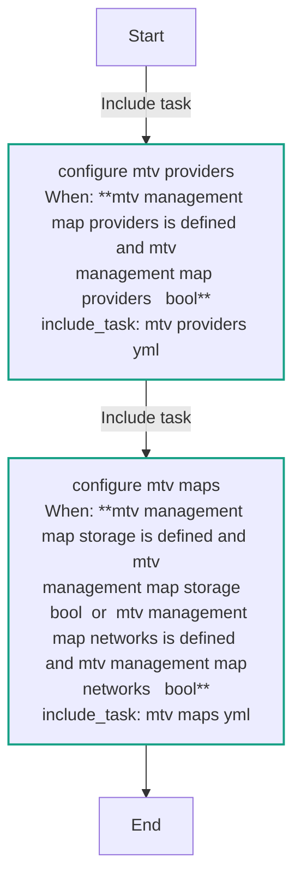

### Graph for mtv_maps.yml

```mermaid
flowchart TD
Start
classDef block stroke:#3498db,stroke-width:2px;
classDef task stroke:#4b76bb,stroke-width:2px;
classDef includeTasks stroke:#16a085,stroke-width:2px;
classDef importTasks stroke:#34495e,stroke-width:2px;
classDef includeRole stroke:#2980b9,stroke-width:2px;
classDef importRole stroke:#699ba7,stroke-width:2px;
classDef includeVars stroke:#8e44ad,stroke-width:2px;
classDef rescue stroke:#665352,stroke-width:2px;

  Start-->|Include task| mtv_maps___Retrieve_Configured_providers_mtv_query_inventory_yml_0[mtv maps   retrieve configured providers<br>include_task: mtv query inventory yml]:::includeTasks
  mtv_maps___Retrieve_Configured_providers_mtv_query_inventory_yml_0-->|Task| mtv_maps___Verify_VMWare_Source_Provider_Exists1[mtv maps   verify vmware source provider exists<br>When: **vsphere  in provider**]:::task
  mtv_maps___Verify_VMWare_Source_Provider_Exists1-->|Task| mtv_maps___Verify_Ovirt_Source_Provider_Exists2[mtv maps   verify ovirt source provider exists<br>When: **ovirt  in provider**]:::task
  mtv_maps___Verify_Ovirt_Source_Provider_Exists2-->|Task| mtv_maps___Destination_OpenShift_Destination_Provider_Exists3[mtv maps   destination openshift destination<br>provider exists]:::task
  mtv_maps___Destination_OpenShift_Destination_Provider_Exists3-->|Include task| mtv_maps___Configure_MTV_Storage_Maps__mtv_storage_map_yml_4[mtv maps   configure mtv storage maps<br>When: **mtv management map storage is defined and mtv<br>management map storage   bool**<br>include_task:  mtv storage map yml]:::includeTasks
  mtv_maps___Configure_MTV_Storage_Maps__mtv_storage_map_yml_4-->|Include task| mtv_maps___Configure_MTV_Network_Map__mtv_network_map_yml_5[mtv maps   configure mtv network map<br>When: **mtv management map networks is defined and mtv<br>management map networks   bool**<br>include_task:  mtv network map yml]:::includeTasks
  mtv_maps___Configure_MTV_Network_Map__mtv_network_map_yml_5-->End
```

### Graph for _mtv_storage_map.yml

```mermaid
flowchart TD
Start
classDef block stroke:#3498db,stroke-width:2px;
classDef task stroke:#4b76bb,stroke-width:2px;
classDef includeTasks stroke:#16a085,stroke-width:2px;
classDef importTasks stroke:#34495e,stroke-width:2px;
classDef includeRole stroke:#2980b9,stroke-width:2px;
classDef importRole stroke:#699ba7,stroke-width:2px;
classDef includeVars stroke:#8e44ad,stroke-width:2px;
classDef rescue stroke:#665352,stroke-width:2px;

  Start-->|Task| _mtv_storage_map___Initialize_data_structures0[ mtv storage map   initialize data structures]:::task
  _mtv_storage_map___Initialize_data_structures0-->|Task| _mtv_storage_map___Verify_Storage_Map_Overrides_do_not_contain_both_includes_and_excludes1[ mtv storage map   verify storage map overrides do<br>not contain both includes and excludes<br>When: **mtv management storage map overrides is defined<br>and mtv management storage map overrides  <br>selectattr  include    defined     list   length  <br>0 and mtv management storage map overrides  <br>selectattr  exclude    defined     list   length  <br>0**]:::task
  _mtv_storage_map___Verify_Storage_Map_Overrides_do_not_contain_both_includes_and_excludes1-->|Include task| _mtv_storage_map___Query_for_Storage_Classes_from_Destination_Provider_mtv_query_inventory_yml_2[ mtv storage map   query for storage classes from<br>destination provider<br>include_task: mtv query inventory yml]:::includeTasks
  _mtv_storage_map___Query_for_Storage_Classes_from_Destination_Provider_mtv_query_inventory_yml_2-->|Task| _mtv_storage_map___Determine_Destination_Storage_Class3[ mtv storage map   determine destination storage<br>class<br>When: **mtv management default storage class is not<br>defined or mtv management default storage class  <br>default     true    trim   length    0 and item<br>object metadata annotations is defined and   item<br>object metadata annotations  storageclass<br>kubernetes io is default class     default  false <br>   string   lower      true**]:::task
  _mtv_storage_map___Determine_Destination_Storage_Class3-->|Include task| _mtv_storage_map___Query_for_Datastores_from_Destination_Provider_mtv_query_inventory_yml_4[ mtv storage map   query for datastores from<br>destination provider<br>When: **ovirt  in provider**<br>include_task: mtv query inventory yml]:::includeTasks
  _mtv_storage_map___Query_for_Datastores_from_Destination_Provider_mtv_query_inventory_yml_4-->|Include task| _mtv_storage_map___Query_for_Datastores_from_Destination_Provider_mtv_query_inventory_yml_5[ mtv storage map   query for datastores from<br>destination provider<br>When: **vsphere  in provider**<br>include_task: mtv query inventory yml]:::includeTasks
  _mtv_storage_map___Query_for_Datastores_from_Destination_Provider_mtv_query_inventory_yml_5-->|Include task| _mtv_storage_map___Process_VMware_Datastores__mtv_storage_map_process_datastore_yml_6[ mtv storage map   process vmware datastores<br>When: **vsphere  in provider and mtv destination<br>datastores is defined and mtv destination<br>datastores   length   0**<br>include_task:  mtv storage map process datastore yml]:::includeTasks
  _mtv_storage_map___Process_VMware_Datastores__mtv_storage_map_process_datastore_yml_6-->|Include task| _mtv_storage_map___Process_Ovirt_Datastores__mtv_storage_map_process_datastore_yml_7[ mtv storage map   process ovirt datastores<br>When: **ovirt  in provider and mtv destination datastores<br>is defined and mtv destination datastores   length<br>  0**<br>include_task:  mtv storage map process datastore yml]:::includeTasks
  _mtv_storage_map___Process_Ovirt_Datastores__mtv_storage_map_process_datastore_yml_7-->|Task| _mtv_storage_map___Template_StorageMap_Map8[ mtv storage map   template storagemap map]:::task
  _mtv_storage_map___Template_StorageMap_Map8-->|Task| _mtv_storage_map___Create_Storage_Map9[ mtv storage map   create storage map]:::task
  _mtv_storage_map___Create_Storage_Map9-->End
```

### Graph for _mtv_storage_map_process_datastore.yml

```mermaid
flowchart TD
Start
classDef block stroke:#3498db,stroke-width:2px;
classDef task stroke:#4b76bb,stroke-width:2px;
classDef includeTasks stroke:#16a085,stroke-width:2px;
classDef importTasks stroke:#34495e,stroke-width:2px;
classDef includeRole stroke:#2980b9,stroke-width:2px;
classDef importRole stroke:#699ba7,stroke-width:2px;
classDef includeVars stroke:#8e44ad,stroke-width:2px;
classDef rescue stroke:#665352,stroke-width:2px;

  Start-->|Task| _mtv_storage_map_process_datastore___Set_VMware_StorageMap_Variables0[ mtv storage map process datastore   set vmware<br>storagemap variables<br>When: **mtv vmware datastore is defined**]:::task
  _mtv_storage_map_process_datastore___Set_VMware_StorageMap_Variables0-->|Task| _mtv_storage_map_process_datastore___Set_Ovirt_StorageMap_Variables1[ mtv storage map process datastore   set ovirt<br>storagemap variables<br>When: **mtv ovirt datastore is defined**]:::task
  _mtv_storage_map_process_datastore___Set_Ovirt_StorageMap_Variables1-->|Task| _mtv_storage_map_process_datastore___Set_VMware_StorageMap_StorageClass_from_Overrides2[ mtv storage map process datastore   set vmware<br>storagemap storageclass from overrides<br>When: **mtv vmware datastore is defined and  storageclass <br>in mtv management mtv vmware datastore overrides<br>and mtv management mtv vmware datastore overrides<br>storageclass   default     true    trim   length  <br>0**]:::task
  _mtv_storage_map_process_datastore___Set_VMware_StorageMap_StorageClass_from_Overrides2-->|Task| _mtv_storage_map_process_datastore___Set_Ovirt_StorageMap_StorageClass_from_Overrides3[ mtv storage map process datastore   set ovirt<br>storagemap storageclass from overrides<br>When: **mtv ovirt datastore is defined and  storageclass <br>in mtv management mtv ovirt datastore overrides<br>and mtv management mtv ovirt datastore overrides<br>storageclass   default     true    trim   length  <br>0**]:::task
  _mtv_storage_map_process_datastore___Set_Ovirt_StorageMap_StorageClass_from_Overrides3-->|Task| _mtv_storage_map_process_datastore___Verify_VMWare_Destination_Storage_Class4[ mtv storage map process datastore   verify vmware<br>destination storage class<br>When: **mtv vmware datastore is defined**]:::task
  _mtv_storage_map_process_datastore___Verify_VMWare_Destination_Storage_Class4-->|Task| _mtv_storage_map_process_datastore___Verify_Ovirt_Destination_Storage_Class5[ mtv storage map process datastore   verify ovirt<br>destination storage class<br>When: **mtv ovirt datastore is defined**]:::task
  _mtv_storage_map_process_datastore___Verify_Ovirt_Destination_Storage_Class5-->|Task| _mtv_storage_map_process_datastore___Template_StorageMap_Map6[ mtv storage map process datastore   template<br>storagemap map]:::task
  _mtv_storage_map_process_datastore___Template_StorageMap_Map6-->|Task| _mtv_storage_map_process_datastore___Add_VMware_StorageMap_Map_to_Dict7[ mtv storage map process datastore   add vmware<br>storagemap map to dict<br>When: **mtv vmware datastore is defined and    include  in<br>mtv management mtv vmware datastore overrides and<br>mtv management storage map overrides   selectattr <br>include    defined     list   length   0  or  mtv<br>management storage map overrides   selectattr <br>include    defined     list   length    0 and mtv<br>management storage map overrides   selectattr <br>exclude    defined     list   length    0   or  <br>exclude  not in mtv management mtv vmware<br>datastore overrides and mtv management storage map<br>overrides   selectattr  exclude    defined    <br>list   length   0**]:::task
  _mtv_storage_map_process_datastore___Add_VMware_StorageMap_Map_to_Dict7-->|Task| _mtv_storage_map_process_datastore___Add_Ovirt_StorageMap_Map_to_Dict8[ mtv storage map process datastore   add ovirt<br>storagemap map to dict<br>When: **mtv ovirt datastore is defined and    include  in<br>mtv management mtv ovirt datastore overrides and<br>mtv management storage map overrides   selectattr <br>include    defined     list   length   0  or  mtv<br>management storage map overrides   selectattr <br>include    defined     list   length    0 and mtv<br>management storage map overrides   selectattr <br>exclude    defined     list   length    0   or  <br>exclude  not in mtv management mtv ovirt datastore<br>overrides and mtv management storage map overrides<br>  selectattr  exclude    defined     list   length<br>  0**]:::task
  _mtv_storage_map_process_datastore___Add_Ovirt_StorageMap_Map_to_Dict8-->End
```

### Graph for mtv_providers.yml

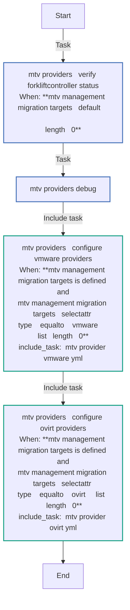

### Graph for mtv_query_inventory.yml

```mermaid
flowchart TD
Start
classDef block stroke:#3498db,stroke-width:2px;
classDef task stroke:#4b76bb,stroke-width:2px;
classDef includeTasks stroke:#16a085,stroke-width:2px;
classDef importTasks stroke:#34495e,stroke-width:2px;
classDef includeRole stroke:#2980b9,stroke-width:2px;
classDef importRole stroke:#699ba7,stroke-width:2px;
classDef includeVars stroke:#8e44ad,stroke-width:2px;
classDef rescue stroke:#665352,stroke-width:2px;

  Start-->|Task| mtv_query_inventory___Verify_valid_inventory_query_retrieval_method0[mtv query inventory   verify valid inventory query<br>retrieval method]:::task
  mtv_query_inventory___Verify_valid_inventory_query_retrieval_method0-->|Task| mtv_query_inventory___Verify_valid_query_parameters1[mtv query inventory   verify valid query<br>parameters]:::task
  mtv_query_inventory___Verify_valid_query_parameters1-->|Block Start| mtv_query_inventory___Exec_inventory_retrieval_method2_block_start_0[[mtv query inventory   exec inventory retrieval<br>method<br>When: **mtv management inventory retrieval method     exec<br>**]]:::block
  mtv_query_inventory___Exec_inventory_retrieval_method2_block_start_0-->|Task| mtv_query_inventory___Obtain_the_name_of_a_Running_Forklift_Inventory_Pod0[mtv query inventory   obtain the name of a running<br>forklift inventory pod]:::task
  mtv_query_inventory___Obtain_the_name_of_a_Running_Forklift_Inventory_Pod0-->|Task| mtv_query_inventory___Set_name_of_the_MTV_Inventory_Pod1[mtv query inventory   set name of the mtv<br>inventory pod]:::task
  mtv_query_inventory___Set_name_of_the_MTV_Inventory_Pod1-->|Task| mtv_query_inventory___Execute_Query__exec_2[mtv query inventory   execute query  exec ]:::task
  mtv_query_inventory___Execute_Query__exec_2-->|Task| mtv_query_inventory___Set_Result_Fact3[mtv query inventory   set result fact]:::task
  mtv_query_inventory___Set_Result_Fact3-.->|End of Block| mtv_query_inventory___Exec_inventory_retrieval_method2_block_start_0
  mtv_query_inventory___Set_Result_Fact3-->|Block Start| mtv_query_inventory___Rest_inventory_retrieval_method3_block_start_0[[mtv query inventory   rest inventory retrieval<br>method<br>When: **mtv management inventory retrieval method     rest<br>**]]:::block
  mtv_query_inventory___Rest_inventory_retrieval_method3_block_start_0-->|Task| mtv_query_inventory___Locate_MTV_Route0[mtv query inventory   locate mtv route<br>When: **forklift inventory url   default     true   <br>length    0**]:::task
  mtv_query_inventory___Locate_MTV_Route0-->|Task| mtv_query_inventory___Verify_route_found1[mtv query inventory   verify route found]:::task
  mtv_query_inventory___Verify_route_found1-->|Task| mtv_query_inventory___Execute_Query__rest_2[mtv query inventory   execute query  rest ]:::task
  mtv_query_inventory___Execute_Query__rest_2-->|Task| mtv_query_inventory___Set_Result_Fact3[mtv query inventory   set result fact]:::task
  mtv_query_inventory___Set_Result_Fact3-.->|End of Block| mtv_query_inventory___Rest_inventory_retrieval_method3_block_start_0
  mtv_query_inventory___Set_Result_Fact3-->End
```

### Graph for mtv_vddk.yml

```mermaid
flowchart TD
Start
classDef block stroke:#3498db,stroke-width:2px;
classDef task stroke:#4b76bb,stroke-width:2px;
classDef includeTasks stroke:#16a085,stroke-width:2px;
classDef importTasks stroke:#34495e,stroke-width:2px;
classDef includeRole stroke:#2980b9,stroke-width:2px;
classDef importRole stroke:#699ba7,stroke-width:2px;
classDef includeVars stroke:#8e44ad,stroke-width:2px;
classDef rescue stroke:#665352,stroke-width:2px;

  Start-->|Task| mtv_vddk___Verify_VDDK_Secret_Parameters_Provided0[mtv vddk   verify vddk secret parameters provided]:::task
  mtv_vddk___Verify_VDDK_Secret_Parameters_Provided0-->|Task| mtv_vddk___Verify_VDDK_Image_Parameters_Provided1[mtv vddk   verify vddk image parameters provided]:::task
  mtv_vddk___Verify_VDDK_Image_Parameters_Provided1-->|Task| mtv_vddk___Create_VDDK_Pull_Secret2[mtv vddk   create vddk pull secret]:::task
  mtv_vddk___Create_VDDK_Pull_Secret2-->|Block Start| mtv_vddk___Manage_VDDK_Provided_Credentials3_block_start_0[[mtv vddk   manage vddk provided credentials<br>When: **mtv management vmware vddk init image credentials<br>secret   default     true    length   0**]]:::block
  mtv_vddk___Manage_VDDK_Provided_Credentials3_block_start_0-->|Task| mtv_vddk___Retrieve_Provided_VDDK_Credentials_Secret0[mtv vddk   retrieve provided vddk credentials<br>secret]:::task
  mtv_vddk___Retrieve_Provided_VDDK_Credentials_Secret0-->|Task| mtv_vddk___Verify_Provided_VDDK_Credentials_Secret1[mtv vddk   verify provided vddk credentials secret]:::task
  mtv_vddk___Verify_Provided_VDDK_Credentials_Secret1-->|Task| mtv_vddk___Update_Pull_Secret_Name_for_Provided_Credential2[mtv vddk   update pull secret name for provided<br>credential]:::task
  mtv_vddk___Update_Pull_Secret_Name_for_Provided_Credential2-.->|End of Block| mtv_vddk___Manage_VDDK_Provided_Credentials3_block_start_0
  mtv_vddk___Update_Pull_Secret_Name_for_Provided_Credential2-->|Task| mtv_vddk___Retrieve_VDDK_Service_Account4[mtv vddk   retrieve vddk service account]:::task
  mtv_vddk___Retrieve_VDDK_Service_Account4-->|Task| mtv_vddk___Patch_Service_Account_with_VDDK_pull_secret5[mtv vddk   patch service account with vddk pull<br>secret<br>When: **resources  in mtv management vmware vddk service<br>account result and mtv management vmware vddk<br>service account result resources   length   0 and <br>imagepullsecrets  in mtv management vmware vddk<br>service account result resources 0  and mtv<br>management vmware vddk service account result<br>resources 0  imagepullsecrets   selectattr  name  <br> equalto   mtv management vmware vddk secret name <br>  length    0**]:::task
  mtv_vddk___Patch_Service_Account_with_VDDK_pull_secret5-->End
```

### Graph for _mtv_network_map.yml

```mermaid
flowchart TD
Start
classDef block stroke:#3498db,stroke-width:2px;
classDef task stroke:#4b76bb,stroke-width:2px;
classDef includeTasks stroke:#16a085,stroke-width:2px;
classDef importTasks stroke:#34495e,stroke-width:2px;
classDef includeRole stroke:#2980b9,stroke-width:2px;
classDef importRole stroke:#699ba7,stroke-width:2px;
classDef includeVars stroke:#8e44ad,stroke-width:2px;
classDef rescue stroke:#665352,stroke-width:2px;

  Start-->|Task| _mtv_network_map___Initialize_data_structures0[ mtv network map   initialize data structures]:::task
  _mtv_network_map___Initialize_data_structures0-->|Task| _mtv_network_map___Verify_Network_Map_Overrides_do_not_contain_both_includes_and_excludes1[ mtv network map   verify network map overrides do<br>not contain both includes and excludes<br>When: **mtv management network map overrides is defined<br>and mtv management network map overrides  <br>selectattr  include    defined     list   length  <br>0 and mtv management network map overrides  <br>selectattr  exclude    defined     list   length  <br>0**]:::task
  _mtv_network_map___Verify_Network_Map_Overrides_do_not_contain_both_includes_and_excludes1-->|Include task| _mtv_network_map___Query_for_VMWare_Networks_from_Source_Provider_mtv_query_inventory_yml_2[ mtv network map   query for vmware networks from<br>source provider<br>When: **vsphere  in provider**<br>include_task: mtv query inventory yml]:::includeTasks
  _mtv_network_map___Query_for_VMWare_Networks_from_Source_Provider_mtv_query_inventory_yml_2-->|Include task| _mtv_network_map___Query_for_Ovirt_Networks_from_Source_Provider_mtv_query_inventory_yml_3[ mtv network map   query for ovirt networks from<br>source provider<br>When: **ovirt  in provider**<br>include_task: mtv query inventory yml]:::includeTasks
  _mtv_network_map___Query_for_Ovirt_Networks_from_Source_Provider_mtv_query_inventory_yml_3-->|Include task| _mtv_network_map___Query_for_NetworkAttachmentDefinitions_from_Destination_Provider_mtv_query_inventory_yml_4[ mtv network map   query for<br>networkattachmentdefinitions from destination<br>provider<br>include_task: mtv query inventory yml]:::includeTasks
  _mtv_network_map___Query_for_NetworkAttachmentDefinitions_from_Destination_Provider_mtv_query_inventory_yml_4-->|Include task| _mtv_network_map___Process_VMware_Networks__mtv_network_map_process_network_yml_5[ mtv network map   process vmware networks<br>When: **vsphere  in provider and mtv networks is defined<br>and mtv networks   length   0**<br>include_task:  mtv network map process network yml]:::includeTasks
  _mtv_network_map___Process_VMware_Networks__mtv_network_map_process_network_yml_5-->|Include task| _mtv_network_map___Process_Ovirt_Networks__mtv_network_map_process_network_yml_6[ mtv network map   process ovirt networks<br>When: **ovirt  in provider and mtv networks is defined<br>and mtv networks   length   0**<br>include_task:  mtv network map process network yml]:::includeTasks
  _mtv_network_map___Process_Ovirt_Networks__mtv_network_map_process_network_yml_6-->|Task| _mtv_network_map___Template_NetworkMap_Map7[ mtv network map   template networkmap map]:::task
  _mtv_network_map___Template_NetworkMap_Map7-->|Task| _mtv_network_map___Create_Network_Map8[ mtv network map   create network map]:::task
  _mtv_network_map___Create_Network_Map8-->End
```

### Graph for _mtv_network_map_process_network.yml

```mermaid
flowchart TD
Start
classDef block stroke:#3498db,stroke-width:2px;
classDef task stroke:#4b76bb,stroke-width:2px;
classDef includeTasks stroke:#16a085,stroke-width:2px;
classDef importTasks stroke:#34495e,stroke-width:2px;
classDef includeRole stroke:#2980b9,stroke-width:2px;
classDef importRole stroke:#699ba7,stroke-width:2px;
classDef includeVars stroke:#8e44ad,stroke-width:2px;
classDef rescue stroke:#665352,stroke-width:2px;

  Start-->|Task| _mtv_network_map_process_network___Set_VMware_NetworkMap_Variables0[ mtv network map process network   set vmware<br>networkmap variables<br>When: **mtv vmware network is defined**]:::task
  _mtv_network_map_process_network___Set_VMware_NetworkMap_Variables0-->|Task| _mtv_network_map_process_network___Set_Ovirt_NetworkMap_Variables1[ mtv network map process network   set ovirt<br>networkmap variables<br>When: **mtv ovirt network is defined**]:::task
  _mtv_network_map_process_network___Set_Ovirt_NetworkMap_Variables1-->|Task| _mtv_network_map_process_network___Locate_VMware_NetworkAttachmentDefinition2[ mtv network map process network   locate vmware<br>networkattachmentdefinition<br>When: **mtv vmware network is defined**]:::task
  _mtv_network_map_process_network___Locate_VMware_NetworkAttachmentDefinition2-->|Task| _mtv_network_map_process_network___Locate_Ovirt_NetworkAttachmentDefinition3[ mtv network map process network   locate ovirt<br>networkattachmentdefinition<br>When: **mtv ovirt network is defined**]:::task
  _mtv_network_map_process_network___Locate_Ovirt_NetworkAttachmentDefinition3-->|Task| _mtv_network_map_process_network___Validate_Found_VMware_NetworkAttachmentDefinitions4[ mtv network map process network   validate found<br>vmware networkattachmentdefinitions<br>When: **mtv vmware network is defined**]:::task
  _mtv_network_map_process_network___Validate_Found_VMware_NetworkAttachmentDefinitions4-->|Task| _mtv_network_map_process_network___Validate_Found_Ovirt_NetworkAttachmentDefinitions5[ mtv network map process network   validate found<br>ovirt networkattachmentdefinitions<br>When: **mtv ovirt network is defined**]:::task
  _mtv_network_map_process_network___Validate_Found_Ovirt_NetworkAttachmentDefinitions5-->|Task| _mtv_network_map_process_network___Template_NetworkMap_Map6[ mtv network map process network   template<br>networkmap map]:::task
  _mtv_network_map_process_network___Template_NetworkMap_Map6-->|Task| _mtv_network_map_process_network___Add_VMWare_NetworkMaps_Map_to_Dict7[ mtv network map process network   add vmware<br>networkmaps map to dict<br>When: **mtv vmware network is defined and    include  in<br>mtv management mtv vmware network overrides and<br>mtv management network map overrides   selectattr <br>include    defined     list   length   0  or  mtv<br>management network map overrides   selectattr <br>include    defined     list   length    0 and mtv<br>management network map overrides   selectattr <br>exclude    defined     list   length    0   or  <br>exclude  not in mtv management mtv vmware network<br>overrides and mtv management network map overrides<br>  selectattr  exclude    defined     list   length<br>  0**]:::task
  _mtv_network_map_process_network___Add_VMWare_NetworkMaps_Map_to_Dict7-->|Task| _mtv_network_map_process_network___Add_Ovirt_NetworkMaps_Map_to_Dict8[ mtv network map process network   add ovirt<br>networkmaps map to dict<br>When: **mtv ovirt network is defined and    include  in<br>mtv management mtv ovirt network overrides and mtv<br>management network map overrides   selectattr <br>include    defined     list   length   0  or  mtv<br>management network map overrides   selectattr <br>include    defined     list   length    0 and mtv<br>management network map overrides   selectattr <br>exclude    defined     list   length    0   or  <br>exclude  not in mtv management mtv ovirt network<br>overrides and mtv management network map overrides<br>  selectattr  exclude    defined     list   length<br>  0**]:::task
  _mtv_network_map_process_network___Add_Ovirt_NetworkMaps_Map_to_Dict8-->End
```

### Graph for _mtv_provider_ovirt.yml

```mermaid
flowchart TD
Start
classDef block stroke:#3498db,stroke-width:2px;
classDef task stroke:#4b76bb,stroke-width:2px;
classDef includeTasks stroke:#16a085,stroke-width:2px;
classDef importTasks stroke:#34495e,stroke-width:2px;
classDef includeRole stroke:#2980b9,stroke-width:2px;
classDef importRole stroke:#699ba7,stroke-width:2px;
classDef includeVars stroke:#8e44ad,stroke-width:2px;
classDef rescue stroke:#665352,stroke-width:2px;

  Start-->|Task| _mtv_provider_ovirt___Verify_credential_name_provided_when_more_than_one_credential_specified0[ mtv provider ovirt   verify credential name<br>provided when more than one credential specified<br>When: **not single ovirt target**]:::task
  _mtv_provider_ovirt___Verify_credential_name_provided_when_more_than_one_credential_specified0-->|Task| _mtv_provider_ovirt___Set_provider_name1[ mtv provider ovirt   set provider name]:::task
  _mtv_provider_ovirt___Set_provider_name1-->|Task| _mtv_provider_ovirt___Validate_required_Ovirt_provider_Properties2[ mtv provider ovirt   validate required ovirt<br>provider properties]:::task
  _mtv_provider_ovirt___Validate_required_Ovirt_provider_Properties2-->|Task| _mtv_provider_ovirt___Set_Ovirt_Provider_URL3[ mtv provider ovirt   set ovirt provider url]:::task
  _mtv_provider_ovirt___Set_Ovirt_Provider_URL3-->|Block Start| _mtv_provider_ovirt___MTV_Certificate4_block_start_0[[ mtv provider ovirt   mtv certificate<br>When: **certificate  not in mtv management populated<br>ovirt target or  mtv management populated ovirt<br>target  certificate     default       trim  <br>length    0**]]:::block
  _mtv_provider_ovirt___MTV_Certificate4_block_start_0-->|Task| _mtv_provider_ovirt___Retrieve_Remote_Ovirt_Provider_Certificate0[ mtv provider ovirt   retrieve remote ovirt<br>provider certificate]:::task
  _mtv_provider_ovirt___Retrieve_Remote_Ovirt_Provider_Certificate0-->|Task| _mtv_provider_ovirt___Set_Ovirt_Provider_Certificate1[ mtv provider ovirt   set ovirt provider<br>certificate]:::task
  _mtv_provider_ovirt___Set_Ovirt_Provider_Certificate1-.->|End of Block| _mtv_provider_ovirt___MTV_Certificate4_block_start_0
  _mtv_provider_ovirt___Set_Ovirt_Provider_Certificate1-->|Task| _mtv_provider_ovirt___Set_Provider_Secret_Name_Namespace__Configuration_5[ mtv provider ovirt   set provider secret name<br>namespace  configuration <br>When: **credentialssecretref  in mtv management populated<br>ovirt target and  mtv management populated ovirt<br>target  credentialssecretref     default      <br>trim   length   0**]:::task
  _mtv_provider_ovirt___Set_Provider_Secret_Name_Namespace__Configuration_5-->|Block Start| _mtv_provider_ovirt___Configure_Provider_Secret6_block_start_0[[ mtv provider ovirt   configure provider secret<br>When: **credentialssecretref  not in mtv management<br>populated ovirt target or  mtv management<br>populated ovirt target  credentialssecretref    <br>default       trim   length    0**]]:::block
  _mtv_provider_ovirt___Configure_Provider_Secret6_block_start_0-->|Task| _mtv_provider_ovirt___Set_Provider_Secret_Name_Namespace__Generated_0[ mtv provider ovirt   set provider secret name<br>namespace  generated <br>When: **credentialssecretref  not in mtv management<br>populated ovirt target or  mtv management<br>populated ovirt target  credentialssecretref    <br>default       trim   length    0**]:::task
  _mtv_provider_ovirt___Set_Provider_Secret_Name_Namespace__Generated_0-->|Task| _mtv_provider_ovirt___Create_Ovirt_credentials_secret1[ mtv provider ovirt   create ovirt credentials<br>secret<br>When: **credentialssecretref  not in mtv management<br>populated ovirt target or  mtv management<br>populated ovirt target  credentialssecretref    <br>default       trim   length    0**]:::task
  _mtv_provider_ovirt___Create_Ovirt_credentials_secret1-.->|End of Block| _mtv_provider_ovirt___Configure_Provider_Secret6_block_start_0
  _mtv_provider_ovirt___Create_Ovirt_credentials_secret1-->|Task| _mtv_provider_ovirt___Create_Ovirt_Provider_resource7[ mtv provider ovirt   create ovirt provider<br>resource]:::task
  _mtv_provider_ovirt___Create_Ovirt_Provider_resource7-->End
```

### Graph for _mtv_provider_vmware.yml

```mermaid
flowchart TD
Start
classDef block stroke:#3498db,stroke-width:2px;
classDef task stroke:#4b76bb,stroke-width:2px;
classDef includeTasks stroke:#16a085,stroke-width:2px;
classDef importTasks stroke:#34495e,stroke-width:2px;
classDef includeRole stroke:#2980b9,stroke-width:2px;
classDef importRole stroke:#699ba7,stroke-width:2px;
classDef includeVars stroke:#8e44ad,stroke-width:2px;
classDef rescue stroke:#665352,stroke-width:2px;

  Start-->|Task| _mtv_provider_vmware___Verify_credential_name_provided_when_more_than_one_credential_specified0[ mtv provider vmware   verify credential name<br>provided when more than one credential specified<br>When: **not single vmware target**]:::task
  _mtv_provider_vmware___Verify_credential_name_provided_when_more_than_one_credential_specified0-->|Task| _mtv_provider_vmware___Set_provider_name1[ mtv provider vmware   set provider name]:::task
  _mtv_provider_vmware___Set_provider_name1-->|Task| _mtv_provider_vmware___Validate_required_VMware_provider_Properties2[ mtv provider vmware   validate required vmware<br>provider properties]:::task
  _mtv_provider_vmware___Validate_required_VMware_provider_Properties2-->|Task| _mtv_provider_vmware___Set_VMware_Provider_URL3[ mtv provider vmware   set vmware provider url]:::task
  _mtv_provider_vmware___Set_VMware_Provider_URL3-->|Block Start| _mtv_provider_vmware___MTV_Certificate4_block_start_0[[ mtv provider vmware   mtv certificate<br>When: **certificate  not in mtv management populated<br>vmware target or  mtv management populated vmware<br>target  certificate     default       trim  <br>length    0**]]:::block
  _mtv_provider_vmware___MTV_Certificate4_block_start_0-->|Task| _mtv_provider_vmware___Retrieve_Remote_VMware_Provider_Certificate0[ mtv provider vmware   retrieve remote vmware<br>provider certificate]:::task
  _mtv_provider_vmware___Retrieve_Remote_VMware_Provider_Certificate0-->|Task| _mtv_provider_vmware___Set_VMware_Provider_Certificate1[ mtv provider vmware   set vmware provider<br>certificate]:::task
  _mtv_provider_vmware___Set_VMware_Provider_Certificate1-.->|End of Block| _mtv_provider_vmware___MTV_Certificate4_block_start_0
  _mtv_provider_vmware___Set_VMware_Provider_Certificate1-->|Task| _mtv_provider_vmware___Set_Provider_Secret_Name_Namespace__Configuration_5[ mtv provider vmware   set provider secret name<br>namespace  configuration <br>When: **credentialssecretref  in mtv management populated<br>vmware target and  mtv management populated vmware<br>target  credentialssecretref     default      <br>trim   length   0**]:::task
  _mtv_provider_vmware___Set_Provider_Secret_Name_Namespace__Configuration_5-->|Block Start| _mtv_provider_vmware___Configure_Provider_Secret6_block_start_0[[ mtv provider vmware   configure provider secret<br>When: **credentialssecretref  not in mtv management<br>populated vmware target or  mtv management<br>populated vmware target  credentialssecretref    <br>default       trim   length    0**]]:::block
  _mtv_provider_vmware___Configure_Provider_Secret6_block_start_0-->|Task| _mtv_provider_vmware___Set_Provider_Secret_Name_Namespace__Generated_0[ mtv provider vmware   set provider secret name<br>namespace  generated <br>When: **credentialssecretref  not in mtv management<br>populated vmware target or  mtv management<br>populated vmware target  credentialssecretref    <br>default       trim   length    0**]:::task
  _mtv_provider_vmware___Set_Provider_Secret_Name_Namespace__Generated_0-->|Task| _mtv_provider_vmware___Create_VMware_credentials_secret1[ mtv provider vmware   create vmware credentials<br>secret<br>When: **credentialssecretref  not in mtv management<br>populated vmware target or  mtv management<br>populated vmware target  credentialssecretref    <br>default       trim   length    0**]:::task
  _mtv_provider_vmware___Create_VMware_credentials_secret1-.->|End of Block| _mtv_provider_vmware___Configure_Provider_Secret6_block_start_0
  _mtv_provider_vmware___Create_VMware_credentials_secret1-->|Task| _mtv_provider_vmware___Create_VMware_Provider_resource7[ mtv provider vmware   create vmware provider<br>resource]:::task
  _mtv_provider_vmware___Create_VMware_Provider_resource7-->End
```

## Playbook

```yml
---
- name: Test play
  hosts: localhost
  remote_user: root
  roles:
    - mtv_management
...

```

## Playbook graph

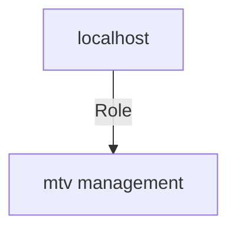

## Author Information

OpenShift Virtualization Migration Contributors

## License

GPL-3.0-only

## Minimum Ansible Version

2.15.0

## Platforms

* **EL**: ['all']

<!-- DOCSIBLE END -->