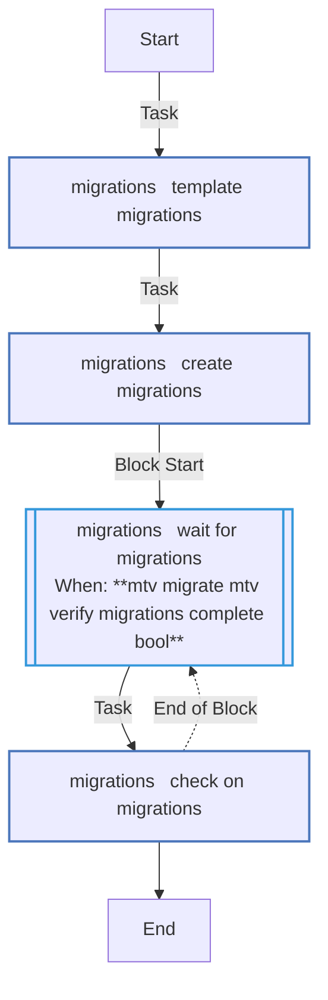
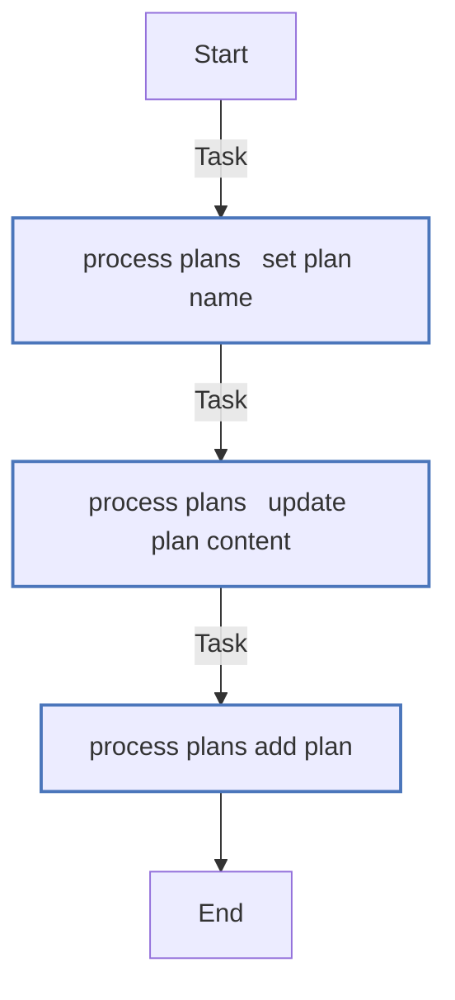
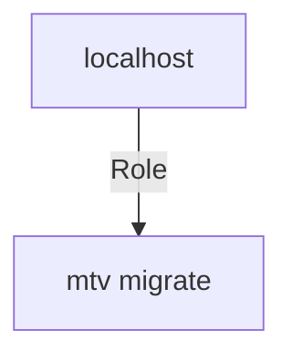

<!-- STATIC CONTENT START
Use this section for adding additional content to the README
This will not be overwritten by Docsible -->
# 📃 Role overview

<!-- STATIC CONTENT END -->
<!-- Everything below will be overwritten by Docsible -->
<!-- DOCSIBLE START -->
## mtv_migrate

```
Role belongs to infra/openshift_virtualization_migration
Namespace - infra
Collection - openshift_virtualization_migration
Version - 1.24.0
Repository - https://github.com/redhat-cop/openshift_virtualization_migration
```

Description: Migration of Virtual Machines from Source to Destination.

### Argument Specifications

<details>
<summary><b>🧩 Argument Specifications in `meta/argument_specs`</b></summary>

#### Key: main

* **Description**: MTV Migrate - Migrate VMs at scale
* **Options**:
  * **mtv_migrate_default_namespace**:
    * **Required**: false
    * **Type**: str
    * **Default**: openshift-mtv
    * **Description**: The default namespace to use if not specified
  * **mtv_migrate_migration_request**:
    * **Required**: True
    * **Type**: dict
    * **Default**: none
    * **Description**: This is a dictionary with details of a migration plan to create and / or run
    * **Options**:
      * **mtv_namespace**:
        * **Required**: false
        * **Type**: str
        * **Default**: openshift-mtv
        * **Description**: The namespace MTV is deployed in
      * **source_type**:
        * **Required**: false
        * **Type**: str
        * **Default**: vsphere
        * **Description**: Source MTV Provider
      * **source**:
        * **Required**: false
        * **Type**: str
        * **Default**: vmware
        * **Description**: Source containing VMs
      * **source_namespace**:
        * **Required**: false
        * **Type**: str
        * **Default**: openshift-mtv
        * **Description**: Namespace the source provider is located
      * **destination**:
        * **Required**: false
        * **Type**: str
        * **Default**: host
        * **Description**: Name of target to migrate VMs to
      * **destination_namespace**:
        * **Required**: false
        * **Type**: str
        * **Default**: openshift-mtv
        * **Description**: Namespace the MTV destination provider is located
      * **destination_type**:
        * **Required**: false
        * **Type**: str
        * **Default**: openshift
        * **Description**: Destination provider type
      * **vms_per_plan**:
        * **Required**: false
        * **Type**: int
        * **Default**: 10
        * **Description**: Number of VMs to split into multiple plans
      * **split_plans**:
        * **Required**: false
        * **Type**: bool
        * **Default**: False
        * **Description**: Determines whether to split into multiple plans
      * **plan_overrides**:
        * **Required**: false
        * **Type**: dict
        * **Default**: none
        * **Description**: Config to apply at the plan level
      * **vm_overrides**:
        * **Required**: false
        * **Type**: dict
        * **Default**: none
        * **Description**: Config to apply at to each VM
      * **target_namespace**:
        * **Required**: false
        * **Type**: str
        * **Default**: openshift-mtv
        * **Description**: Namespace to create VMs in
      * **dry_run**:
        * **Required**: false
        * **Type**: bool
        * **Default**: False
        * **Description**: Build the plans without applying them
      * **network_map**:
        * **Required**: false
        * **Type**: str
        * **Default**: vmware-host
        * **Description**: Name of the network map to use
      * **network_map_namespace**:
        * **Required**: false
        * **Type**: str
        * **Default**: openshift-mtv
        * **Description**: Namespace containing the network map
      * **storage_map**:
        * **Required**: false
        * **Type**: str
        * **Default**: vmware-host
        * **Description**: Name of the storage map
      * **storage_map_namespace**:
        * **Required**: false
        * **Type**: str
        * **Default**: openshift-mtv
        * **Description**: Namespace containing the storage map
      * **start_migration**:
        * **Required**: false
        * **Type**: bool
        * **Default**: False
        * **Description**: Create migration resources for the created plan
      * **verify_plans_ready**:
        * **Required**: false
        * **Type**: bool
        * **Default**: False
        * **Description**: Verify the plan is in a ready state
      * **verify_migrations_complete**:
        * **Required**: false
        * **Type**: bool
        * **Default**: False
        * **Description**: Waits for migrations to complete
      * **plan_name**:
        * **Required**: false
        * **Type**: str
        * **Default**: source_name-target_name-yyyyMMdd-HHmm
        * **Description**: Name of the migration plan
      * **vms**:
        * **Required**: false
        * **Type**: list
        * **Default**: none
        * **Description**: Explicit list of VMs to migrate
      * **folders**:
        * **Required**: false
        * **Type**: list
        * **Default**: none
        * **Description**: Explicit list of folders to migrate
  * **mtv_migrate_plan_base_name_annotation**:
    * **Required**: false
    * **Type**: str
    * **Default**: infra.openshift-virtualization-migration/plan-name
    * **Description**: Label assigned to the MTV plan name
  * **mtv_migrate_default_source_type**:
    * **Required**: false
    * **Type**: str
    * **Default**: vsphere
    * **Description**: Default source type for migrations
  * **mtv_migrate_default_source_target**:
    * **Required**: false
    * **Type**: str
    * **Default**: vmware
    * **Description**: Default source target for migration
  * **mtv_migrate_default_destination_type**:
    * **Required**: false
    * **Type**: str
    * **Default**: openshift
    * **Description**: Default destination type for migrations
  * **mtv_migrate_default_destination_target**:
    * **Required**: false
    * **Type**: str
    * **Default**: host
    * **Description**: Default destination for migrations
  * **mtv_migrate_default_split_plans**:
    * **Required**: false
    * **Type**: bool
    * **Default**: False
    * **Description**: Whether to split the plans into chunks of VMs
  * **mtv_migrate_default_vms_per_plan**:
    * **Required**: false
    * **Type**: int
    * **Default**: 10
    * **Description**: The size for each chunk of VMs split out
  * **mtv_migrate_default_start_migration**:
    * **Required**: false
    * **Type**: bool
    * **Default**: False
    * **Description**: Whether to start the migration after plan is created
  * **mtv_migrate_default_migrate_dry_run**:
    * **Required**: false
    * **Type**: bool
    * **Default**: False
    * **Description**: Whether to perform a dry_run of plan creation
  * **mtv_migrate_default_verify_plans_ready**:
    * **Required**: false
    * **Type**: bool
    * **Default**: False
    * **Description**: Whether to verify the plans are ready
  * **mtv_migrate_default_verify_migrations_complete**:
    * **Required**: false
    * **Type**: bool
    * **Default**: False
    * **Description**: Whether to wait for migrations to finish

</details>

### Defaults

**These are static variables with lower priority**

#### File: defaults/main.yml

| Var          | Type         | Value       |Choices    |Required    | Title       |
|--------------|--------------|-------------|-------------|-------------|-------------|
| [`mtv_migrate_default_namespace`](defaults/main.yml#L7)   | str   | `openshift-mtv` |  None  |   True  |  Default MTV Namespace |
| [`mtv_migrate_migration_request`](defaults/main.yml#L13)   | dict   | `{}` |  None  |   True  |  Migration Request |
| [`mtv_migrate_plan_base_name_annotation`](defaults/main.yml#L53)   | str   | `infra.openshift-virtualization-migration/plan-name` |  None  |   True  |  MTV Migrate Annotation |
| [`mtv_migrate_default_source_type`](defaults/main.yml#L61)   | str   | `vsphere` |  None  |   True  |  MTV Default Source Type |
| [`mtv_migrate_default_source_target`](defaults/main.yml#L67)   | str   | `vmware` |  None  |   True  |  MTV Default Source Target |
| [`mtv_migrate_default_source_target_namespace`](defaults/main.yml#L73)   | str   | `{{ _mtv_migrate_mtv_namespace }}` |  None  |   True  |  MTV Default Source Namespace |
| [`mtv_migrate_default_destination_type`](defaults/main.yml#L79)   | str   | `openshift` |  None  |   True  |  MTV Default Destination Type |
| [`mtv_migrate_default_destination_target`](defaults/main.yml#L85)   | str   | `host` |  None  |   True  |  MTV Default Destination Target |
| [`mtv_migrate_default_destination_target_namespace`](defaults/main.yml#L91)   | str   | `{{ _mtv_migrate_mtv_namespace }}` |  None  |   True  |  MTV Default Target Namespace |
| [`mtv_migrate_default_split_plans`](defaults/main.yml#L97)   | bool   | `False` |  None  |   True  |  MTV Default Split Plans |
| [`mtv_migrate_default_vms_per_plan`](defaults/main.yml#L103)   | int   | `10` |  None  |   True  |  MTV Default VMs Per Plan |
| [`mtv_migrate_default_start_migration`](defaults/main.yml#L109)   | bool   | `False` |  None  |   True  |  MTV Default Start Migration |
| [`mtv_migrate_default_migrate_dry_run`](defaults/main.yml#L115)   | bool   | `False` |  None  |   True  |  MTV Default Dry Run |
| [`mtv_migrate_default_verify_plans_ready`](defaults/main.yml#L121)   | bool   | `False` |  None  |   True  |  MTV Default Verify Plans Ready |
| [`mtv_migrate_default_verify_migrations_complete`](defaults/main.yml#L127)   | bool   | `False` |  None  |   True  |  MTV Default Verify Migrations Complete |
| [`mtv_migrate_default_target_namespace`](defaults/main.yml#L133)   | str   | `{{ _mtv_migrate_mtv_namespace }}` |  None  |   True  |  MTV Default Target Namespace |
| [`mtv_migrate_default_plan_base_name`](defaults/main.yml#L139)   | str   | `{{ (_mtv_migrate_mtv_source_target + '-' + _mtv_migrate_mtv_destination_target) + '-' + lookup('pipe', 'date +%Y%m%d-%H%M') }}` |  None  |   True  |  MTV Default Plan Base Name |
| [`mtv_migrate_default_network_map_name`](defaults/main.yml#L147)   | str   | `{{ (_mtv_migrate_mtv_source_target + '-' + _mtv_migrate_mtv_destination_target) ¦ infra.openshift_virtualization_migration.rfc1123 }}` |  None  |   True  |  MTV Default Network Map Name |
| [`mtv_migrate_default_network_map_namespace`](defaults/main.yml#L153)   | str   | `{{ _mtv_migrate_mtv_namespace }}` |  None  |   True  |  MTV Default Network Map Namespace |
| [`mtv_migrate_default_storage_map_name`](defaults/main.yml#L159)   | str   | `{{ (_mtv_migrate_mtv_source_target + '-' + _mtv_migrate_mtv_destination_target) ¦ infra.openshift_virtualization_migration.rfc1123 }}` |  None  |   True  |  MTV Default Storage Map Name |
| [`mtv_migrate_default_storage_map_namespace`](defaults/main.yml#L165)   | str   | `{{ _mtv_migrate_mtv_namespace }}` |  None  |   True  |  MTV Default Storage Map Namespace |
| [`mtv_migrate_verify_plans_ready_retries`](defaults/main.yml#L170)   | int   | `180` |  None  |   True  |  MTV Migration Verify Plans Ready Retries |
| [`mtv_migrate_verify_plans_ready_delay`](defaults/main.yml#L175)   | int   | `20` |  None  |   True  |  MTV Migration Verify Plans Ready Delay |
| [`mtv_migrate_verify_migration_complete_retries`](defaults/main.yml#L180)   | int   | `360` |  None  |   True  |  MTV Migration Verify Migration Complete Retries |
| [`mtv_migrate_verify_migration_complete_delay`](defaults/main.yml#L185)   | int   | `20` |  None  |   True  |  MTV Migration Verify Migration Complete Delay |

<summary><b>🖇️ Full descriptions for vars in defaults/main.yml</b></summary>
<br>
<b>`mtv_migrate_default_namespace`:</b> The default namespace to use if not specified
<br>
<b>`mtv_migrate_migration_request`:</b> None
<br>
<b>`mtv_migrate_plan_base_name_annotation`:</b> Label assigned to the MTV plan name
<br>
<b>`mtv_migrate_default_source_type`:</b> None
<br>
<b>`mtv_migrate_default_source_target`:</b> None
<br>
<b>`mtv_migrate_default_source_target_namespace`:</b> None
<br>
<b>`mtv_migrate_default_destination_type`:</b> None
<br>
<b>`mtv_migrate_default_destination_target`:</b> None
<br>
<b>`mtv_migrate_default_destination_target_namespace`:</b> None
<br>
<b>`mtv_migrate_default_split_plans`:</b> None
<br>
<b>`mtv_migrate_default_vms_per_plan`:</b> None
<br>
<b>`mtv_migrate_default_start_migration`:</b> None
<br>
<b>`mtv_migrate_default_migrate_dry_run`:</b> None
<br>
<b>`mtv_migrate_default_verify_plans_ready`:</b> None
<br>
<b>`mtv_migrate_default_verify_migrations_complete`:</b> None
<br>
<b>`mtv_migrate_default_target_namespace`:</b> None
<br>
<b>`mtv_migrate_default_plan_base_name`:</b> None
<br>
<b>`mtv_migrate_default_network_map_name`:</b> None
<br>
<b>`mtv_migrate_default_network_map_namespace`:</b> None
<br>
<b>`mtv_migrate_default_storage_map_name`:</b> None
<br>
<b>`mtv_migrate_default_storage_map_namespace`:</b> None
<br>
<b>`mtv_migrate_verify_plans_ready_retries`:</b> None
<br>
<b>`mtv_migrate_verify_plans_ready_delay`:</b> None
<br>
<b>`mtv_migrate_verify_migration_complete_retries`:</b> None
<br>
<b>`mtv_migrate_verify_migration_complete_delay`:</b> None
<br>
<br>

### Tasks

#### File: tasks/main.yml

| Name | Module | Has Conditions |
| ---- | ------ | --------- |
| Verify Request Provided | `ansible.builtin.assert` | False |
| Initialize Data Structures | `ansible.builtin.set_fact` | False |
| Process Request (MTV Namespace) | `ansible.builtin.set_fact` | False |
| Process Request (Baseline) | `ansible.builtin.set_fact` | False |
| Process Request (Maps) | `ansible.builtin.set_fact` | False |
| Verify Split Plan Value is Positive | `ansible.builtin.assert` | True |
| Generate Plans | `ansible.builtin.include_tasks` | True |
| Manage Migrations | `ansible.builtin.include_tasks` | True |

#### File: tasks/_migrations.yml

| Name | Module | Has Conditions |
| ---- | ------ | --------- |
| _migrations ¦ Template Migrations | `ansible.builtin.set_fact` | False |
| _migrations ¦ Create Migrations | `redhat.openshift.k8s` | False |
| _migrations ¦ Wait for Migrations | `block` | True |
| _migrations ¦ Check on Migrations | `kubernetes.core.k8s_info` | False |

#### File: tasks/_plans.yml

| Name | Module | Has Conditions |
| ---- | ------ | --------- |
| _plans ¦ Set Plan Base Name | `ansible.builtin.set_fact` | False |
| _plans ¦ Retrieve Configured providers | `ansible.builtin.include_role` | False |
| _plans ¦ Verify Source Provider | `ansible.builtin.assert` | False |
| _plans ¦ Verify Destination Providers | `ansible.builtin.assert` | False |
| _plans ¦ Retrieve StorageMaps | `kubernetes.core.k8s_info` | False |
| _plans ¦ Verify StorageMap | `ansible.builtin.assert` | False |
| _plans ¦ Retrieve NetworkMap | `kubernetes.core.k8s_info` | False |
| _plans ¦ Verify NetworkMap | `ansible.builtin.assert` | False |
| _plans ¦ Process Plan Skeleton | `ansible.builtin.set_fact` | False |
| _plans ¦ Get Inventory vms | `ansible.builtin.include_role` | False |
| _plans ¦ Manage specified folders | `block` | True |
| _plans ¦ Get Inventory folders | `ansible.builtin.include_role` | False |
| _plans ¦ Manage specified Folders | `ansible.builtin.include_tasks` | False |
| _plans ¦ Manage specified VM's | `ansible.builtin.include_tasks` | True |
| _plans ¦ Flatten VM's to Migrate | `ansible.builtin.set_fact` | False |
| _plans ¦ Verify Plan has VMs | `ansible.builtin.assert` | False |
| _plans ¦ Process Plans | `ansible.builtin.include_tasks` | False |
| _plans ¦ Create and Verify Plans | `block` | True |
| _plans ¦ Create Plans | `redhat.openshift.k8s` | False |
| _plans ¦ Verify Plans Ready | `kubernetes.core.k8s_info` | True |
| _plans ¦ Set Created Plans to Migrate | `ansible.builtin.set_fact` | True |
| _plans ¦ Display Plans (Dry Run) | `ansible.builtin.debug` | True |

#### File: tasks/_process_folder.yml

| Name | Module | Has Conditions |
| ---- | ------ | --------- |
| _process_folder ¦ Initialize Folder Variables | `ansible.builtin.set_fact` | False |
| _process_folder ¦ Verify Name or ID or Path specified for Folder | `ansible.builtin.assert` | False |
| _process_folder ¦ Locate Folder by name | `ansible.builtin.set_fact` | True |
| _process_folder ¦ Locate Folder by id | `ansible.builtin.set_fact` | True |
| _process_folder ¦ Locate VM by path | `ansible.builtin.set_fact` | True |
| _process_folder ¦ Verify single Folder found | `ansible.builtin.assert` | False |
| _process_folder ¦ Set Folder to Process | `ansible.builtin.set_fact` | False |
| _process_folder ¦ Check Excludes | `block` | True |
| _process_folder ¦ Process Folder VM's | `ansible.builtin.include_tasks` | True |
| _process_folder ¦ Process Subfolders | `ansible.builtin.include_tasks` | True |

#### File: tasks/_process_plans.yml

| Name | Module | Has Conditions |
| ---- | ------ | --------- |
| _process_plans ¦ Set Plan Name | `ansible.builtin.set_fact` | False |
| _process_plans ¦ Update Plan Content | `ansible.builtin.set_fact` | False |
| _process_plans ¦ Add Plan | `ansible.builtin.set_fact` | False |

#### File: tasks/_process_vm.yml

| Name | Module | Has Conditions |
| ---- | ------ | --------- |
| _process_vm ¦ Initialize VM Variables | `ansible.builtin.set_fact` | False |
| _process_vm ¦ Verify Name or ID or Path specified for VM | `ansible.builtin.assert` | False |
| _process_vm ¦ Locate VM by name | `ansible.builtin.set_fact` | True |
| _process_vm ¦ Locate VM by id | `ansible.builtin.set_fact` | True |
| _process_vm ¦ Locate VM by path | `ansible.builtin.set_fact` | True |
| _process_vm ¦ Verify single VM found | `ansible.builtin.assert` | False |
| _process_vm ¦ Set VM to Process | `ansible.builtin.set_fact` | False |
| _process_vm ¦ Add VM to Migration Dict | `ansible.builtin.set_fact` | True |
| _process_vm ¦ Clear VM Variables | `ansible.builtin.set_fact` | False |

## Task Flow Graphs

### Graph for main.yml

```mermaid
flowchart TD
Start
classDef block stroke:#3498db,stroke-width:2px;
classDef task stroke:#4b76bb,stroke-width:2px;
classDef includeTasks stroke:#16a085,stroke-width:2px;
classDef importTasks stroke:#34495e,stroke-width:2px;
classDef includeRole stroke:#2980b9,stroke-width:2px;
classDef importRole stroke:#699ba7,stroke-width:2px;
classDef includeVars stroke:#8e44ad,stroke-width:2px;
classDef rescue stroke:#665352,stroke-width:2px;

  Start-->|Task| Verify_Request_Provided0[verify request provided]:::task
  Verify_Request_Provided0-->|Task| Initialize_Data_Structures1[initialize data structures]:::task
  Initialize_Data_Structures1-->|Task| Process_Request__MTV_Namespace_2[process request  mtv namespace ]:::task
  Process_Request__MTV_Namespace_2-->|Task| Process_Request__Baseline_3[process request  baseline ]:::task
  Process_Request__Baseline_3-->|Task| Process_Request__Maps_4[process request  maps ]:::task
  Process_Request__Maps_4-->|Task| Verify_Split_Plan_Value_is_Positive5[verify split plan value is positive<br>When: **mtv migrate mtv split plans   bool**]:::task
  Verify_Split_Plan_Value_is_Positive5-->|Include task| Generate_Plans__plans_yml_6[generate plans<br>When: **mtv migrate migration request  vms     default   <br>   mtv migrate migration request  folders    <br>default        length   0**<br>include_task:  plans yml]:::includeTasks
  Generate_Plans__plans_yml_6-->|Include task| Manage_Migrations__migrations_yml_7[manage migrations<br>When: **mtv migrate mtv start migration bool and not  mtv<br>migrate mtv dry run bool and  mtv migrate mtv<br>plans to migrate   default       length   0**<br>include_task:  migrations yml]:::includeTasks
  Manage_Migrations__migrations_yml_7-->End
```



### Graph for _process_folder.yml

```mermaid
flowchart TD
Start
classDef block stroke:#3498db,stroke-width:2px;
classDef task stroke:#4b76bb,stroke-width:2px;
classDef includeTasks stroke:#16a085,stroke-width:2px;
classDef importTasks stroke:#34495e,stroke-width:2px;
classDef includeRole stroke:#2980b9,stroke-width:2px;
classDef importRole stroke:#699ba7,stroke-width:2px;
classDef includeVars stroke:#8e44ad,stroke-width:2px;
classDef rescue stroke:#665352,stroke-width:2px;

  Start-->|Task| _process_folder___Initialize_Folder_Variables0[ process folder   initialize folder variables]:::task
  _process_folder___Initialize_Folder_Variables0-->|Task| _process_folder___Verify_Name_or_ID_or_Path_specified_for_Folder1[ process folder   verify name or id or path<br>specified for folder]:::task
  _process_folder___Verify_Name_or_ID_or_Path_specified_for_Folder1-->|Task| _process_folder___Locate_Folder_by_name2[ process folder   locate folder by name<br>When: **name  in folder to process and  id  not in folder<br>to process and  path  not in folder to process**]:::task
  _process_folder___Locate_Folder_by_name2-->|Task| _process_folder___Locate_Folder_by_id3[ process folder   locate folder by id<br>When: **id  in folder to process and  name  not in folder<br>to process and  path  not in folder to process**]:::task
  _process_folder___Locate_Folder_by_id3-->|Task| _process_folder___Locate_VM_by_path4[ process folder   locate vm by path<br>When: **path  in folder to process and  id  not in folder<br>to process and  name  not in folder to process**]:::task
  _process_folder___Locate_VM_by_path4-->|Task| _process_folder___Verify_single_Folder_found5[ process folder   verify single folder found]:::task
  _process_folder___Verify_single_Folder_found5-->|Task| _process_folder___Set_Folder_to_Process6[ process folder   set folder to process]:::task
  _process_folder___Set_Folder_to_Process6-->|Block Start| _process_folder___Check_Excludes7_block_start_0[[ process folder   check excludes<br>When: **mtv migrate migration request  folders     default<br>      selectattr  exclude    defined    <br>selectattr  exclude    equalto   true   <br>selectattr  name    defined     selectattr  name  <br> equalto    mtv migrate folder to process  name   <br>  list   length    0 and mtv migrate migration<br>request  folders     default       selectattr <br>exclude    defined     selectattr  exclude   <br>equalto   true    selectattr  id    defined    <br>selectattr  id    equalto    mtv migrate folder to<br>process  id      list   length    0 and mtv<br>migrate migration request  folders     default    <br>  selectattr  exclude    defined     selectattr <br>exclude    equalto   true    selectattr  path   <br>defined     selectattr  path    equalto    mtv<br>migrate folder to process  path      list   length<br>   0**]]:::block
  _process_folder___Check_Excludes7_block_start_0-->|Include task| _process_folder___Process_Folder_VM_s__process_vm_yml_0[ process folder   process folder vm s<br>When: **children  in  mtv migrate folder to process**<br>include_task:  process vm yml]:::includeTasks
  _process_folder___Process_Folder_VM_s__process_vm_yml_0-->|Include task| _process_folder___Process_Subfolders__process_folder_yml_1[ process folder   process subfolders<br>When: **children  in  mtv migrate folder to process**<br>include_task:  process folder yml]:::includeTasks
  _process_folder___Process_Subfolders__process_folder_yml_1-.->|End of Block| _process_folder___Check_Excludes7_block_start_0
  _process_folder___Process_Subfolders__process_folder_yml_1-->End
```



### Graph for _migrations.yml



### Graph for _process_plans.yml



### Graph for _process_vm.yml

```mermaid
flowchart TD
Start
classDef block stroke:#3498db,stroke-width:2px;
classDef task stroke:#4b76bb,stroke-width:2px;
classDef includeTasks stroke:#16a085,stroke-width:2px;
classDef importTasks stroke:#34495e,stroke-width:2px;
classDef includeRole stroke:#2980b9,stroke-width:2px;
classDef importRole stroke:#699ba7,stroke-width:2px;
classDef includeVars stroke:#8e44ad,stroke-width:2px;
classDef rescue stroke:#665352,stroke-width:2px;

  Start-->|Task| _process_vm___Initialize_VM_Variables0[ process vm   initialize vm variables]:::task
  _process_vm___Initialize_VM_Variables0-->|Task| _process_vm___Verify_Name_or_ID_or_Path_specified_for_VM1[ process vm   verify name or id or path specified<br>for vm]:::task
  _process_vm___Verify_Name_or_ID_or_Path_specified_for_VM1-->|Task| _process_vm___Locate_VM_by_name2[ process vm   locate vm by name<br>When: **name  in vm to process and  id  not in vm to<br>process and  path  not in vm to process**]:::task
  _process_vm___Locate_VM_by_name2-->|Task| _process_vm___Locate_VM_by_id3[ process vm   locate vm by id<br>When: **id  in vm to process and  name  not in vm to<br>process and  path  not in vm to process**]:::task
  _process_vm___Locate_VM_by_id3-->|Task| _process_vm___Locate_VM_by_path4[ process vm   locate vm by path<br>When: **path  in vm to process and  id  not in vm to<br>process and  name  not in vm to process**]:::task
  _process_vm___Locate_VM_by_path4-->|Task| _process_vm___Verify_single_VM_found5[ process vm   verify single vm found]:::task
  _process_vm___Verify_single_VM_found5-->|Task| _process_vm___Set_VM_to_Process6[ process vm   set vm to process]:::task
  _process_vm___Set_VM_to_Process6-->|Task| _process_vm___Add_VM_to_Migration_Dict7[ process vm   add vm to migration dict<br>When: **mtv migrate migration request  vms     default    <br>  selectattr  exclude    defined     selectattr <br>exclude    equalto   true    selectattr  name   <br>defined     selectattr  name    equalto    mtv<br>migrate vm to process  name      list   length   <br>0 and mtv migrate migration request  vms    <br>default       selectattr  exclude    defined    <br>selectattr  exclude    equalto   true   <br>selectattr  id    defined     selectattr  id   <br>equalto    mtv migrate vm to process  id      list<br>  length    0 and mtv migrate migration request <br>vms     default       selectattr  exclude   <br>defined     selectattr  exclude    equalto   true <br>  selectattr  path    defined     selectattr  path<br>   equalto    mtv migrate vm to process  path     <br>list   length    0 and not  mtv migrate vm to<br>process  istemplate     default false**]:::task
  _process_vm___Add_VM_to_Migration_Dict7-->|Task| _process_vm___Clear_VM_Variables8[ process vm   clear vm variables]:::task
  _process_vm___Clear_VM_Variables8-->End
```



### Graph for _plans.yml

```mermaid
flowchart TD
Start
classDef block stroke:#3498db,stroke-width:2px;
classDef task stroke:#4b76bb,stroke-width:2px;
classDef includeTasks stroke:#16a085,stroke-width:2px;
classDef importTasks stroke:#34495e,stroke-width:2px;
classDef includeRole stroke:#2980b9,stroke-width:2px;
classDef importRole stroke:#699ba7,stroke-width:2px;
classDef includeVars stroke:#8e44ad,stroke-width:2px;
classDef rescue stroke:#665352,stroke-width:2px;

  Start-->|Task| _plans___Set_Plan_Base_Name0[ plans   set plan base name]:::task
  _plans___Set_Plan_Base_Name0-->|Include role| _plans___Retrieve_Configured_providers_mtv_management_1( plans   retrieve configured providers<br>include_role: mtv management):::includeRole
  _plans___Retrieve_Configured_providers_mtv_management_1-->|Task| _plans___Verify_Source_Provider2[ plans   verify source provider]:::task
  _plans___Verify_Source_Provider2-->|Task| _plans___Verify_Destination_Providers3[ plans   verify destination providers]:::task
  _plans___Verify_Destination_Providers3-->|Task| _plans___Retrieve_StorageMaps4[ plans   retrieve storagemaps]:::task
  _plans___Retrieve_StorageMaps4-->|Task| _plans___Verify_StorageMap5[ plans   verify storagemap]:::task
  _plans___Verify_StorageMap5-->|Task| _plans___Retrieve_NetworkMap6[ plans   retrieve networkmap]:::task
  _plans___Retrieve_NetworkMap6-->|Task| _plans___Verify_NetworkMap7[ plans   verify networkmap]:::task
  _plans___Verify_NetworkMap7-->|Task| _plans___Process_Plan_Skeleton8[ plans   process plan skeleton]:::task
  _plans___Process_Plan_Skeleton8-->|Include role| _plans___Get_Inventory_vms_mtv_management_9( plans   get inventory vms<br>include_role: mtv management):::includeRole
  _plans___Get_Inventory_vms_mtv_management_9-->|Block Start| _plans___Manage_specified_folders10_block_start_0[[ plans   manage specified folders<br>When: **folders  in mtv migrate migration request and<br>folder to process  exclude   is not defined or <br>exclude  in folder to process and not folder to<br>process  exclude   bool**]]:::block
  _plans___Manage_specified_folders10_block_start_0-->|Include role| _plans___Get_Inventory_folders_mtv_management_0( plans   get inventory folders<br>include_role: mtv management):::includeRole
  _plans___Get_Inventory_folders_mtv_management_0-->|Include task| _plans___Manage_specified_Folders__process_folder_yml_1[ plans   manage specified folders<br>include_task:  process folder yml]:::includeTasks
  _plans___Manage_specified_Folders__process_folder_yml_1-.->|End of Block| _plans___Manage_specified_folders10_block_start_0
  _plans___Manage_specified_Folders__process_folder_yml_1-->|Include task| _plans___Manage_specified_VM_s__process_vm_yml_11[ plans   manage specified vm s<br>When: **vms  in mtv migrate migration request and vm to<br>process  exclude   is not defined or  exclude  in<br>vm to process and not vm to process  exclude  <br>bool**<br>include_task:  process vm yml]:::includeTasks
  _plans___Manage_specified_VM_s__process_vm_yml_11-->|Task| _plans___Flatten_VM_s_to_Migrate12[ plans   flatten vm s to migrate]:::task
  _plans___Flatten_VM_s_to_Migrate12-->|Task| _plans___Verify_Plan_has_VMs13[ plans   verify plan has vms]:::task
  _plans___Verify_Plan_has_VMs13-->|Include task| _plans___Process_Plans__process_plans_yml_14[ plans   process plans<br>include_task:  process plans yml]:::includeTasks
  _plans___Process_Plans__process_plans_yml_14-->|Block Start| _plans___Create_and_Verify_Plans15_block_start_0[[ plans   create and verify plans<br>When: **not  mtv migrate mtv dry run bool**]]:::block
  _plans___Create_and_Verify_Plans15_block_start_0-->|Task| _plans___Create_Plans0[ plans   create plans]:::task
  _plans___Create_Plans0-->|Task| _plans___Verify_Plans_Ready1[ plans   verify plans ready<br>When: **mtv migrate mtv verify plans ready bool**]:::task
  _plans___Verify_Plans_Ready1-->|Task| _plans___Set_Created_Plans_to_Migrate2[ plans   set created plans to migrate<br>When: **mtv migrate mtv start migration bool**]:::task
  _plans___Set_Created_Plans_to_Migrate2-.->|End of Block| _plans___Create_and_Verify_Plans15_block_start_0
  _plans___Set_Created_Plans_to_Migrate2-->|Task| _plans___Display_Plans__Dry_Run_16[ plans   display plans  dry run <br>When: **mtv migrate mtv dry run bool**]:::task
  _plans___Display_Plans__Dry_Run_16-->End
```



## Playbook

```yml
---
- name: Test play
  hosts: localhost
  remote_user: root
  roles:
    - mtv_migrate
...

```

## Playbook graph



## Author Information

OpenShift Virtualization Migration Contributors

## License

GPL-3.0-only

## Minimum Ansible Version

2.15.0

## Platforms

* **EL**: ['all']

<!-- DOCSIBLE END -->