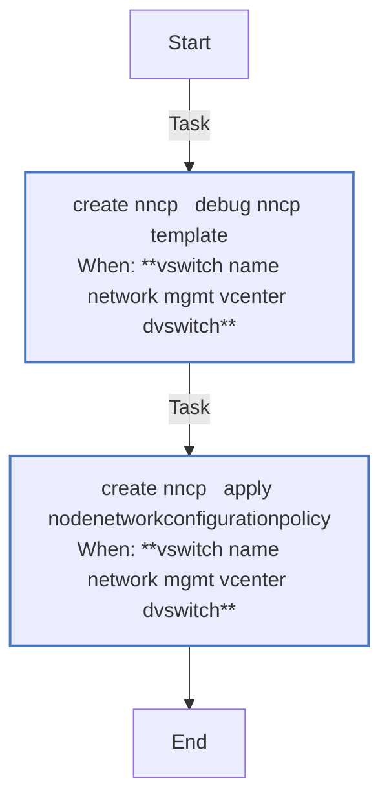
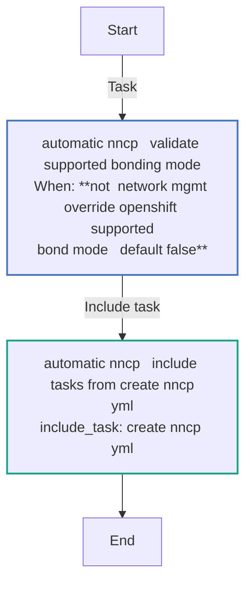
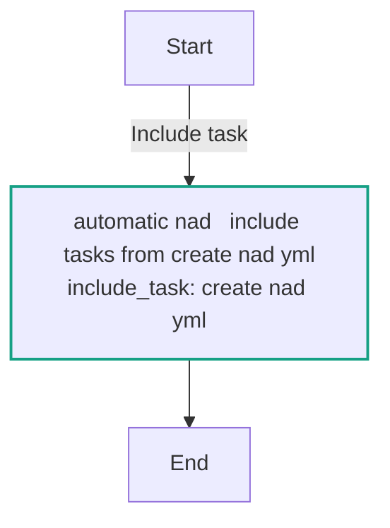
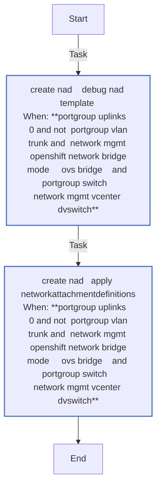
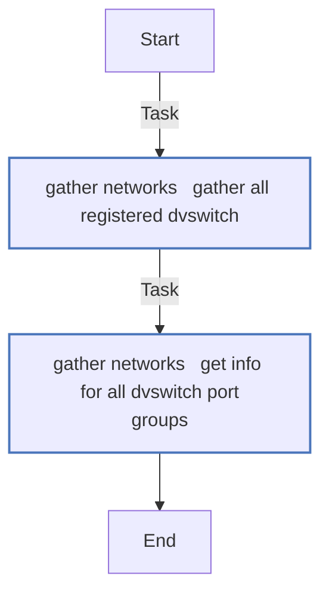
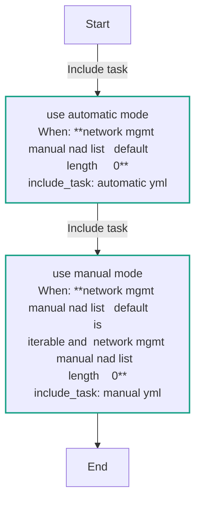
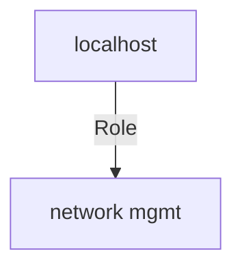

<!-- STATIC CONTENT START
Use this section for adding additional content to the README
This will not be overwritten by Docsible -->
# 📃 Role overview

This role performs network management in two modes: Manual and Automatic. It performs tasks that include gathering network information in the vCenter environment, migrate the Port Groups by creating NetworkAttachementDefinitions (NAD), and migrate distributed switches by creating NodeNetworkConfigurationPolicy (NNCP).
<!-- STATIC CONTENT END -->
<!-- Everything below will be overwritten by Docsible -->
<!-- DOCSIBLE START -->
## network_mgmt

```
Role belongs to infra/openshift_virtualization_migration
Namespace - infra
Collection - openshift_virtualization_migration
```

Description: Management of network related components.

### Defaults

**These are static variables with lower priority**

#### File: defaults/main.yml

| Var          | Type         | Value       |Choices    |Required    | Title       |
|--------------|--------------|-------------|-------------|-------------|-------------|
| [`network_mgmt_openshift_node_network_ports`](defaults/main.yml#L5)   | list   | `[]` |  None  |   True  |  OpenShift Node Network Ports |
| [`network_mgmt_port_is_existing_bond`](defaults/main.yml#L10)   | bool   | `False` |  None  |   True  |  Define Bond |
| [`network_mgmt_vcenter_dvswitch`](defaults/main.yml#L16)   | str   | `` |  None  |   True  |  vCenter DVSwitch |
| [`network_mgmt_vcenter_datacenter`](defaults/main.yml#L21)   | str   | `` |  None  |   True  |  vCenter Data Center |
| [`network_mgmt_openshift_network_bridge_mode`](defaults/main.yml#L26)   | str   | `linux-bridge` |  None  |   True  |  OpenShift Network Bridge Mode |
| [`network_mgmt_use_default_ovn_bridge`](defaults/main.yml#L31)   | bool   | `False` |  None  |   True  |  OVN Bridge |
| [`network_mgmt_openshift_network_bond_mode`](defaults/main.yml#L40)   | str   | `802.3ad` |  None  |   True  |  OpenShift Network Bond Mode |
| [`network_mgmt_openshift_network_supported_bond_modes`](defaults/main.yml#L46)   | list   | `[]` |  None  |   True  |  Supported Bond Modes |
| [`network_mgmt_openshift_network_supported_bond_modes.0`](defaults/main.yml#L47)   | str   | `802.3ad` |  None  |   None  |  None |
| [`network_mgmt_openshift_network_supported_bond_modes.1`](defaults/main.yml#L48)   | str   | `active-backup` |  None  |   None  |  None |
| [`network_mgmt_openshift_network_supported_bond_modes.2`](defaults/main.yml#L49)   | str   | `balance-xor` |  None  |   None  |  None |
| [`network_mgmt_nncp_max_unavailable`](defaults/main.yml#L54)   | int   | `3` |  None  |   True  |  NNCP Max Unavailability |
| [`network_mgmt_nncp_nodeselector`](defaults/main.yml#L62)   | dict   | `{}` |  None  |   True  |  NNCP NodeSelector |
| [`network_mgmt_nncp_nodeselector.node-role.kubernetes.io/worker`](defaults/main.yml#L63)   | str   | `` |  None  |   None  |  None |
| [`network_mgmt_nncp_name_prefix`](defaults/main.yml#L68)   | str   | `vs-` |  None  |   True  |  NNCP Name Prefix |
| [`network_mgmt_nad_namespace`](defaults/main.yml#L73)   | str   | `default` |  None  |   True  |  NAD Namespace |
| [`network_mgmt_nad_auto_bridge_name`](defaults/main.yml#L78)   | str   | `` |  None  |   None  |  None |
| [`network_mgmt_nad_name_prefix`](defaults/main.yml#L85)   | str   | `net-` |  None  |   True  |  NAD Name Prefix |
| [`network_mgmt_manual_bond_name`](defaults/main.yml#L90)   | str   | `` |  None  |   True  |  Bond Name in Manual Mode |
| [`network_mgmt_manual_bridge_name`](defaults/main.yml#L95)   | str   | `vm-bridge` |  None  |   True  |  Bridge Name in Manual Mode |
| [`network_mgmt_manual_localnet_name`](defaults/main.yml#L100)   | str   | `` |  None  |   True  |  Local Network Name in Manual Mode |
| [`network_mgmt_manual_nad_list`](defaults/main.yml#L105)   | list   | `[]` |  None  |   True  |  NAD List in Manual Mode |

<summary><b>🖇️ Full descriptions for vars in defaults/main.yml</b></summary>
<br>
<b>`network_mgmt_openshift_node_network_ports`:</b> List of Node Network Ports
<br>
<b>`network_mgmt_port_is_existing_bond`:</b> Boolean value to check if a bond is defined
<br>
<b>`network_mgmt_vcenter_dvswitch`:</b> vCenter Distributed Switch
<br>
<b>`network_mgmt_vcenter_datacenter`:</b> vCenter Data Center name
<br>
<b>`network_mgmt_openshift_network_bridge_mode`:</b> OpenShift Network Bridge Mode
<br>
<b>`network_mgmt_use_default_ovn_bridge`:</b> Boolean value defines usage of OVN bridge
<br>
<b>`network_mgmt_openshift_network_bond_mode`:</b> OpenShift Network Bond Mode
<br>
<b>`network_mgmt_openshift_network_supported_bond_modes`:</b> List of supported bond modes
<br>
<b>`network_mgmt_openshift_network_supported_bond_modes.0`:</b> None
<br>
<b>`network_mgmt_openshift_network_supported_bond_modes.1`:</b> None
<br>
<b>`network_mgmt_openshift_network_supported_bond_modes.2`:</b> None
<br>
<b>`network_mgmt_nncp_max_unavailable`:</b> Maximum number of times NNCP can be unavailable
<br>
<b>`network_mgmt_nncp_nodeselector`:</b> NNCP NodeSelector on the OpenShift cluster
<br>
<b>`network_mgmt_nncp_nodeselector.node-role.kubernetes.io/worker`:</b> None
<br>
<b>`network_mgmt_nncp_name_prefix`:</b> NNCP Name Prefix
<br>
<b>`network_mgmt_nad_namespace`:</b> NAD Namespace
<br>
<b>`network_mgmt_nad_auto_bridge_name`:</b> None
<br>
<b>`network_mgmt_nad_name_prefix`:</b> NAD Name Prefix
<br>
<b>`network_mgmt_manual_bond_name`:</b> Bond Name in Manual Mode
<br>
<b>`network_mgmt_manual_bridge_name`:</b> Bridge Name in Manual Mode
<br>
<b>`network_mgmt_manual_localnet_name`:</b> Local Network Name in Manual Mode
<br>
<b>`network_mgmt_manual_nad_list`:</b> NAD List in Manual Mode
<br>
<br>

### Tasks

#### File: tasks/main.yml

| Name | Module | Has Conditions |
| ---- | ------ | --------- |
| Use automatic mode | `ansible.builtin.include_tasks` | True |
| Use manual mode | `ansible.builtin.include_tasks` | True |

#### File: tasks/automatic.yml

| Name | Module | Has Conditions |
| ---- | ------ | --------- |
| automatic ¦ Include tasks from gather_networks.yml | `ansible.builtin.include_tasks` | False |
| automatic ¦ Set the switches and portgroups to migrate | `ansible.builtin.set_fact` | False |
| automatic ¦ Include tasks from automatic_nncp.yml | `ansible.builtin.include_tasks` | True |
| automatic ¦ Include tasks from automatic_nad.yml | `ansible.builtin.include_tasks` | True |

#### File: tasks/automatic_nad.yml

| Name | Module | Has Conditions |
| ---- | ------ | --------- |
| automatic_nad ¦ Include tasks from create_nad.yml | `ansible.builtin.include_tasks` | False |

#### File: tasks/automatic_nncp.yml

| Name | Module | Has Conditions |
| ---- | ------ | --------- |
| automatic_nncp ¦ Validate supported bonding mode | `ansible.builtin.assert` | True |
| automatic_nncp ¦ Include tasks from create_nncp.yml | `ansible.builtin.include_tasks` | False |

#### File: tasks/create_nad.yml

| Name | Module | Has Conditions |
| ---- | ------ | --------- |
| create_nad ¦ "DEBUG nad Template" | `ansible.builtin.debug` | True |
| create_nad ¦ Apply NetworkAttachmentDefinitions | `redhat.openshift.k8s` | True |

#### File: tasks/create_nncp.yml

| Name | Module | Has Conditions |
| ---- | ------ | --------- |
| create_nncp ¦ DEBUG nncp Template | `ansible.builtin.debug` | True |
| create_nncp ¦ Apply NodeNetworkConfigurationPolicy | `redhat.openshift.k8s` | True |

#### File: tasks/gather_networks.yml

| Name | Module | Has Conditions |
| ---- | ------ | --------- |
| gather_networks ¦ Gather all registered dvswitch | `community.vmware.vmware_dvswitch_info` | False |
| gather_networks ¦ Get info for all dVSwitch Port Groups | `community.vmware.vmware_dvs_portgroup_info` | False |

#### File: tasks/manual.yml

| Name | Module | Has Conditions |
| ---- | ------ | --------- |
| manual ¦ Validate network_mgmt_manual_nad_list | `ansible.builtin.assert` | False |
| manual ¦ Validate supported bonding mode if also creating bond | `ansible.builtin.assert` | True |
| manual ¦ Validate ovs-bridge mode | `ansible.builtin.assert` | True |
| manual ¦ Validate linux-bridge | `ansible.builtin.assert` | False |
| manual ¦ Apply NodeNetworkConfigurationPolicy | `redhat.openshift.k8s` | True |
| manual ¦ Validate access port | `ansible.builtin.assert` | True |
| manual ¦ Validate trunk ports | `ansible.builtin.assert` | True |
| manual ¦ Apply NetworkAttachmentDefinitions | `redhat.openshift.k8s` | False |

## Task Flow Graphs

### Graph for manual.yml

```mermaid
flowchart TD
Start
classDef block stroke:#3498db,stroke-width:2px;
classDef task stroke:#4b76bb,stroke-width:2px;
classDef includeTasks stroke:#16a085,stroke-width:2px;
classDef importTasks stroke:#34495e,stroke-width:2px;
classDef includeRole stroke:#2980b9,stroke-width:2px;
classDef importRole stroke:#699ba7,stroke-width:2px;
classDef includeVars stroke:#8e44ad,stroke-width:2px;
classDef rescue stroke:#665352,stroke-width:2px;

  Start-->|Task| manual___Validate_network_mgmt_manual_nad_list0[manual   validate network mgmt manual nad list]:::task
  manual___Validate_network_mgmt_manual_nad_list0-->|Task| manual___Validate_supported_bonding_mode_if_also_creating_bond1[manual   validate supported bonding mode if also<br>creating bond<br>When: **not  network mgmt override openshift supported<br>bond mode   default false   and  network mgmt<br>openshift node network ports   default      <br>length     0**]:::task
  manual___Validate_supported_bonding_mode_if_also_creating_bond1-->|Task| manual___Validate_ovs_bridge_mode2[manual   validate ovs bridge mode<br>When: **network mgmt openshift network bridge mode     ovs<br>bridge**]:::task
  manual___Validate_ovs_bridge_mode2-->|Task| manual___Validate_linux_bridge3[manual   validate linux bridge]:::task
  manual___Validate_linux_bridge3-->|Task| manual___Apply_NodeNetworkConfigurationPolicy4[manual   apply nodenetworkconfigurationpolicy<br>When: **network mgmt manual bridge name   default      <br>length   0 and network mgmt manual bond name  <br>default       length   0 and network mgmt<br>openshift network bridge mode     linux bridge**]:::task
  manual___Apply_NodeNetworkConfigurationPolicy4-->|Task| manual___Validate_access_port5[manual   validate access port<br>When: **trunk  not in nad  or  not nad trunk**]:::task
  manual___Validate_access_port5-->|Task| manual___Validate_trunk_ports6[manual   validate trunk ports<br>When: **trunk  in nad and nad trunk**]:::task
  manual___Validate_trunk_ports6-->|Task| manual___Apply_NetworkAttachmentDefinitions7[manual   apply networkattachmentdefinitions]:::task
  manual___Apply_NetworkAttachmentDefinitions7-->End
```



### Graph for automatic.yml

```mermaid
flowchart TD
Start
classDef block stroke:#3498db,stroke-width:2px;
classDef task stroke:#4b76bb,stroke-width:2px;
classDef includeTasks stroke:#16a085,stroke-width:2px;
classDef importTasks stroke:#34495e,stroke-width:2px;
classDef includeRole stroke:#2980b9,stroke-width:2px;
classDef importRole stroke:#699ba7,stroke-width:2px;
classDef includeVars stroke:#8e44ad,stroke-width:2px;
classDef rescue stroke:#665352,stroke-width:2px;

  Start-->|Include task| automatic___Include_tasks_from_gather_networks_yml_gather_networks_yml_0[automatic   include tasks from gather networks yml<br>include_task: gather networks yml]:::includeTasks
  automatic___Include_tasks_from_gather_networks_yml_gather_networks_yml_0-->|Task| automatic___Set_the_switches_and_portgroups_to_migrate1[automatic   set the switches and portgroups to<br>migrate]:::task
  automatic___Set_the_switches_and_portgroups_to_migrate1-->|Include task| automatic___Include_tasks_from_automatic_nncp_yml_automatic_nncp_yml_2[automatic   include tasks from automatic nncp yml<br>When: **network mgmt openshift node network ports  <br>default       is iterable and  network mgmt<br>openshift node network ports   default       is<br>not string and network mgmt openshift node network<br>ports   default       length   0 and network mgmt<br>vcenter dvswitch   default     true    trim  <br>length   0 and network mgmt vcenter datacenter  <br>default     true    trim   length   0**<br>include_task: automatic nncp yml]:::includeTasks
  automatic___Include_tasks_from_automatic_nncp_yml_automatic_nncp_yml_2-->|Include task| automatic___Include_tasks_from_automatic_nad_yml_automatic_nad_yml_3[automatic   include tasks from automatic nad yml<br>When: **network mgmt vcenter dvswitch   default     true  <br> trim   length   0 and network mgmt vcenter<br>datacenter   default     true    trim   length   0<br>and   network mgmt openshift node network ports  <br>default       is iterable and  network mgmt<br>openshift node network ports   default       is<br>not string and  network mgmt openshift node<br>network ports   default       length   0   or <br>network mgmt nad auto bridge name is defined and<br>network mgmt nad auto bridge name  length   0**<br>include_task: automatic nad yml]:::includeTasks
  automatic___Include_tasks_from_automatic_nad_yml_automatic_nad_yml_3-->End
```



### Graph for create_nncp.yml



### Graph for automatic_nncp.yml



### Graph for automatic_nad.yml



### Graph for create_nad.yml



### Graph for gather_networks.yml



### Graph for main.yml



## Playbook

```yml
---
- name: Test
  hosts: localhost
  remote_user: root
  roles:
    - network_mgmt
...

```

## Playbook graph



## Author Information

OpenShift Virtualization Migration Contributors

## License

GPL-3.0-only

## Minimum Ansible Version

2.15.0

## Platforms

No platforms specified.

<!-- DOCSIBLE END -->
