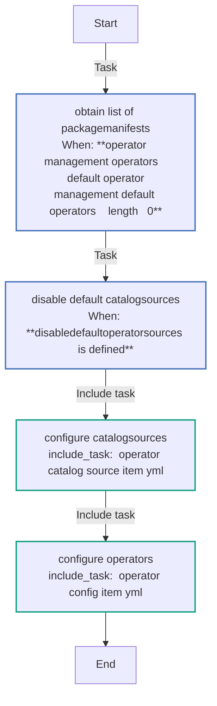
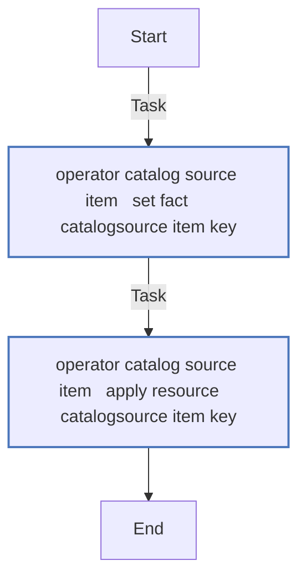
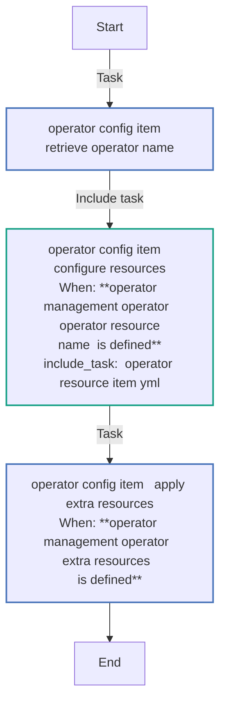
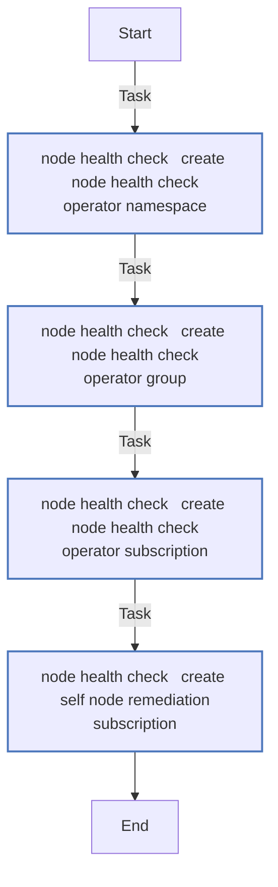
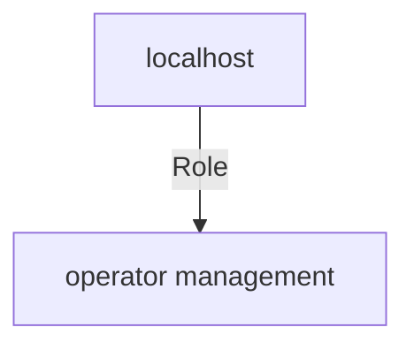

<!-- STATIC CONTENT START
Use this section for adding additional content to the README
This will not be overwritten by Docsible -->
# 📃 Role overview

This role manages the lifecycle of operators for OpenShift Virtualization

<!-- STATIC CONTENT END -->
<!-- Everything below will be overwritten by Docsible -->
<!-- DOCSIBLE START -->
## operator_management

```
Role belongs to infra/openshift_virtualization_migration
Namespace - infra
Collection - openshift_virtualization_migration
Version - 1.24.0
Repository - https://github.com/redhat-cop/openshift_virtualization_migration
```

Description: Management of OpenShift Operators.

### Defaults

**These are static variables with lower priority**

#### File: defaults/main.yml

| Var          | Type         | Value       |Choices    |Required    | Title       |
|--------------|--------------|-------------|-------------|-------------|-------------|
| [`operator_management_catalogsources`](defaults/main.yml#L7)   | dict   | `{}` |  None  |   True  |  CatalogSources |
| [`operator_management_default_operators`](defaults/main.yml#L27)   | list   | `[]` |  None  |   True  |  Default Operators for OpenShift Virtualization |
| [`operator_management_default_operators.0`](defaults/main.yml#L28)   | str   | `mtv` |  None  |   None  |  None |
| [`operator_management_default_operators.1`](defaults/main.yml#L29)   | str   | `cnv` |  None  |   None  |  None |
| [`operator_management_default_operators.2`](defaults/main.yml#L30)   | str   | `acm` |  None  |   None  |  None |
| [`operator_management_default_operators.3`](defaults/main.yml#L31)   | str   | `oadp` |  None  |   None  |  None |
| [`operator_management_default_operators.4`](defaults/main.yml#L32)   | str   | `far` |  None  |   None  |  None |
| [`operator_management_default_operators.5`](defaults/main.yml#L33)   | str   | `nmstate` |  None  |   None  |  None |
| [`operator_management_default_operators.6`](defaults/main.yml#L34)   | str   | `nho` |  None  |   None  |  None |
| [`operator_management_default_operators.7`](defaults/main.yml#L35)   | str   | `gitops` |  None  |   None  |  None |
| [`operator_management_default_mtv`](defaults/main.yml#L40)   | dict   | `{}` |  None  |   True  |  Operator Management of MTV |
| [`operator_management_default_mtv.namespace`](defaults/main.yml#L41)   | dict   | `{}` |  None  |   None  |  None |
| [`operator_management_default_mtv.namespace.metadata`](defaults/main.yml#L42)   | dict   | `{}` |  None  |   None  |  None |
| [`operator_management_default_mtv.namespace.metadata.name`](defaults/main.yml#L43)   | str   | `openshift-mtv` |  None  |   None  |  None |
| [`operator_management_default_mtv.operatorgroup`](defaults/main.yml#L44)   | dict   | `{}` |  None  |   None  |  None |
| [`operator_management_default_mtv.operatorgroup.metadata`](defaults/main.yml#L45)   | dict   | `{}` |  None  |   None  |  None |
| [`operator_management_default_mtv.operatorgroup.metadata.name`](defaults/main.yml#L46)   | str   | `migration` |  None  |   None  |  None |
| [`operator_management_default_mtv.operatorgroup.spec`](defaults/main.yml#L47)   | dict   | `{}` |  None  |   None  |  None |
| [`operator_management_default_mtv.operatorgroup.spec.targetNamespaces`](defaults/main.yml#L48)   | list   | `[]` |  None  |   None  |  None |
| [`operator_management_default_mtv.operatorgroup.spec.targetNamespaces.0`](defaults/main.yml#L48)   | str   | `openshift-mtv` |  None  |   None  |  None |
| [`operator_management_default_mtv.subscription`](defaults/main.yml#L50)   | dict   | `{}` |  None  |   None  |  None |
| [`operator_management_default_mtv.subscription.spec`](defaults/main.yml#L51)   | dict   | `{}` |  None  |   None  |  None |
| [`operator_management_default_mtv.subscription.spec.name`](defaults/main.yml#L52)   | str   | `mtv-operator` |  None  |   None  |  None |
| [`operator_management_default_mtv.extra_resources`](defaults/main.yml#L53)   | dict   | `{}` |  None  |   None  |  None |
| [`operator_management_default_mtv.extra_resources.forkliftcontroller`](defaults/main.yml#L54)   | dict   | `{}` |  None  |   None  |  None |
| [`operator_management_default_mtv.extra_resources.forkliftcontroller.apiVersion`](defaults/main.yml#L55)   | str   | `forklift.konveyor.io/v1beta1` |  None  |   None  |  None |
| [`operator_management_default_mtv.extra_resources.forkliftcontroller.kind`](defaults/main.yml#L56)   | str   | `ForkliftController` |  None  |   None  |  None |
| [`operator_management_default_mtv.extra_resources.forkliftcontroller.metadata`](defaults/main.yml#L57)   | dict   | `{}` |  None  |   None  |  None |
| [`operator_management_default_mtv.extra_resources.forkliftcontroller.metadata.name`](defaults/main.yml#L58)   | str   | `forklift-controller` |  None  |   None  |  None |
| [`operator_management_default_mtv.extra_resources.forkliftcontroller.metadata.namespace`](defaults/main.yml#L59)   | str   | `openshift-mtv` |  None  |   None  |  None |
| [`operator_management_default_mtv.extra_resources.forkliftcontroller.spec`](defaults/main.yml#L60)   | dict   | `{}` |  None  |   None  |  None |
| [`operator_management_default_mtv.extra_resources.forkliftcontroller.spec.olm_managed`](defaults/main.yml#L61)   | bool   | `True` |  None  |   None  |  None |
| [`operator_management_default_cnv`](defaults/main.yml#L66)   | dict   | `{}` |  None  |   True  |  Operator Management of OpenShift Virtualization |
| [`operator_management_default_cnv.namespace`](defaults/main.yml#L67)   | dict   | `{}` |  None  |   None  |  None |
| [`operator_management_default_cnv.namespace.metadata`](defaults/main.yml#L68)   | dict   | `{}` |  None  |   None  |  None |
| [`operator_management_default_cnv.namespace.metadata.name`](defaults/main.yml#L69)   | str   | `openshift-cnv` |  None  |   None  |  None |
| [`operator_management_default_cnv.operatorgroup`](defaults/main.yml#L70)   | dict   | `{}` |  None  |   None  |  None |
| [`operator_management_default_cnv.operatorgroup.metadata`](defaults/main.yml#L71)   | dict   | `{}` |  None  |   None  |  None |
| [`operator_management_default_cnv.operatorgroup.metadata.name`](defaults/main.yml#L72)   | str   | `kubevirt-hyperconverged-group` |  None  |   None  |  None |
| [`operator_management_default_cnv.operatorgroup.spec`](defaults/main.yml#L73)   | dict   | `{}` |  None  |   None  |  None |
| [`operator_management_default_cnv.operatorgroup.spec.targetNamespaces`](defaults/main.yml#L74)   | list   | `[]` |  None  |   None  |  None |
| [`operator_management_default_cnv.operatorgroup.spec.targetNamespaces.0`](defaults/main.yml#L74)   | str   | `openshift-cnv` |  None  |   None  |  None |
| [`operator_management_default_cnv.subscription`](defaults/main.yml#L76)   | dict   | `{}` |  None  |   None  |  None |
| [`operator_management_default_cnv.subscription.metadata`](defaults/main.yml#L77)   | dict   | `{}` |  None  |   None  |  None |
| [`operator_management_default_cnv.subscription.metadata.name`](defaults/main.yml#L78)   | str   | `kubevirt-hyperconverged` |  None  |   None  |  None |
| [`operator_management_default_cnv.extra_resources`](defaults/main.yml#L79)   | dict   | `{}` |  None  |   None  |  None |
| [`operator_management_default_cnv.extra_resources.hyperconverged`](defaults/main.yml#L80)   | dict   | `{}` |  None  |   None  |  None |
| [`operator_management_default_cnv.extra_resources.hyperconverged.apiVersion`](defaults/main.yml#L81)   | str   | `hco.kubevirt.io/v1beta1` |  None  |   None  |  None |
| [`operator_management_default_cnv.extra_resources.hyperconverged.kind`](defaults/main.yml#L82)   | str   | `HyperConverged` |  None  |   None  |  None |
| [`operator_management_default_cnv.extra_resources.hyperconverged.metadata`](defaults/main.yml#L83)   | dict   | `{}` |  None  |   None  |  None |
| [`operator_management_default_cnv.extra_resources.hyperconverged.metadata.name`](defaults/main.yml#L84)   | str   | `kubevirt-hyperconverged` |  None  |   None  |  None |
| [`operator_management_default_cnv.extra_resources.hyperconverged.metadata.namespace`](defaults/main.yml#L85)   | str   | `openshift-cnv` |  None  |   None  |  None |
| [`operator_management_default_acm`](defaults/main.yml#L89)   | dict   | `{}` |  None  |   True  |  Operator Management of ACM |
| [`operator_management_default_acm.namespace`](defaults/main.yml#L90)   | dict   | `{}` |  None  |   None  |  None |
| [`operator_management_default_acm.namespace.metadata`](defaults/main.yml#L91)   | dict   | `{}` |  None  |   None  |  None |
| [`operator_management_default_acm.namespace.metadata.name`](defaults/main.yml#L92)   | str   | `open-cluster-management` |  None  |   None  |  None |
| [`operator_management_default_acm.operatorgroup`](defaults/main.yml#L93)   | dict   | `{}` |  None  |   None  |  None |
| [`operator_management_default_acm.operatorgroup.metadata`](defaults/main.yml#L94)   | dict   | `{}` |  None  |   None  |  None |
| [`operator_management_default_acm.operatorgroup.metadata.name`](defaults/main.yml#L95)   | str   | `acm-operator` |  None  |   None  |  None |
| [`operator_management_default_acm.operatorgroup.spec`](defaults/main.yml#L96)   | dict   | `{}` |  None  |   None  |  None |
| [`operator_management_default_acm.operatorgroup.spec.targetNamespaces`](defaults/main.yml#L97)   | list   | `[]` |  None  |   None  |  None |
| [`operator_management_default_acm.operatorgroup.spec.targetNamespaces.0`](defaults/main.yml#L106)   | str   | `open-cluster-management` |  None  |   None  |  None |
| [`operator_management_default_acm.subscription`](defaults/main.yml#L130)   | dict   | `{}` |  None  |   None  |  None |
| [`operator_management_default_acm.subscription.metadata`](defaults/main.yml#L131)   | dict   | `{}` |  None  |   None  |  None |
| [`operator_management_default_acm.subscription.metadata.name`](defaults/main.yml#L132)   | str   | `acm-operator` |  None  |   None  |  None |
| [`operator_management_default_acm.subscription.spec`](defaults/main.yml#L133)   | dict   | `{}` |  None  |   None  |  None |
| [`operator_management_default_acm.subscription.spec.name`](defaults/main.yml#L134)   | str   | `advanced-cluster-management` |  None  |   None  |  None |
| [`operator_management_default_acm.extra_resources`](defaults/main.yml#L166)   | dict   | `{}` |  None  |   None  |  None |
| [`operator_management_default_acm.extra_resources.multiclusterhub`](defaults/main.yml#L166)   | dict   | `{}` |  None  |   None  |  None |
| [`operator_management_default_acm.extra_resources.multiclusterhub.apiVersion`](defaults/main.yml#L168)   | str   | `operator.open-cluster-management.io/v1` |  None  |   None  |  None |
| [`operator_management_default_acm.extra_resources.multiclusterhub.kind`](defaults/main.yml#L169)   | str   | `MultiClusterHub` |  None  |   None  |  None |
| [`operator_management_default_acm.extra_resources.multiclusterhub.metadata`](defaults/main.yml#L170)   | dict   | `{}` |  None  |   None  |  None |
| [`operator_management_default_acm.extra_resources.multiclusterhub.metadata.name`](defaults/main.yml#L171)   | str   | `multiclusterhub` |  None  |   None  |  None |
| [`operator_management_default_acm.extra_resources.multiclusterhub.metadata.namespace`](defaults/main.yml#L177)   | str   | `open-cluster-management` |  None  |   None  |  None |
| [`operator_management_default_acm.extra_resources.multiclusterhub.metadata.finalizers`](defaults/main.yml#L177)   | list   | `[]` |  None  |   None  |  None |
| [`operator_management_default_acm.extra_resources.multiclusterhub.metadata.finalizers.0`](defaults/main.yml#L177)   | str   | `finalizer.operator.open-cluster-management.io` |  None  |   None  |  None |
| [`operator_management_default_acm.extra_resources.multiclusterhub.spec`](defaults/main.yml#L186)   | dict   | `{}` |  None  |   None  |  None |
| [`operator_management_default_acm.extra_resources.multiclusterhub.spec.availabilityConfig`](defaults/main.yml#L186)   | str   | `High` |  None  |   None  |  None |
| [`operator_management_default_acm.extra_resources.multiclusterhub.spec.enableClusterBackup`](defaults/main.yml#L186)   | bool   | `False` |  None  |   None  |  None |
| [`operator_management_default_oadp`](defaults/main.yml#L186)   | dict   | `{}` |  None  |   None  |  None |
| [`operator_management_default_oadp.namespace`](defaults/main.yml#L193)   | dict   | `{}` |  None  |   None  |  None |
| [`operator_management_default_oadp.namespace.metadata`](defaults/main.yml#L194)   | dict   | `{}` |  None  |   None  |  None |
| [`operator_management_default_oadp.namespace.metadata.name`](defaults/main.yml#L195)   | str   | `openshift-adp` |  None  |   None  |  None |
| [`operator_management_default_oadp.operatorgroup`](defaults/main.yml#L196)   | dict   | `{}` |  None  |   None  |  None |
| [`operator_management_default_oadp.operatorgroup.metadata`](defaults/main.yml#L197)   | dict   | `{}` |  None  |   None  |  None |
| [`operator_management_default_oadp.operatorgroup.metadata.name`](defaults/main.yml#L198)   | str   | `redhat-oadp-operator-group` |  None  |   None  |  None |
| [`operator_management_default_oadp.operatorgroup.spec`](defaults/main.yml#L199)   | dict   | `{}` |  None  |   None  |  None |
| [`operator_management_default_oadp.operatorgroup.spec.targetNamespaces`](defaults/main.yml#L200)   | list   | `[]` |  None  |   None  |  None |
| [`operator_management_default_oadp.operatorgroup.spec.targetNamespaces.0`](defaults/main.yml#L200)   | str   | `openshift-adp` |  None  |   None  |  None |
| [`operator_management_default_oadp.subscription`](defaults/main.yml#L201)   | dict   | `{}` |  None  |   None  |  None |
| [`operator_management_default_oadp.subscription.metadata`](defaults/main.yml#L202)   | dict   | `{}` |  None  |   None  |  None |
| [`operator_management_default_oadp.subscription.metadata.name`](defaults/main.yml#L203)   | str   | `redhat-oadp-operator-subscription` |  None  |   None  |  None |
| [`operator_management_default_oadp.subscription.spec`](defaults/main.yml#L204)   | dict   | `{}` |  None  |   None  |  None |
| [`operator_management_default_oadp.subscription.spec.name`](defaults/main.yml#L205)   | str   | `redhat-oadp-operator` |  None  |   None  |  None |
| [`operator_management_far`](defaults/main.yml#L205)   | dict   | `{}` |  None  |   None  |  None |
| [`operator_management_far.namespace`](defaults/main.yml#L205)   | dict   | `{}` |  None  |   None  |  None |
| [`operator_management_far.namespace.metadata`](defaults/main.yml#L205)   | dict   | `{}` |  None  |   None  |  None |
| [`operator_management_far.namespace.metadata.name`](defaults/main.yml#L205)   | str   | `openshift-workload-availability` |  None  |   None  |  None |
| [`operator_management_far.operatorgroup`](defaults/main.yml#L205)   | dict   | `{}` |  None  |   None  |  None |
| [`operator_management_far.operatorgroup.metadata`](defaults/main.yml#L205)   | dict   | `{}` |  None  |   None  |  None |
| [`operator_management_far.operatorgroup.metadata.name`](defaults/main.yml#L205)   | str   | `openshift-workload-availability-operator-group` |  None  |   None  |  None |
| [`operator_management_far.subscription`](defaults/main.yml#L205)   | dict   | `{}` |  None  |   None  |  None |
| [`operator_management_far.subscription.metadata`](defaults/main.yml#L205)   | dict   | `{}` |  None  |   None  |  None |
| [`operator_management_far.subscription.metadata.name`](defaults/main.yml#L205)   | str   | `fence-agents-remediation` |  None  |   None  |  None |
| [`operator_management_default_nmstate`](defaults/main.yml#L205)   | dict   | `{}` |  None  |   None  |  None |
| [`operator_management_default_nmstate.namespace`](defaults/main.yml#L205)   | dict   | `{}` |  None  |   None  |  None |
| [`operator_management_default_nmstate.namespace.metadata`](defaults/main.yml#L205)   | dict   | `{}` |  None  |   None  |  None |
| [`operator_management_default_nmstate.namespace.metadata.name`](defaults/main.yml#L205)   | str   | `openshift-nmstate` |  None  |   None  |  None |
| [`operator_management_default_nmstate.operatorgroup`](defaults/main.yml#L205)   | dict   | `{}` |  None  |   None  |  None |
| [`operator_management_default_nmstate.operatorgroup.metadata`](defaults/main.yml#L205)   | dict   | `{}` |  None  |   None  |  None |
| [`operator_management_default_nmstate.operatorgroup.metadata.name`](defaults/main.yml#L205)   | str   | `nmstate-operator-group` |  None  |   None  |  None |
| [`operator_management_default_nmstate.operatorgroup.spec`](defaults/main.yml#L205)   | dict   | `{}` |  None  |   None  |  None |
| [`operator_management_default_nmstate.operatorgroup.spec.targetNamespaces`](defaults/main.yml#L205)   | list   | `[]` |  None  |   None  |  None |
| [`operator_management_default_nmstate.operatorgroup.spec.targetNamespaces.0`](defaults/main.yml#L205)   | str   | `openshift-nmstate` |  None  |   None  |  None |
| [`operator_management_default_nmstate.subscription`](defaults/main.yml#L205)   | dict   | `{}` |  None  |   None  |  None |
| [`operator_management_default_nmstate.subscription.metadata`](defaults/main.yml#L205)   | dict   | `{}` |  None  |   None  |  None |
| [`operator_management_default_nmstate.subscription.metadata.name`](defaults/main.yml#L205)   | str   | `kubernetes-nmstate-operator` |  None  |   None  |  None |
| [`operator_management_default_nmstate.extra_resources`](defaults/main.yml#L205)   | dict   | `{}` |  None  |   None  |  None |
| [`operator_management_default_nmstate.extra_resources.nmstate`](defaults/main.yml#L205)   | dict   | `{}` |  None  |   None  |  None |
| [`operator_management_default_nmstate.extra_resources.nmstate.apiVersion`](defaults/main.yml#L205)   | str   | `nmstate.io/v1` |  None  |   None  |  None |
| [`operator_management_default_nmstate.extra_resources.nmstate.kind`](defaults/main.yml#L205)   | str   | `NMState` |  None  |   None  |  None |
| [`operator_management_default_nmstate.extra_resources.nmstate.metadata`](defaults/main.yml#L205)   | dict   | `{}` |  None  |   None  |  None |
| [`operator_management_default_nmstate.extra_resources.nmstate.metadata.name`](defaults/main.yml#L205)   | str   | `nmstate` |  None  |   None  |  None |
| [`operator_management_default_nho`](defaults/main.yml#L205)   | dict   | `{}` |  None  |   None  |  None |
| [`operator_management_default_nho.namespace`](defaults/main.yml#L205)   | dict   | `{}` |  None  |   None  |  None |
| [`operator_management_default_nho.namespace.metadata`](defaults/main.yml#L205)   | dict   | `{}` |  None  |   None  |  None |
| [`operator_management_default_nho.namespace.metadata.name`](defaults/main.yml#L205)   | str   | `openshift-workload-availability` |  None  |   None  |  None |
| [`operator_management_default_nho.operatorgroup`](defaults/main.yml#L205)   | dict   | `{}` |  None  |   None  |  None |
| [`operator_management_default_nho.operatorgroup.metadata`](defaults/main.yml#L205)   | dict   | `{}` |  None  |   None  |  None |
| [`operator_management_default_nho.operatorgroup.metadata.name`](defaults/main.yml#L205)   | str   | `openshift-workload-availability-operator-group` |  None  |   None  |  None |
| [`operator_management_default_nho.subscription`](defaults/main.yml#L205)   | dict   | `{}` |  None  |   None  |  None |
| [`operator_management_default_nho.subscription.metadata`](defaults/main.yml#L205)   | dict   | `{}` |  None  |   None  |  None |
| [`operator_management_default_nho.subscription.metadata.name`](defaults/main.yml#L205)   | str   | `node-healthcheck-operator` |  None  |   None  |  None |
| [`operator_management_default_nho.subscription.spec`](defaults/main.yml#L205)   | dict   | `{}` |  None  |   None  |  None |
| [`operator_management_default_nho.subscription.spec.name`](defaults/main.yml#L205)   | str   | `node-healthcheck-operator` |  None  |   None  |  None |
| [`operator_management_default_gitops`](defaults/main.yml#L205)   | dict   | `{}` |  None  |   None  |  None |
| [`operator_management_default_gitops.namespace`](defaults/main.yml#L205)   | dict   | `{}` |  None  |   None  |  None |
| [`operator_management_default_gitops.namespace.metadata`](defaults/main.yml#L205)   | dict   | `{}` |  None  |   None  |  None |
| [`operator_management_default_gitops.namespace.metadata.name`](defaults/main.yml#L205)   | str   | `openshift-gitops-operator` |  None  |   None  |  None |
| [`operator_management_default_gitops.operatorgroup`](defaults/main.yml#L205)   | dict   | `{}` |  None  |   None  |  None |
| [`operator_management_default_gitops.operatorgroup.metadata`](defaults/main.yml#L205)   | dict   | `{}` |  None  |   None  |  None |
| [`operator_management_default_gitops.operatorgroup.metadata.name`](defaults/main.yml#L205)   | str   | `openshift-gitops-operator-group` |  None  |   None  |  None |
| [`operator_management_default_gitops.operatorgroup.spec`](defaults/main.yml#L205)   | dict   | `{}` |  None  |   None  |  None |
| [`operator_management_default_gitops.operatorgroup.spec.targetNamespaces`](defaults/main.yml#L205)   | list   | `[]` |  None  |   None  |  None |
| [`operator_management_default_gitops.subscription`](defaults/main.yml#L205)   | dict   | `{}` |  None  |   None  |  None |
| [`operator_management_default_gitops.subscription.metadata`](defaults/main.yml#L205)   | dict   | `{}` |  None  |   None  |  None |
| [`operator_management_default_gitops.subscription.metadata.name`](defaults/main.yml#L205)   | str   | `openshift-gitops-operator` |  None  |   None  |  None |
| [`operator_management_default_gitops.subscription.spec`](defaults/main.yml#L205)   | dict   | `{}` |  None  |   None  |  None |
| [`operator_management_default_gitops.subscription.spec.name`](defaults/main.yml#L205)   | str   | `openshift-gitops-operator` |  None  |   None  |  None |
| [`operator_management_catalog_sources`](defaults/main.yml#L210)   | list   | `[]` |  None  |   True  |  Operator Management of Red Hat Marketplace |
| [`operator_management_catalog_sources.0`](defaults/main.yml#L211)   | dict   | `{}` |  None  |   None  |  None |
| [`operator_management_catalog_sources.0.name`](defaults/main.yml#L211)   | str   | `redhat-marketplace2` |  None  |   None  |  None |
| [`operator_management_catalog_sources.0.source_type`](defaults/main.yml#L212)   | str   | `grpc` |  None  |   None  |  None |
| [`operator_management_catalog_sources.0.display_name`](defaults/main.yml#L213)   | str   | `Mirror to Red Hat Marketplace` |  None  |   None  |  None |
| [`operator_management_catalog_sources.0.image_path`](defaults/main.yml#L214)   | str   | `internal-registry.example.com/operator:v1` |  None  |   None  |  None |
| [`operator_management_catalog_sources.0.priority`](defaults/main.yml#L215)   | str   | `-300` |  None  |   None  |  None |
| [`operator_management_catalog_sources.0.icon`](defaults/main.yml#L216)   | dict   | `{}` |  None  |   None  |  None |
| [`operator_management_catalog_sources.0.icon.base64data`](defaults/main.yml#L217)   | str   | `` |  None  |   None  |  None |
| [`operator_management_catalog_sources.0.icon.mediatype`](defaults/main.yml#L218)   | str   | `` |  None  |   None  |  None |
| [`operator_management_catalog_sources.0.publisher`](defaults/main.yml#L219)   | str   | `redhat` |  None  |   None  |  None |
| [`operator_management_catalog_sources.0.address`](defaults/main.yml#L220)   | str   | `` |  None  |   None  |  None |
| [`operator_management_catalog_sources.0.grpc_pod_config`](defaults/main.yml#L221)   | str   | `<multiline value: literal>` |  None  |   None  |  None |
| [`operator_management_catalog_sources.0.registry_poll_interval`](defaults/main.yml#L239)   | str   | `10m` |  None  |   None  |  None |

<summary><b>🖇️ Full descriptions for vars in defaults/main.yml</b></summary>
<br>
<b>`operator_management_catalogsources`:</b> List of Custom CatalogSources
<br>
<b>`operator_management_default_operators`:</b> defaults file for operator_management
<br>
<b>`operator_management_default_operators.0`:</b> None
<br>
<b>`operator_management_default_operators.1`:</b> None
<br>
<b>`operator_management_default_operators.2`:</b> None
<br>
<b>`operator_management_default_operators.3`:</b> None
<br>
<b>`operator_management_default_operators.4`:</b> None
<br>
<b>`operator_management_default_operators.5`:</b> None
<br>
<b>`operator_management_default_operators.6`:</b> None
<br>
<b>`operator_management_default_operators.7`:</b> None
<br>
<b>`operator_management_default_mtv`:</b> Operator Management of Migration Toolkit for Virtualization (MTV)
<br>
<b>`operator_management_default_mtv.namespace`:</b> None
<br>
<b>`operator_management_default_mtv.namespace.metadata`:</b> None
<br>
<b>`operator_management_default_mtv.namespace.metadata.name`:</b> None
<br>
<b>`operator_management_default_mtv.operatorgroup`:</b> None
<br>
<b>`operator_management_default_mtv.operatorgroup.metadata`:</b> None
<br>
<b>`operator_management_default_mtv.operatorgroup.metadata.name`:</b> None
<br>
<b>`operator_management_default_mtv.operatorgroup.spec`:</b> None
<br>
<b>`operator_management_default_mtv.operatorgroup.spec.targetNamespaces`:</b> None
<br>
<b>`operator_management_default_mtv.operatorgroup.spec.targetNamespaces.0`:</b> None
<br>
<b>`operator_management_default_mtv.subscription`:</b> None
<br>
<b>`operator_management_default_mtv.subscription.spec`:</b> None
<br>
<b>`operator_management_default_mtv.subscription.spec.name`:</b> None
<br>
<b>`operator_management_default_mtv.extra_resources`:</b> None
<br>
<b>`operator_management_default_mtv.extra_resources.forkliftcontroller`:</b> None
<br>
<b>`operator_management_default_mtv.extra_resources.forkliftcontroller.apiVersion`:</b> None
<br>
<b>`operator_management_default_mtv.extra_resources.forkliftcontroller.kind`:</b> None
<br>
<b>`operator_management_default_mtv.extra_resources.forkliftcontroller.metadata`:</b> None
<br>
<b>`operator_management_default_mtv.extra_resources.forkliftcontroller.metadata.name`:</b> None
<br>
<b>`operator_management_default_mtv.extra_resources.forkliftcontroller.metadata.namespace`:</b> None
<br>
<b>`operator_management_default_mtv.extra_resources.forkliftcontroller.spec`:</b> None
<br>
<b>`operator_management_default_mtv.extra_resources.forkliftcontroller.spec.olm_managed`:</b> None
<br>
<b>`operator_management_default_cnv`:</b> Operator Management of OpenShift Virtualization
<br>
<b>`operator_management_default_cnv.namespace`:</b> None
<br>
<b>`operator_management_default_cnv.namespace.metadata`:</b> None
<br>
<b>`operator_management_default_cnv.namespace.metadata.name`:</b> None
<br>
<b>`operator_management_default_cnv.operatorgroup`:</b> None
<br>
<b>`operator_management_default_cnv.operatorgroup.metadata`:</b> None
<br>
<b>`operator_management_default_cnv.operatorgroup.metadata.name`:</b> None
<br>
<b>`operator_management_default_cnv.operatorgroup.spec`:</b> None
<br>
<b>`operator_management_default_cnv.operatorgroup.spec.targetNamespaces`:</b> None
<br>
<b>`operator_management_default_cnv.operatorgroup.spec.targetNamespaces.0`:</b> None
<br>
<b>`operator_management_default_cnv.subscription`:</b> None
<br>
<b>`operator_management_default_cnv.subscription.metadata`:</b> None
<br>
<b>`operator_management_default_cnv.subscription.metadata.name`:</b> None
<br>
<b>`operator_management_default_cnv.extra_resources`:</b> None
<br>
<b>`operator_management_default_cnv.extra_resources.hyperconverged`:</b> None
<br>
<b>`operator_management_default_cnv.extra_resources.hyperconverged.apiVersion`:</b> None
<br>
<b>`operator_management_default_cnv.extra_resources.hyperconverged.kind`:</b> None
<br>
<b>`operator_management_default_cnv.extra_resources.hyperconverged.metadata`:</b> None
<br>
<b>`operator_management_default_cnv.extra_resources.hyperconverged.metadata.name`:</b> None
<br>
<b>`operator_management_default_cnv.extra_resources.hyperconverged.metadata.namespace`:</b> None
<br>
<b>`operator_management_default_acm`:</b> Operator Management of Advanced Cluster Management (ACM)
<br>
<b>`operator_management_default_acm.namespace`:</b> None
<br>
<b>`operator_management_default_acm.namespace.metadata`:</b> None
<br>
<b>`operator_management_default_acm.namespace.metadata.name`:</b> None
<br>
<b>`operator_management_default_acm.operatorgroup`:</b> None
<br>
<b>`operator_management_default_acm.operatorgroup.metadata`:</b> None
<br>
<b>`operator_management_default_acm.operatorgroup.metadata.name`:</b> None
<br>
<b>`operator_management_default_acm.operatorgroup.spec`:</b> None
<br>
<b>`operator_management_default_acm.operatorgroup.spec.targetNamespaces`:</b> None
<br>
<b>`operator_management_default_acm.operatorgroup.spec.targetNamespaces.0`:</b> None
<br>
<b>`operator_management_default_acm.subscription`:</b> None
<br>
<b>`operator_management_default_acm.subscription.metadata`:</b> None
<br>
<b>`operator_management_default_acm.subscription.metadata.name`:</b> None
<br>
<b>`operator_management_default_acm.subscription.spec`:</b> None
<br>
<b>`operator_management_default_acm.subscription.spec.name`:</b> None
<br>
<b>`operator_management_default_acm.extra_resources`:</b> None
<br>
<b>`operator_management_default_acm.extra_resources.multiclusterhub`:</b> None
<br>
<b>`operator_management_default_acm.extra_resources.multiclusterhub.apiVersion`:</b> None
<br>
<b>`operator_management_default_acm.extra_resources.multiclusterhub.kind`:</b> None
<br>
<b>`operator_management_default_acm.extra_resources.multiclusterhub.metadata`:</b> None
<br>
<b>`operator_management_default_acm.extra_resources.multiclusterhub.metadata.name`:</b> None
<br>
<b>`operator_management_default_acm.extra_resources.multiclusterhub.metadata.namespace`:</b> None
<br>
<b>`operator_management_default_acm.extra_resources.multiclusterhub.metadata.finalizers`:</b> None
<br>
<b>`operator_management_default_acm.extra_resources.multiclusterhub.metadata.finalizers.0`:</b> None
<br>
<b>`operator_management_default_acm.extra_resources.multiclusterhub.spec`:</b> None
<br>
<b>`operator_management_default_acm.extra_resources.multiclusterhub.spec.availabilityConfig`:</b> None
<br>
<b>`operator_management_default_acm.extra_resources.multiclusterhub.spec.enableClusterBackup`:</b> None
<br>
<b>`operator_management_default_oadp`:</b> None
<br>
<b>`operator_management_default_oadp.namespace`:</b> None
<br>
<b>`operator_management_default_oadp.namespace.metadata`:</b> None
<br>
<b>`operator_management_default_oadp.namespace.metadata.name`:</b> None
<br>
<b>`operator_management_default_oadp.operatorgroup`:</b> None
<br>
<b>`operator_management_default_oadp.operatorgroup.metadata`:</b> None
<br>
<b>`operator_management_default_oadp.operatorgroup.metadata.name`:</b> None
<br>
<b>`operator_management_default_oadp.operatorgroup.spec`:</b> None
<br>
<b>`operator_management_default_oadp.operatorgroup.spec.targetNamespaces`:</b> None
<br>
<b>`operator_management_default_oadp.operatorgroup.spec.targetNamespaces.0`:</b> None
<br>
<b>`operator_management_default_oadp.subscription`:</b> None
<br>
<b>`operator_management_default_oadp.subscription.metadata`:</b> None
<br>
<b>`operator_management_default_oadp.subscription.metadata.name`:</b> None
<br>
<b>`operator_management_default_oadp.subscription.spec`:</b> None
<br>
<b>`operator_management_default_oadp.subscription.spec.name`:</b> None
<br>
<b>`operator_management_far`:</b> None
<br>
<b>`operator_management_far.namespace`:</b> None
<br>
<b>`operator_management_far.namespace.metadata`:</b> None
<br>
<b>`operator_management_far.namespace.metadata.name`:</b> None
<br>
<b>`operator_management_far.operatorgroup`:</b> None
<br>
<b>`operator_management_far.operatorgroup.metadata`:</b> None
<br>
<b>`operator_management_far.operatorgroup.metadata.name`:</b> None
<br>
<b>`operator_management_far.subscription`:</b> None
<br>
<b>`operator_management_far.subscription.metadata`:</b> None
<br>
<b>`operator_management_far.subscription.metadata.name`:</b> None
<br>
<b>`operator_management_default_nmstate`:</b> None
<br>
<b>`operator_management_default_nmstate.namespace`:</b> None
<br>
<b>`operator_management_default_nmstate.namespace.metadata`:</b> None
<br>
<b>`operator_management_default_nmstate.namespace.metadata.name`:</b> None
<br>
<b>`operator_management_default_nmstate.operatorgroup`:</b> None
<br>
<b>`operator_management_default_nmstate.operatorgroup.metadata`:</b> None
<br>
<b>`operator_management_default_nmstate.operatorgroup.metadata.name`:</b> None
<br>
<b>`operator_management_default_nmstate.operatorgroup.spec`:</b> None
<br>
<b>`operator_management_default_nmstate.operatorgroup.spec.targetNamespaces`:</b> None
<br>
<b>`operator_management_default_nmstate.operatorgroup.spec.targetNamespaces.0`:</b> None
<br>
<b>`operator_management_default_nmstate.subscription`:</b> None
<br>
<b>`operator_management_default_nmstate.subscription.metadata`:</b> None
<br>
<b>`operator_management_default_nmstate.subscription.metadata.name`:</b> None
<br>
<b>`operator_management_default_nmstate.extra_resources`:</b> None
<br>
<b>`operator_management_default_nmstate.extra_resources.nmstate`:</b> None
<br>
<b>`operator_management_default_nmstate.extra_resources.nmstate.apiVersion`:</b> None
<br>
<b>`operator_management_default_nmstate.extra_resources.nmstate.kind`:</b> None
<br>
<b>`operator_management_default_nmstate.extra_resources.nmstate.metadata`:</b> None
<br>
<b>`operator_management_default_nmstate.extra_resources.nmstate.metadata.name`:</b> None
<br>
<b>`operator_management_default_nho`:</b> None
<br>
<b>`operator_management_default_nho.namespace`:</b> None
<br>
<b>`operator_management_default_nho.namespace.metadata`:</b> None
<br>
<b>`operator_management_default_nho.namespace.metadata.name`:</b> None
<br>
<b>`operator_management_default_nho.operatorgroup`:</b> None
<br>
<b>`operator_management_default_nho.operatorgroup.metadata`:</b> None
<br>
<b>`operator_management_default_nho.operatorgroup.metadata.name`:</b> None
<br>
<b>`operator_management_default_nho.subscription`:</b> None
<br>
<b>`operator_management_default_nho.subscription.metadata`:</b> None
<br>
<b>`operator_management_default_nho.subscription.metadata.name`:</b> None
<br>
<b>`operator_management_default_nho.subscription.spec`:</b> None
<br>
<b>`operator_management_default_nho.subscription.spec.name`:</b> None
<br>
<b>`operator_management_default_gitops`:</b> None
<br>
<b>`operator_management_default_gitops.namespace`:</b> None
<br>
<b>`operator_management_default_gitops.namespace.metadata`:</b> None
<br>
<b>`operator_management_default_gitops.namespace.metadata.name`:</b> None
<br>
<b>`operator_management_default_gitops.operatorgroup`:</b> None
<br>
<b>`operator_management_default_gitops.operatorgroup.metadata`:</b> None
<br>
<b>`operator_management_default_gitops.operatorgroup.metadata.name`:</b> None
<br>
<b>`operator_management_default_gitops.operatorgroup.spec`:</b> None
<br>
<b>`operator_management_default_gitops.operatorgroup.spec.targetNamespaces`:</b> None
<br>
<b>`operator_management_default_gitops.subscription`:</b> None
<br>
<b>`operator_management_default_gitops.subscription.metadata`:</b> None
<br>
<b>`operator_management_default_gitops.subscription.metadata.name`:</b> None
<br>
<b>`operator_management_default_gitops.subscription.spec`:</b> None
<br>
<b>`operator_management_default_gitops.subscription.spec.name`:</b> None
<br>
<b>`operator_management_catalog_sources`:</b> Operator Management of Red Hat Marketplace
<br>
<b>`operator_management_catalog_sources.0`:</b> None
<br>
<b>`operator_management_catalog_sources.0.name`:</b> None
<br>
<b>`operator_management_catalog_sources.0.source_type`:</b> None
<br>
<b>`operator_management_catalog_sources.0.display_name`:</b> None
<br>
<b>`operator_management_catalog_sources.0.image_path`:</b> None
<br>
<b>`operator_management_catalog_sources.0.priority`:</b> None
<br>
<b>`operator_management_catalog_sources.0.icon`:</b> None
<br>
<b>`operator_management_catalog_sources.0.icon.base64data`:</b> None
<br>
<b>`operator_management_catalog_sources.0.icon.mediatype`:</b> None
<br>
<b>`operator_management_catalog_sources.0.publisher`:</b> None
<br>
<b>`operator_management_catalog_sources.0.address`:</b> None
<br>
<b>`operator_management_catalog_sources.0.grpc_pod_config`:</b> None
<br>
<b>`operator_management_catalog_sources.0.registry_poll_interval`:</b> None
<br>
<br>

### Tasks

#### File: tasks/main.yml

| Name | Module | Has Conditions |
| ---- | ------ | --------- |
| Obtain List of PackageManifests | `kubernetes.core.k8s_info` | True |
| Disable default CatalogSources | `redhat.openshift.k8s` | True |
| Configure CatalogSources | `ansible.builtin.include_tasks` | False |
| Configure Operators | `ansible.builtin.include_tasks` | False |

#### File: tasks/_operator_catalog_source_item.yml

| Name | Module | Has Conditions |
| ---- | ------ | --------- |
| _operator_catalog_source_item ¦ Set Fact: {{ _catalogsource_item.key }} | `ansible.builtin.set_fact` | False |
| _operator_catalog_source_item ¦ Apply Resource {{ _catalogsource_item.key }} | `redhat.openshift.k8s` | False |

#### File: tasks/_operator_config_item.yml

| Name | Module | Has Conditions |
| ---- | ------ | --------- |
| _operator_config_item ¦ Retrieve Operator name | `ansible.builtin.set_fact` | False |
| _operator_config_item ¦ Configure Resources | `ansible.builtin.include_tasks` | True |
| _operator_config_item ¦ Apply Extra Resources | `redhat.openshift.k8s` | True |

#### File: tasks/_operator_resource_item.yml

| Name | Module | Has Conditions |
| ---- | ------ | --------- |
| _operator_resource_item ¦ Set Fact: {{ _operator_resource_name ¦ capitalize }} | `ansible.builtin.set_fact` | False |
| _operator_resource_item ¦ Configure Operator Subscription | `block` | True |
| _operator_resource_item ¦ Verify Operator Exists | `ansible.builtin.assert` | False |
| _operator_resource_item ¦ Verify Operator Channel Exists | `ansible.builtin.assert` | True |
| _operator_resource_item ¦ Set Operator channel when not defined | `ansible.builtin.set_fact` | False |
| _operator_resource_item ¦ Apply Resource {{ _operator_resource_name ¦ capitalize }} | `redhat.openshift.k8s` | False |
| _operator_resource_item ¦ Operator Installation Management | `block` | True |
| _operator_resource_item ¦ Obtain Related CSV Name | `ansible.builtin.set_fact` | False |
| _operator_resource_item ¦ Wait until InstallPlan created: ({{ _operator_management_resource.spec.name }}) | `kubernetes.core.k8s_info` | False |
| _operator_resource_item ¦ Get Installed CSV: ({{ _operator_management_resource.spec.name }}) | `kubernetes.core.k8s_info` | False |
| _operator_resource_item ¦ Wait until CSV is installed: ({{ _operator_management_resource.spec.name }}) | `kubernetes.core.k8s_info` | False |

#### File: tasks/node-health-check.yml

| Name | Module | Has Conditions |
| ---- | ------ | --------- |
| node-health-check ¦ Create node-health-check operator namespace | `redhat.openshift.k8s` | False |
| node-health-check ¦ Create node-health-check operator group | `redhat.openshift.k8s` | False |
| node-health-check ¦ Create node-health-check operator subscription | `redhat.openshift.k8s` | False |
| node-health-check ¦ Create Self Node Remediation subscription | `redhat.openshift.k8s` | False |

## Task Flow Graphs

### Graph for main.yml



### Graph for _operator_resource_item.yml

```mermaid
flowchart TD
Start
classDef block stroke:#3498db,stroke-width:2px;
classDef task stroke:#4b76bb,stroke-width:2px;
classDef includeTasks stroke:#16a085,stroke-width:2px;
classDef importTasks stroke:#34495e,stroke-width:2px;
classDef includeRole stroke:#2980b9,stroke-width:2px;
classDef importRole stroke:#699ba7,stroke-width:2px;
classDef includeVars stroke:#8e44ad,stroke-width:2px;
classDef rescue stroke:#665352,stroke-width:2px;

  Start-->|Task| _operator_resource_item___Set_Fact______operator_resource_name___capitalize___0[ operator resource item   set fact      operator<br>resource name   capitalize   ]:::task
  _operator_resource_item___Set_Fact______operator_resource_name___capitalize___0-->|Block Start| _operator_resource_item___Configure_Operator_Subscription1_block_start_0[[ operator resource item   configure operator<br>subscription<br>When: **operator resource name     subscription**]]:::block
  _operator_resource_item___Configure_Operator_Subscription1_block_start_0-->|Task| _operator_resource_item___Verify_Operator_Exists0[ operator resource item   verify operator exists]:::task
  _operator_resource_item___Verify_Operator_Exists0-->|Task| _operator_resource_item___Verify_Operator_Channel_Exists1[ operator resource item   verify operator channel<br>exists<br>When: **operator management resource spec is defined and <br>operator management resource spec channel is<br>defined**]:::task
  _operator_resource_item___Verify_Operator_Channel_Exists1-->|Task| _operator_resource_item___Set_Operator_channel_when_not_defined2[ operator resource item   set operator channel<br>when not defined]:::task
  _operator_resource_item___Set_Operator_channel_when_not_defined2-.->|End of Block| _operator_resource_item___Configure_Operator_Subscription1_block_start_0
  _operator_resource_item___Set_Operator_channel_when_not_defined2-->|Task| _operator_resource_item___Apply_Resource_____operator_resource_name___capitalize___2[ operator resource item   apply resource    <br>operator resource name   capitalize   ]:::task
  _operator_resource_item___Apply_Resource_____operator_resource_name___capitalize___2-->|Block Start| _operator_resource_item___Operator_Installation_Management3_block_start_0[[ operator resource item   operator installation<br>management<br>When: **operator resource name     subscription**]]:::block
  _operator_resource_item___Operator_Installation_Management3_block_start_0-->|Task| _operator_resource_item___Obtain_Related_CSV_Name0[ operator resource item   obtain related csv name]:::task
  _operator_resource_item___Obtain_Related_CSV_Name0-->|Task| _operator_resource_item___Wait_until_InstallPlan_created_______operator_management_resource_spec_name____1[ operator resource item   wait until installplan<br>created       operator management resource spec<br>name    ]:::task
  _operator_resource_item___Wait_until_InstallPlan_created_______operator_management_resource_spec_name____1-->|Task| _operator_resource_item___Get_Installed_CSV_______operator_management_resource_spec_name____2[ operator resource item   get installed csv      <br>operator management resource spec name    ]:::task
  _operator_resource_item___Get_Installed_CSV_______operator_management_resource_spec_name____2-->|Task| _operator_resource_item___Wait_until_CSV_is_installed_______operator_management_resource_spec_name____3[ operator resource item   wait until csv is<br>installed       operator management resource spec<br>name    ]:::task
  _operator_resource_item___Wait_until_CSV_is_installed_______operator_management_resource_spec_name____3-.->|End of Block| _operator_resource_item___Operator_Installation_Management3_block_start_0
  _operator_resource_item___Wait_until_CSV_is_installed_______operator_management_resource_spec_name____3-->End
```



### Graph for _operator_catalog_source_item.yml



### Graph for _operator_config_item.yml



### Graph for node-health-check.yml



## Playbook

```yml
---
- name: Test
  hosts: localhost
  remote_user: root
  roles:
    - operator_management
...

```

## Playbook graph



## Author Information

OpenShift Virtualization Migration Contributors

## License

GPL-3.0-only

## Minimum Ansible Version

2.15.0

## Platforms

No platforms specified.

<!-- DOCSIBLE END -->