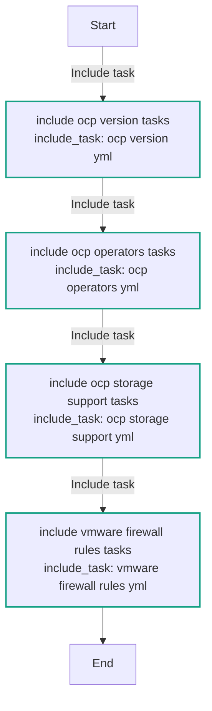
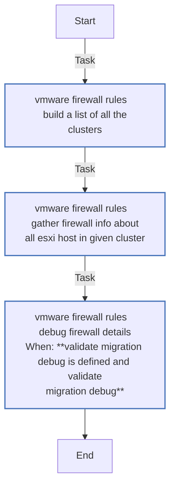
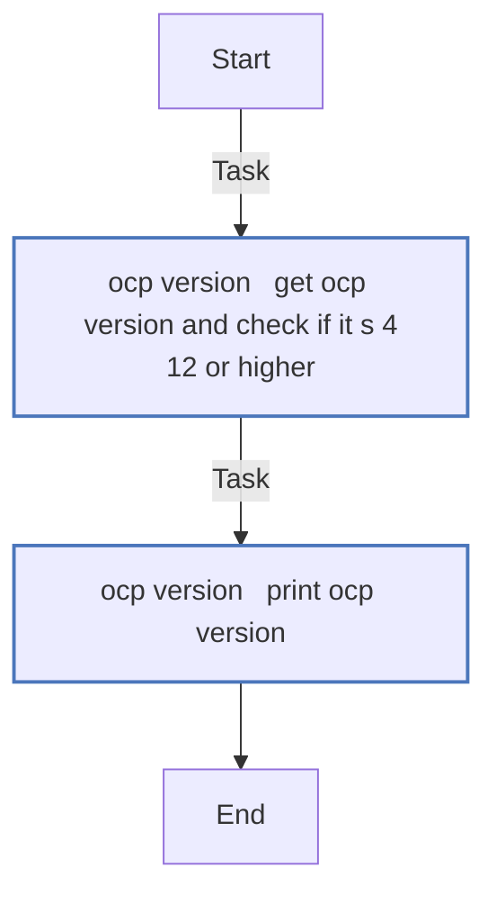
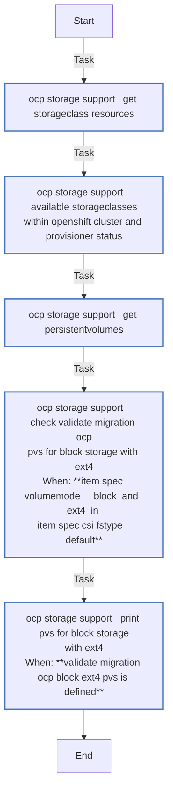
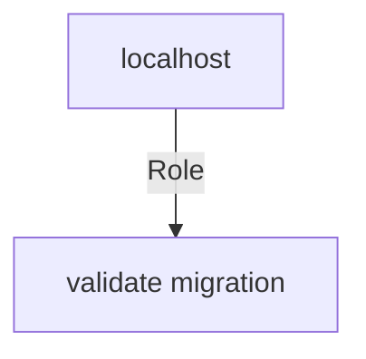

<!-- STATIC CONTENT START
Use this section for adding additional content to the README
This will not be overwritten by Docsible -->
# 📃 Role overview

<!-- STATIC CONTENT END -->
<!-- Everything below will be overwritten by Docsible -->
<!-- DOCSIBLE START -->
## validate_migration

```
Role belongs to infra/openshift_virtualization_migration
Namespace - infra
Collection - openshift_virtualization_migration
Version - 1.24.0
Repository - https://github.com/redhat-cop/openshift_virtualization_migration
```

Description: Verification of an Ansible for OpenShift Virtualization Migration environment.

### Defaults

**These are static variables with lower priority**

#### File: defaults/main.yml

| Var          | Type         | Value       |Choices    |Required    | Title       |
|--------------|--------------|-------------|-------------|-------------|-------------|
| [`validate_migration_expected_provisioners`](defaults/main.yml#L3)   | list   | `[]` |  None  |   None  |  None |
| [`validate_migration_expected_provisioners.0`](defaults/main.yml#L4)   | str   | `kubernetes.io/aws-ebs` |  None  |   None  |  None |
| [`validate_migration_expected_provisioners.1`](defaults/main.yml#L5)   | str   | `kubernetes.io/azure-disk` |  None  |   None  |  None |
| [`validate_migration_expected_provisioners.2`](defaults/main.yml#L6)   | str   | `kubernetes.io/azure-file` |  None  |   None  |  None |
| [`validate_migration_expected_provisioners.3`](defaults/main.yml#L7)   | str   | `kubernetes.io/cinder` |  None  |   None  |  None |
| [`validate_migration_expected_provisioners.4`](defaults/main.yml#L8)   | str   | `kubernetes.io/gce-pd` |  None  |   None  |  None |
| [`validate_migration_expected_provisioners.5`](defaults/main.yml#L9)   | str   | `kubernetes.io/hostpath-provisioner` |  None  |   None  |  None |
| [`validate_migration_expected_provisioners.6`](defaults/main.yml#L10)   | str   | `manila.csi.openstack.org` |  None  |   None  |  None |
| [`validate_migration_expected_provisioners.7`](defaults/main.yml#L11)   | str   | `openshift-storage.cephfs.csi.ceph.com` |  None  |   None  |  None |
| [`validate_migration_expected_provisioners.8`](defaults/main.yml#L12)   | str   | `openshift-storage.rbd.csi.ceph.com` |  None  |   None  |  None |
| [`validate_migration_expected_provisioners.9`](defaults/main.yml#L13)   | str   | `kubernetes.io/rbd` |  None  |   None  |  None |
| [`validate_migration_expected_provisioners.10`](defaults/main.yml#L14)   | str   | `kubernetes.io/vsphere-volume` |  None  |   None  |  None |
| [`validate_migration_namespace`](defaults/main.yml#L16)   | str   | `openshift-mtv` |  None  |   None  |  None |
| [`validate_migration_debug`](defaults/main.yml#L18)   | bool   | `True` |  None  |   None  |  None |
| [`validate_migration_cluster_name`](defaults/main.yml#L20)   | str   | `cluster01` |  None  |   None  |  None |

<summary><b>🖇️ Full descriptions for vars in defaults/main.yml</b></summary>
<br>
<b>`validate_migration_expected_provisioners`:</b> None
<br>
<b>`validate_migration_expected_provisioners.0`:</b> None
<br>
<b>`validate_migration_expected_provisioners.1`:</b> None
<br>
<b>`validate_migration_expected_provisioners.2`:</b> None
<br>
<b>`validate_migration_expected_provisioners.3`:</b> None
<br>
<b>`validate_migration_expected_provisioners.4`:</b> None
<br>
<b>`validate_migration_expected_provisioners.5`:</b> None
<br>
<b>`validate_migration_expected_provisioners.6`:</b> None
<br>
<b>`validate_migration_expected_provisioners.7`:</b> None
<br>
<b>`validate_migration_expected_provisioners.8`:</b> None
<br>
<b>`validate_migration_expected_provisioners.9`:</b> None
<br>
<b>`validate_migration_expected_provisioners.10`:</b> None
<br>
<b>`validate_migration_namespace`:</b> None
<br>
<b>`validate_migration_debug`:</b> None
<br>
<b>`validate_migration_cluster_name`:</b> None
<br>
<br>

### Tasks

#### File: tasks/main.yml

| Name | Module | Has Conditions |
| ---- | ------ | --------- |
| Include ocp_version tasks | `ansible.builtin.include_tasks` | False |
| Include ocp_operators tasks | `ansible.builtin.include_tasks` | False |
| Include ocp_storage_support tasks | `ansible.builtin.include_tasks` | False |
| Include vmware_firewall_rules tasks | `ansible.builtin.include_tasks` | False |

#### File: tasks/ocp_operators.yml

| Name | Module | Has Conditions |
| ---- | ------ | --------- |
| ocp_operators ¦ Verify existence of Project {{ validate_migration_namespace }} | `block` | False |
| ocp_operators ¦ Get list of Project named {{ validate_migration_namespace }} | `kubernetes.core.k8s_info` | False |
| ocp_operators ¦ Debug Task (Runs if Project Exists) | `ansible.builtin.debug` | False |
| ocp_operators ¦ Verify OperatorGroup exists | `block` | False |
| ocp_operators ¦ Get list of OperatorGroup on Project {{ validate_migration_namespace }} | `kubernetes.core.k8s_info` | False |
| ocp_operators ¦ Debug Task (Runs if OperatorGroup Exists) | `ansible.builtin.debug` | False |
| ocp_operators ¦ Verify Subscription exists | `block` | False |
| ocp_operators ¦ Verify Subscription exists | `kubernetes.core.k8s_info` | False |
| ocp_operators ¦ Debug Task (Runs if Subscription Exists) | `ansible.builtin.debug` | False |

#### File: tasks/ocp_storage_support.yml

| Name | Module | Has Conditions |
| ---- | ------ | --------- |
| ocp_storage_support ¦ Get StorageClass resources | `kubernetes.core.k8s_info` | False |
| ocp_storage_support ¦ Available Storageclasses within OpenShift Cluster and Provisioner Status | `ansible.builtin.debug` | False |
| ocp_storage_support ¦ Get PersistentVolumes | `kubernetes.core.k8s_info` | False |
| ocp_storage_support ¦ Check validate_migration_ocp_pvs for block storage with EXT4 | `ansible.builtin.set_fact` | True |
| ocp_storage_support ¦ Print PVs for block storage with EXT4 | `ansible.builtin.debug` | True |

#### File: tasks/ocp_version.yml

| Name | Module | Has Conditions |
| ---- | ------ | --------- |
| ocp_version ¦ Get OCP version and check if it's 4.12 or higher | `kubernetes.core.k8s_info` | False |
| ocp_version ¦ Print OCP version | `ansible.builtin.debug` | False |

#### File: tasks/vmware_firewall_rules.yml

| Name | Module | Has Conditions |
| ---- | ------ | --------- |
| vmware_firewall_rules ¦ Build a list of all the clusters | `vmware.vmware_rest.vcenter_cluster_info` | False |
| vmware_firewall_rules ¦ Gather firewall info about all ESXi Host in given Cluster | `community.vmware.vmware_host_firewall_info` | False |
| vmware_firewall_rules ¦ Debug firewall details | `ansible.builtin.debug` | True |

## Task Flow Graphs

### Graph for main.yml



### Graph for vmware_firewall_rules.yml



### Graph for ocp_version.yml



### Graph for ocp_operators.yml

```mermaid
flowchart TD
Start
classDef block stroke:#3498db,stroke-width:2px;
classDef task stroke:#4b76bb,stroke-width:2px;
classDef includeTasks stroke:#16a085,stroke-width:2px;
classDef importTasks stroke:#34495e,stroke-width:2px;
classDef includeRole stroke:#2980b9,stroke-width:2px;
classDef importRole stroke:#699ba7,stroke-width:2px;
classDef includeVars stroke:#8e44ad,stroke-width:2px;
classDef rescue stroke:#665352,stroke-width:2px;

  Start-->|Block Start| ocp_operators___Verify_existence_of_Project_validate_migration_namespace0_block_start_0[[ocp operators   verify existence of project<br>validate migration namespace]]:::block
  ocp_operators___Verify_existence_of_Project_validate_migration_namespace0_block_start_0-->|Task| ocp_operators___Get_list_of_Project_named_validate_migration_namespace0[ocp operators   get list of project named validate<br>migration namespace]:::task
  ocp_operators___Get_list_of_Project_named_validate_migration_namespace0-.->|End of Block| ocp_operators___Verify_existence_of_Project_validate_migration_namespace0_block_start_0
  ocp_operators___Get_list_of_Project_named_validate_migration_namespace0-->|Rescue Start| ocp_operators___Verify_existence_of_Project_validate_migration_namespace0_rescue_start_0[ocp operators   verify existence of project<br>validate migration namespace]:::rescue
  ocp_operators___Verify_existence_of_Project_validate_migration_namespace0_rescue_start_0-->|Task| ocp_operators___Debug_Task__Runs_if_Project_doesn_t_Exists_0[ocp operators   debug task  runs if project doesn<br>t exists ]:::task
  ocp_operators___Debug_Task__Runs_if_Project_doesn_t_Exists_0-.->|End of Rescue Block| ocp_operators___Verify_existence_of_Project_validate_migration_namespace0_block_start_0
  ocp_operators___Debug_Task__Runs_if_Project_doesn_t_Exists_0-->|Task| ocp_operators___Debug_Task__Runs_if_Project_Exists_1[ocp operators   debug task  runs if project exists<br>]:::task
  ocp_operators___Debug_Task__Runs_if_Project_Exists_1-->|Block Start| ocp_operators___Verify_OperatorGroup_exists2_block_start_0[[ocp operators   verify operatorgroup exists]]:::block
  ocp_operators___Verify_OperatorGroup_exists2_block_start_0-->|Task| ocp_operators___Get_list_of_OperatorGroup_on_Project_validate_migration_namespace0[ocp operators   get list of operatorgroup on<br>project validate migration namespace]:::task
  ocp_operators___Get_list_of_OperatorGroup_on_Project_validate_migration_namespace0-.->|End of Block| ocp_operators___Verify_OperatorGroup_exists2_block_start_0
  ocp_operators___Get_list_of_OperatorGroup_on_Project_validate_migration_namespace0-->|Rescue Start| ocp_operators___Verify_OperatorGroup_exists2_rescue_start_0[ocp operators   verify operatorgroup exists]:::rescue
  ocp_operators___Verify_OperatorGroup_exists2_rescue_start_0-->|Task| ocp_operators___Debug_Task__Runs_if_OperatorGroup_doesn_t_Exists_0[ocp operators   debug task  runs if operatorgroup<br>doesn t exists ]:::task
  ocp_operators___Debug_Task__Runs_if_OperatorGroup_doesn_t_Exists_0-.->|End of Rescue Block| ocp_operators___Verify_OperatorGroup_exists2_block_start_0
  ocp_operators___Debug_Task__Runs_if_OperatorGroup_doesn_t_Exists_0-->|Task| ocp_operators___Debug_Task__Runs_if_OperatorGroup_Exists_3[ocp operators   debug task  runs if operatorgroup<br>exists ]:::task
  ocp_operators___Debug_Task__Runs_if_OperatorGroup_Exists_3-->|Block Start| ocp_operators___Verify_Subscription_exists4_block_start_0[[ocp operators   verify subscription exists]]:::block
  ocp_operators___Verify_Subscription_exists4_block_start_0-->|Task| ocp_operators___Verify_Subscription_exists0[ocp operators   verify subscription exists]:::task
  ocp_operators___Verify_Subscription_exists0-.->|End of Block| ocp_operators___Verify_Subscription_exists4_block_start_0
  ocp_operators___Verify_Subscription_exists0-->|Rescue Start| ocp_operators___Verify_Subscription_exists4_rescue_start_0[ocp operators   verify subscription exists]:::rescue
  ocp_operators___Verify_Subscription_exists4_rescue_start_0-->|Task| ocp_operators___Debug_Task__Runs_if_Subscription_doesn_t_Exists_0[ocp operators   debug task  runs if subscription<br>doesn t exists ]:::task
  ocp_operators___Debug_Task__Runs_if_Subscription_doesn_t_Exists_0-.->|End of Rescue Block| ocp_operators___Verify_Subscription_exists4_block_start_0
  ocp_operators___Debug_Task__Runs_if_Subscription_doesn_t_Exists_0-->|Task| ocp_operators___Debug_Task__Runs_if_Subscription_Exists_5[ocp operators   debug task  runs if subscription<br>exists ]:::task
  ocp_operators___Debug_Task__Runs_if_Subscription_Exists_5-->End
```



### Graph for ocp_storage_support.yml



## Playbook

```yml
---
- name: Test
  hosts: localhost
  remote_user: root
  roles:
    - validate_migration
...

```

## Playbook graph



## Author Information

OpenShift Virtualization Migration Contributors

## License

GPL-3.0-only

## Minimum Ansible Version

2.15.0

## Platforms

No platforms specified.

<!-- DOCSIBLE END -->