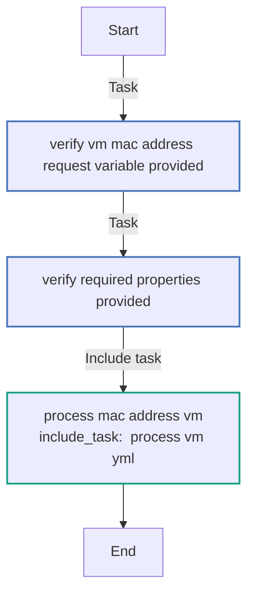
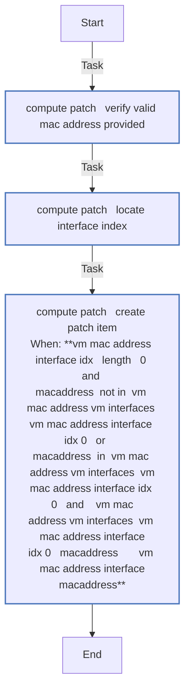
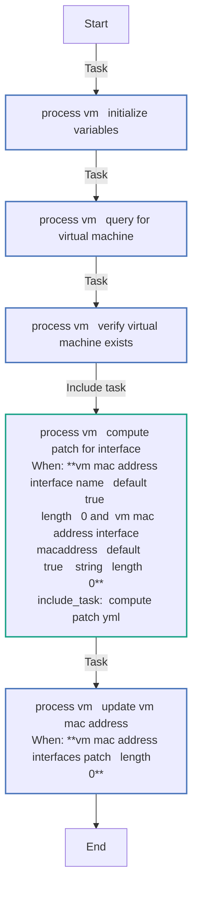
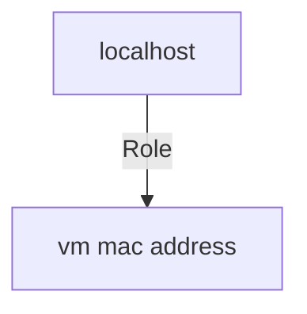

<!-- STATIC CONTENT START
Use this section for adding additional content to the README
This will not be overwritten by Docsible -->
# 📃 Role overview

<!-- STATIC CONTENT END -->
<!-- Everything below will be overwritten by Docsible -->
<!-- DOCSIBLE START -->
## vm_mac_address

```
Role belongs to infra/openshift_virtualization_migration
Namespace - infra
Collection - openshift_virtualization_migration
Version - 1.24.0
Repository - https://github.com/redhat-cop/openshift_virtualization_migration
```

Description: Management of Virtual Machine MAC Addresses.

### Defaults

**These are static variables with lower priority**

#### File: defaults/main.yml

| Var          | Type         | Value       |Choices    |Required    | Title       |
|--------------|--------------|-------------|-------------|-------------|-------------|
| [`vm_mac_address_request`](defaults/main.yml#L7)   | list   | `[]` |  None  |   True  |  MAC Address Request |
| [`vm_mac_address_openshift_host`](defaults/main.yml#L17)   | str   | `{{ openshift_host }}` |  None  |   True  |  OpenShift Host |
| [`vm_mac_address_api_key`](defaults/main.yml#L21)   | str   | `{{ openshift_api_key }}` |  None  |   True  |  OpenShift API Key |
| [`vm_mac_address_openshift_verify_ssl`](defaults/main.yml#L25)   | str   | `{{ openshift_verify_ssl }}` |  None  |   True  |  Verify SSL Certificate |
| [`vm_mac_address_kubevirt_api_version`](defaults/main.yml#L29)   | str   | `kubevirt.io/v1` |  None  |   True  |  KubeVirt API Version |

<summary><b>🖇️ Full descriptions for vars in defaults/main.yml</b></summary>
<br>
<b>`vm_mac_address_request`:</b> List of MAC Address Requests
<br>
<b>`vm_mac_address_openshift_host`:</b> OpenShift Host
<br>
<b>`vm_mac_address_api_key`:</b> OpenShift API Key
<br>
<b>`vm_mac_address_openshift_verify_ssl`:</b> Verify SSL Certificate
<br>
<b>`vm_mac_address_kubevirt_api_version`:</b> KubeVirt API Version
<br>
<br>

### Tasks

#### File: tasks/main.yml

| Name | Module | Has Conditions |
| ---- | ------ | --------- |
| Verify vm_mac_address_request Variable Provided | `ansible.builtin.assert` | False |
| Verify Required Properties Provided | `ansible.builtin.assert` | False |
| Process MAC Address VM | `ansible.builtin.include_tasks` | False |

#### File: tasks/_compute_patch.yml

| Name | Module | Has Conditions |
| ---- | ------ | --------- |
| _compute_patch ¦ Verify Valid MAC Address Provided | `ansible.builtin.assert` | False |
| _compute_patch ¦ Locate Interface Index | `ansible.builtin.set_fact` | False |
| _compute_patch ¦ Create Patch Item | `ansible.builtin.set_fact` | True |

#### File: tasks/_process_vm.yml

| Name | Module | Has Conditions |
| ---- | ------ | --------- |
| _process_vm ¦ Initialize Variables | `ansible.builtin.set_fact` | False |
| _process_vm ¦ Query for Virtual Machine | `kubernetes.core.k8s_info` | False |
| _process_vm ¦ Verify Virtual Machine Exists | `ansible.builtin.assert` | False |
| _process_vm ¦ Compute Patch for Interface | `ansible.builtin.include_tasks` | True |
| _process_vm ¦ Update VM MAC Address | `kubernetes.core.k8s_json_patch` | True |

## Task Flow Graphs

### Graph for main.yml



### Graph for _compute_patch.yml



### Graph for _process_vm.yml



## Playbook

```yml
---
- name: Test
  hosts: localhost
  remote_user: root
  roles:
    - vm_mac_address
...

```

## Playbook graph



## Author Information

OpenShift Virtualization Migration Contributors

## License

GPL-3.0-only

## Minimum Ansible Version

2.15.0

## Platforms

No platforms specified.

<!-- DOCSIBLE END -->