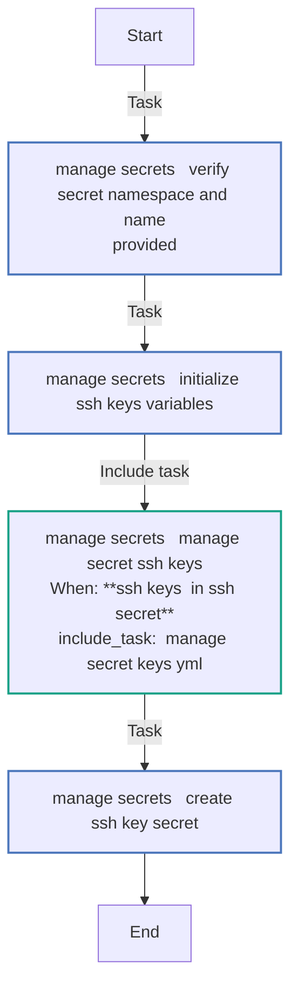
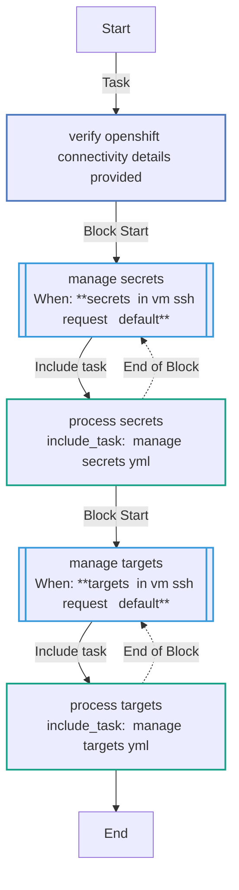
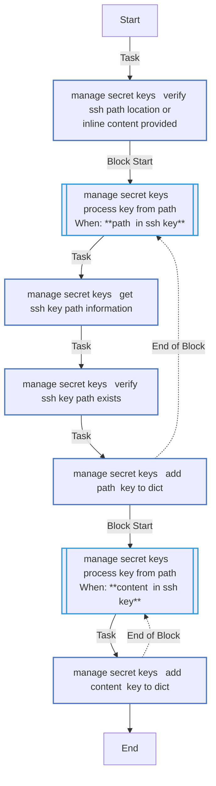
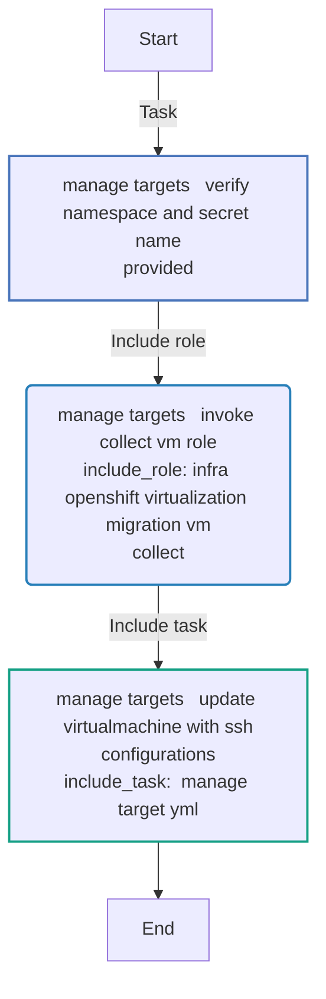
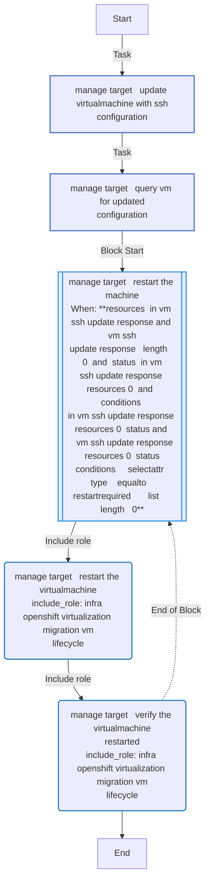
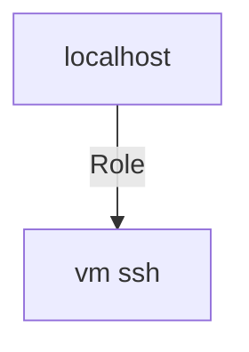

<!-- STATIC CONTENT START
Use this section for adding additional content to the README
This will not be overwritten by Docsible -->
# 📃 Role overview

This role manages SSH access to virtual machines on OpenShift cluster.

<!-- STATIC CONTENT END -->
<!-- Everything below will be overwritten by Docsible -->
<!-- DOCSIBLE START -->
## vm_ssh

```
Role belongs to infra/openshift_virtualization_migration
Namespace - infra
Collection - openshift_virtualization_migration
Version - 1.24.0
Repository - https://github.com/redhat-cop/openshift_virtualization_migration
```

Description: Management of SSH keys for Virtual Machines in OpenShift.

### Defaults

**These are static variables with lower priority**

#### File: defaults/main.yml

| Var          | Type         | Value       |Choices    |Required    | Title       |
|--------------|--------------|-------------|-------------|-------------|-------------|
| [`vm_ssh_request`](defaults/main.yml#L7)   | dict   | `{}` |  None  |   True  |  SSH Requests |
| [`vm_ssh_openshift_host`](defaults/main.yml#L26)   | str   | `{{ openshift_host }}` |  None  |   True  |  OpenShift host |
| [`vm_ssh_openshift_api_key`](defaults/main.yml#L31)   | str   | `{{ openshift_api_key }}` |  None  |   True  |  OpenShift API Key |
| [`vm_ssh_openshift_verify_ssl`](defaults/main.yml#L36)   | str   | `{{ openshift_verify_ssl }}` |  None  |   True  |  Verify SSL Certificate |
| [`vm_ssh_default_users`](defaults/main.yml#L41)   | list   | `[]` |  None  |   True  |  List of default SSH users |
| [`vm_ssh_default_users.0`](defaults/main.yml#L42)   | str   | `root` |  None  |   None  |  None |
| [`vm_ssh_kubevirt_api_version`](defaults/main.yml#L47)   | str   | `kubevirt.io/v1` |  None  |   True  |  KubeVirt API Version |

<summary><b>🖇️ Full descriptions for vars in defaults/main.yml</b></summary>
<br>
<b>`vm_ssh_request`:</b> SSH Requests
<br>
<b>`vm_ssh_openshift_host`:</b> OpenShift host
<br>
<b>`vm_ssh_openshift_api_key`:</b> OpenShift API Key
<br>
<b>`vm_ssh_openshift_verify_ssl`:</b> Variable to enable SSL verification
<br>
<b>`vm_ssh_default_users`:</b> List of default SSH users (default user: root)
<br>
<b>`vm_ssh_default_users.0`:</b> None
<br>
<b>`vm_ssh_kubevirt_api_version`:</b> KubeVirt API Version
<br>
<br>

### Tasks

#### File: tasks/main.yml

| Name | Module | Has Conditions |
| ---- | ------ | --------- |
| Verify OpenShift Connectivity Details Provided | `ansible.builtin.assert` | False |
| Manage Secrets | `block` | True |
| Process Secrets | `ansible.builtin.include_tasks` | False |
| Manage Targets | `block` | True |
| Process Targets | `ansible.builtin.include_tasks` | False |

#### File: tasks/_manage_secret_keys.yml

| Name | Module | Has Conditions |
| ---- | ------ | --------- |
| _manage_secret_keys ¦ Verify SSH path location or inline content provided | `ansible.builtin.assert` | False |
| _manage_secret_keys ¦ Process Key from Path | `block` | True |
| _manage_secret_keys ¦ Get SSH Key Path information | `ansible.builtin.stat` | False |
| _manage_secret_keys ¦ Verify SSH Key Path Exists | `ansible.builtin.assert` | False |
| _manage_secret_keys ¦ Add 'path' Key to Dict | `ansible.builtin.set_fact` | False |
| _manage_secret_keys ¦ Process Key from Path | `block` | True |
| _manage_secret_keys ¦ Add 'content' Key to Dict | `ansible.builtin.set_fact` | False |

#### File: tasks/_manage_secrets.yml

| Name | Module | Has Conditions |
| ---- | ------ | --------- |
| _manage_secrets ¦ Verify Secret Namespace and Name Provided | `ansible.builtin.assert` | False |
| _manage_secrets ¦ Initialize SSH Keys Variables | `ansible.builtin.set_fact` | False |
| _manage_secrets ¦ Manage Secret SSH Keys | `ansible.builtin.include_tasks` | True |
| _manage_secrets ¦ Create SSH Key Secret | `redhat.openshift.k8s` | False |

#### File: tasks/_manage_target.yml

| Name | Module | Has Conditions |
| ---- | ------ | --------- |
| _manage_target ¦ Update VirtualMachine with SSH Configuration | `redhat.openshift.k8s` | False |
| _manage_target ¦ Query VM for Updated Configuration | `kubernetes.core.k8s_info` | False |
| _manage_target ¦ Restart the machine | `block` | True |
| _manage_target ¦ Restart the VirtualMachine | `ansible.builtin.include_role` | False |
| _manage_target ¦ Verify the VirtualMachine restarted | `ansible.builtin.include_role` | False |

#### File: tasks/_manage_targets.yml

| Name | Module | Has Conditions |
| ---- | ------ | --------- |
| _manage_targets ¦ Verify Namespace and Secret Name Provided | `ansible.builtin.assert` | False |
| _manage_targets ¦ Invoke Collect VM Role | `ansible.builtin.include_role` | False |
| _manage_targets ¦ Update VirtualMachine with SSH Configurations | `ansible.builtin.include_tasks` | False |

## Task Flow Graphs

### Graph for _manage_secrets.yml



### Graph for main.yml



### Graph for _manage_secret_keys.yml



### Graph for _manage_targets.yml



### Graph for _manage_target.yml



## Playbook

```yml
---
- name: Test
  hosts: localhost
  remote_user: root
  roles:
    - vm_ssh
...

```

## Playbook graph



## Author Information

OpenShift Virtualization Migration Contributors

## License

GPL-3.0-only

## Minimum Ansible Version

2.15.0

## Platforms

No platforms specified.

<!-- DOCSIBLE END -->